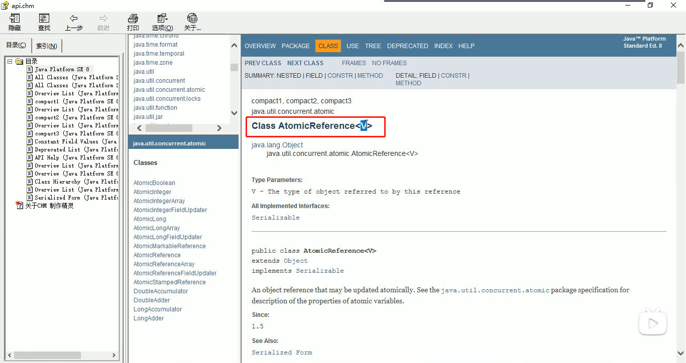
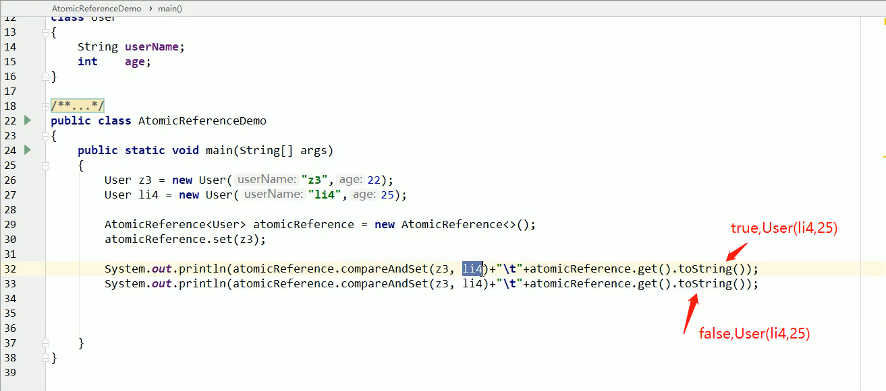
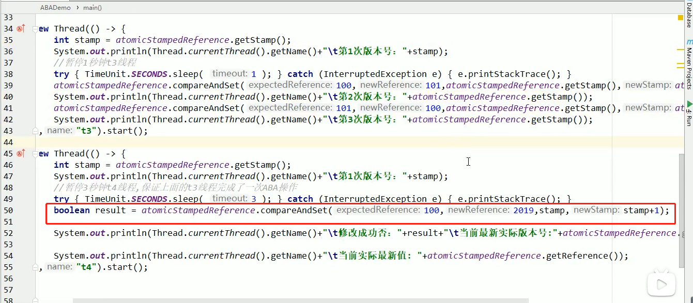

**CAS**

1.CAS机制有点类似于乐观锁，CAS机制可以理解成一个**多线程争抢资源并且无阻塞**的模型。

2.CAS操作包含三个操作数 —— 内存地址(V)、旧的预期值(A)和即将要更新的值（B）。执行CAS的时候，将内存地址的值与预期值进行比较，如果相同就把内存地址对应的值更新成B；如果不相同，就什么也不做。

3.说说CAS底层原理：（1）自旋锁；（2）Unsafe类.  ===>CAS是原子性的

​	CAS并发原语体现在java语言中就是sun.misc.Unsafe类中的各个方法。调用Unsafe类中的CAS方法，JVM会帮我们实现出CAS汇编指令。这是一种完全依赖于硬件的功能，通过它实现了原子操作。再次强调，由于CAS是一种系统原语，原语属于操作系统用语范畴，是由若干条指令组成的，用于完成某个功能的一个过程，**并且原语的执行必须是连续的，在执行过程中不允许被中断，也就是说CAS是一条CPU的原子指令，不会造成所谓的数据不一致问题。**==》下面var2不是值，是对象的地址；var2地址最新真实的值与var5进行比较.

4.Unsafe类：

​	首先再看看AtomicInter类，里面用到了Unsafe类。Unsafe是CAS的核心类，由于java方法无法直接访问底层系统，需要通过本地（native）方法来访问，Unsafe类相当于一个后门，基于该类可以直接操作特定内存的数据。**Unsafe类存在于sun.misc包中**，其内部方法操作可以像C的指针一样直接操作内存，Java中CAS操作的执行依赖于Unsafe类的方法。

​	**注意Unsafe类中的所有方法都是native修饰的，也就是说Unsafe类中的方法都直接调用操作系统底层资源执行相应任务。**

​	下图中的valueOffset，表示该变量在内存中的偏移地址，Unsafe就是直接根据内存偏移地址获取数据的.

​	下图中的value用了volatile修饰，保证了多线程之间的可见性。

**5.CAS的缺点**

1)循环时间长，开销大。如果CAS失败，会一直进行尝试。如果CAS长时间一直不成功，可能会给CPU带来很大的开销。

2)只能保证一个共享变量的原子操作。

3)引出来的ABA问题.(mianshi关键)

**6.CAS问题连环炮：**CAS ---> Unsafe ---> CAS底层思想 ---> ABA问题 ---> 原子引用更行 ---> 如何规避ABA问题？

**7.什么是ABA问题？**

​	但凡问到CAS，必须得知道其中有ABA问题，否则面试官认为你只会用，浮于表面。CAS是指取出内存中某时刻的数据并在当下时刻比较并交换，那么在取出直至比较的这个时间段内，内存里的值可能被其他线程由A->B->...->A,然后这个时候CAS的线程比较成功并交换。这时尽管CAS操作成功，但不代表这个过程没问题。

**8.什么是原子引用更新?**

​	除了基本的AtomicInteger类外，我们自己的对象也可以用并发包里的类AtomicReference<V>包装成原子对象，从而进行原子操作compareAndSet：

**9.AtomicStampedReference版本号原子引用**

​		AtomicStampedReference可以解决ABA问题，加入了时间戳的版本号，类似于乐观锁，如果有其他线程更改了该原子引用，则版本号变大，该线程再compareAndSet(expectedReference,newReference,stamp,stamp+1)的时候会带上时间戳版本号一起比较，若时间戳版本号发生了变化（变大），则更新失败，返回false.如图：

