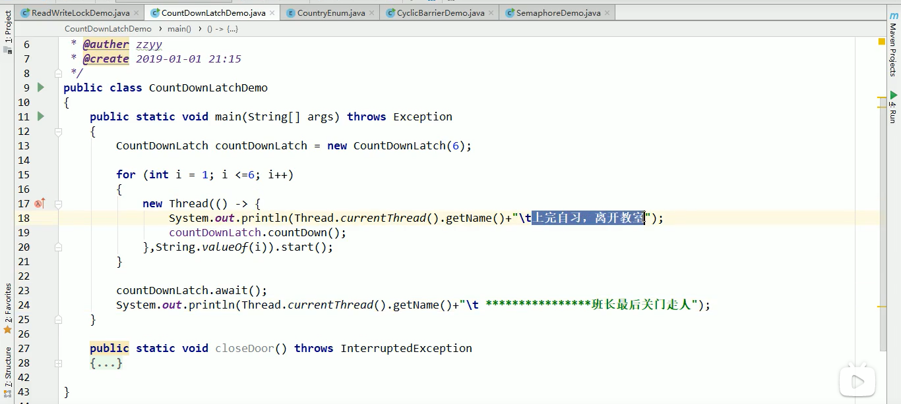
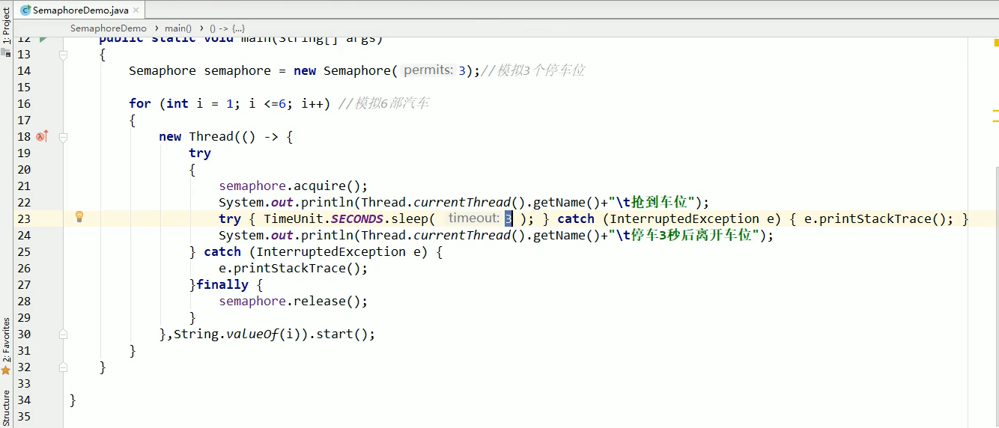

**CountDownLatch、CyclicBarrier、Semaphore**

**1.CountDownLatch**

​	CountDownLatch是concurrent并发包下的倒计数工具类,可控制所有线程执行完后再继续执行的类。它主要有countDown()和await()两个方法。CountDownLatch.await()是当线程减到0后，唤醒当前线程继续执行.

**2.CyclicBarrier**

​	CyclicBarrier和CountDownLatch相反。CyclicBarrier的字面意思是可循环(Cyclic)使用的屏障(Barrier)。它要做事情是让一组线程到达一个屏障（也可以叫同步点）时被阻塞，知道最后一个线程到达屏障时，屏障才会开门，所有被屏障拦截的线程才会继续干活，线程进入屏障通过CyclicBarrier的await()方法。

**3.Semaphore（信号灯）**

​	Semaphore信号量主要用于两个目的，一个是用于多个共享资源的互斥使用，另一个用于并发线程数的控制。（它结合了上面两个的功能，可伸缩。eg:Semaphore(3),最多入场三个，减到0就await）

