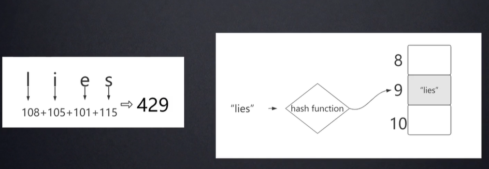
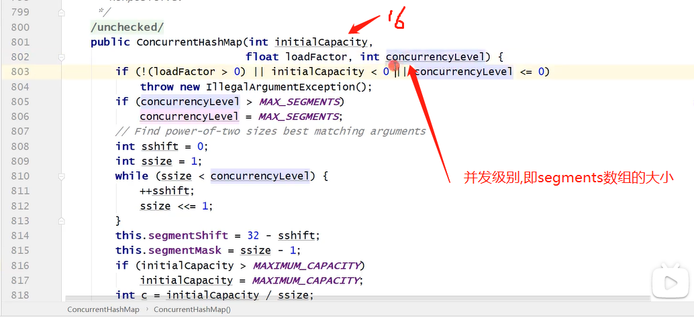

### HashMap详解

#### 1.HashMap底层结构

​		数组加链表.（jdk1.8之后引入了红黑树，7为临界，等于7时不变，当链表长度>7,转化为红黑树；当链表长度<7,转化为链表）

#### 2.哈希碰撞（哈希冲突）

​		根据index=hashCode() & (length-1)算出的下标相同，这时就发生了哈希碰撞，1.7采用头插法插入，1.8采用尾插法。

#### 3.HashMap扩容

##### 		3.1 初始容量

​			16。取16是因为比较符合常用的量。

##### 		3.2 何时扩容

​			当hashmap存储的量达到0.75个容量的时候，大小扩容为原来的2倍。（ArrayList也是动态扩容，只不过它是当超过容量的时候，比如容量10插入第11个时，容量扩为原来的1.5倍）

##### 		3.3 如何扩容

​			容量扩为原来两倍，元素的索引值也要重新计算和插入。index = hashCode（Key） & （Length - 1）。

扩容时1.7在多线程情况下可能会造成死循环（单线程下链表元素的顺序也会翻转过来）。

#### 4.jdk1.7中hashMap为何会造成死循环(多线程下可能会形成循环链表）

​		这是因为头插法在多线程的情况下可能造成的。多个线程在即将扩容时同时插入，这时A线程正常执行，B线程在执行transform()方法前由于网络问题卡住了，等A执行完然后B线程继续执行，这时会发现e2指针在后面，next2指针反而在前面（头插法造成的链表元素反转导致），然后继续按照算法执行下去就会发现出现了死循环。

#### 5.index运算

```java
Node数组的默认初始化大小 -> 1 « 4 -> 16

我们在创建HashMap的时候，阿里巴巴规范插件会提醒我们最好赋初值，而且最好是2的幂。

这样是为了位运算的方便，位与运算比算数计算的效率高了很多，之所以选择16，是为了服务将Key映射到index的算法。

我前面说了所有的key我们都会拿到他的hash，但是我们怎么尽可能的得到一个均匀分布的hash呢？

通过Key的HashCode值去做位运算。

再根据 ` index = HashCode（Key） & （Length- 1）`

15的的二进制是1111，那10111011000010110100 &1111 十进制就是4

之所以用位与运算效果与取模一样，性能也提高了不少！

在使用不是2的幂的数字的时候，Length-1的值是所有二进制位全为1，这种情况下，index的结果等同于HashCode后几位的值。

只要输入的HashCode本身分布均匀，index的结果就是均匀的。
```


#### 6.HashCode重写

##### 	6.1 equals()方法和hashCode()方法分别是用来做什么的？

**equals()方法:**

该方法是用来判断两个对象是否是同一个对象。

在Object类源码（如下所示）中，其底层是使用了“==”来实现

也就是说通过比较两个对象的内存地址是否相同判断是否是同一个对象。

```
public boolean equals(Object obj) {
	return (this == obj);
}
```

但是在实际应用中，该方法不能满足的我们的需求。

因为我们认为两个对象即使不是指向的同一块内存，只要这两个对象的各个字段属性值都相同，那么就认为这两个对象是同一个对象。

所以就需要重写equals（）方法，即如果两个对象指向内存地址相同或者两个对象各个字段值相同，那么就是同一个对象。

**hashCode()方法**

一提到hashcode，很自然就想到哈希表。

将某一key值映射到表中的一个位置，从而达到以O(1)的时间复杂度来查询该key值。

Object类源码（如下所示）中，hashCode()是一个native方法，哈希值的计算利用的是内存地址。

```
public native int hashCode();
```

可以认为利用哈希表也能起到一定的判重的作用，但是现实是可能存在哈希冲突，即使是两个不同的对象，他们的哈希值也可能相同。

总之，记住哈希表具有优越的查询性能，并且存在哈希冲突。


##### 	6.2 equals()方法和hashCode()方法两者有什么关系?

两者事实关系如下：

1. 如果两个对象相同（即用equals比较返回true），那么它们的hashCode值一定要相同！！！！；
2. 如果两个对象不同（即用equals比较返回false），那么它们的hashCode值可能相同也可能不同；
3. 如果两个对象的hashCode相同（存在哈希冲突），那么它们可能相同也可能不同(即equals比较可能是false也可能是true)
4. 如果两个对象的hashCode不同，那么他们肯定不同(即用equals比较返回false)


##### 	6.3 为什么重写equals()就一定要重写hashCode()方法?

对于对象集合的判重，如果一个集合含有10000个对象实例，仅仅使用equals()方法的话。

那么对于一个对象判重就需要比较10000次，随着集合规模的增大，时间开销是很大的。

但是同时使用哈希表的话，就能快速定位到对象的大概存储位置，并且在定位到大概存储位置

后续比较过程中，如果两个对象的hashCode不相同，也不再需要调用equals（）方法，从而大大减少了equals()比较次数。

所以从程序实现原理上来讲的话，既需要equals()方法，也需要hashCode()方法。

那么既然重写了equals（），那么也要重写hashCode()方法，以保证两者之间的配合关系。

基于以上分析，我们可以在Java集合框架中得到验证。

由于HashSet是基于HashMap来实现的，所以这里只看HashMap的put方法即可。源码如下

```java
public V put(K key, V value) {
        if (table == EMPTY_TABLE) {
            inflateTable(threshold);
        }
        if (key == null)
            return putForNullKey(value);
        int hash = hash(key);
        //这里通过哈希值定位到对象的大概存储位置
        int i = indexFor(hash, table.length);
        for (Entry<K,V> e = table[i]; e != null; e = e.next) {
            Object k;
            //if语句中，先比较hashcode，再调用equals()比较
            //由于“&&”具有短路的功能，只要hashcode不同，也无需再调用equals方法
            if (e.hash == hash && ((k = e.key) == key || key.equals(k))) {
                V oldValue = e.value;
                e.value = value;
                e.recordAccess(this);
                return oldValue;
            }
        }

        modCount++;
        addEntry(hash, key, value, i);
        return null;
    }
```

我们在实际应用过程中，如果仅仅重写了equals（），而没有重写hashCode()方法，会出现什么情况？

字段属性值完全相同的两个对象因为hashCode不同，所以在hashmap中的table数组的下标不同，从而这两个对象就会同时存在于集合中（比如说有两个对象名字叫老王，其他属性不同，但是我业务认为只要叫老王就是同）

所以重写equals()就一定要重写hashCode()方法。

对于“为什么重写equals()就一定要重写hashCode()方法？”

这个问题应该是有个前提，就是你需要用到HashMap,HashSet等Java集合。

用不到哈希表的话，其实仅仅重写equals()方法也可以吧。

而工作中的场景是常常用到Java集合，所以Java官方建议重写equals()就一定要重写hashCode()方法。


#### 7.多线程下的Map——ConcurrentHashMap

​		1.7采用了分段锁；1.8采用了CAS+synchronized来保证并发安全性。

**synchronized性能改进**

synchronized之前一直都是重量级的锁，但是后来java官方是对他进行过升级的，他现在采用的是锁升级的方式去做的。

针对 synchronized 获取锁的方式，JVM 使用了锁升级的优化方式，就是先使用偏向锁优先同一线程然后再次获取锁

如果失败，就升级为 CAS 轻量级锁，如果失败就会短暂自旋，防止线程被系统挂起。最后如果以上都失败就升级为重量级锁。

所以是一步步升级上去的，最初也是通过很多轻量级的方式锁定的。


#### 8.hashMap常见问题

```java

```


老笔记 ==========================================》


**hashMap**

1.幂等性

​		幂等性是指使用相同参数重复执行，能获得相同结果，这个结果不受系统环境影响，hash算法就具有幂等性.

2.什么是哈希算法？

​	哈希算法（也叫散列），就是把任意长度值（key）通过散列算法变换成固定长度的key（地址），通过这个地址进行访问的数据结构，加快了查找的速度。

3.什么是哈希碰撞（哈希冲突）？

- 首先HashCode：是通过字符串算出它的ascii码，再对这个ascii码进行取模mod(10)，算出哈希表的下标。取模的作用？是为了节省空间，因为不取模比如说算出ascii码为429，数组的内存是连续的，那么就要开辟一个429空间的内存，取模后只要开辟9。但是这也导致了容易产生相同的模，就会产生哈希碰撞.如下图：



- 为了解决hash碰撞，hashMap采用 数组+链表的数据结构，首先hashCode方法获取hash值并获取存储bucket的位置，然后通过链表的数据结构赋值。比如说("lies","张三")key取模后是9，("elis","李四")key取模后也是"9"，这时候发生hash碰撞：在下标为9的位置以链表的方式存入(lies)->“张三”->"李四".如图：

  

上图Entry<>(k,v,hash,next)这个类似于结构体的类存了四个元素的值. hash.put的时候计算hashCode然后取模，如果table[index]有值,则头插(jdk1.8就尾插了).  hash.get的时候也是先找到索引位置,然后判断table[index]是否为null，不为null则依次对比key是否相等，相等返回entry.get(key).

4.头插法和尾插法的优缺点.

​		HashMap的默认初始化大小是16，initialCapacity=16.

​		JDK8的hashMap对于过长的链表采用了红黑树的数据结构，改善了链表查询过慢的问题，提高了查询效率。

那么既然红黑树查询效率高，为什么不直接用数组+红黑树的形式，而是要在链表超过一个阈值后，才转变为红黑树呢？==》因为鱼与熊掌不可兼得，红黑树虽然提高了查询效率，但是它在插入的时候会发生一个左旋（左中右，小中大），这就降低了插入的效率。

5.ConcurrentHashMap原理

​	hashMap是线程不安全的,hashTable是线程安全的，但它加的锁太重，把整个hashTable对象都锁住了，效率比较低。如有如下两个线程同时执行put操作，正常来讲同时执行但是他们不在同一下标，不影响结果可以同时执行，但是由于hashTable把整个对象都加锁了，线程1获取到锁，必须要等线程1执行完put释放了锁，线程2才能继续执行，由此效率就比较低下。所以jdk增加了比较折中的ConcurrentHashMap.


- ConcurrentHashMap原理 , 如下图：

  a. 先根据key，算出对应的Segment数组的下标，index；

  b.获取index位置上的锁，segments[index].lock();

  c.segments[index].put(key,value)  --entry--数组，链表

  d.释放index位置上的锁，segments[index].unlock();


如上所示，segment[i]如下图其实是一个hashMap结构的数据，segment[i]里面又包含了一个Entry数组和hashCode冲突时所产生的链表结构. ConCurrentHashMap的初始化因子也为16，但是这个16是Segments[]数组里的每个Segments[index]里面的entry[]数组的和.如下图：



上图initialCapacity和concurrencyLevel默认都是16，但是所有segment[i]下的entry[]数组之和是32，因为源码里面限定了entry[]数组最小值cap为2.

6.ConCurrentHashMap利用自旋锁加锁、利用CAS赋值原理源码分析(这段代码作用就是在多线程下 new了一个Segment())：


7.hashSet的底层是什么？

​	hashSet的底层就是hashMap，--》那hashMap是键值对，为什么new HashSet<>().add("a")，只有一个变量呢？-----》答：因为HashSet只关心key，至于value都是给的一个同样的默认值new Object();


