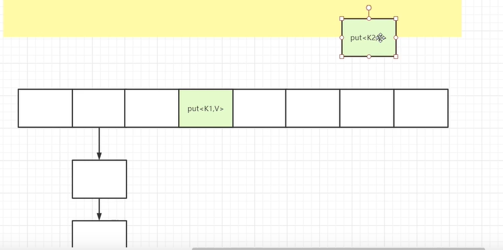

**hashMap**

1.幂等性

​		幂等性是指使用相同参数重复执行，能获得相同结果，这个结果不受系统环境影响，hash算法就具有幂等性.

2.什么是哈希算法？

​	哈希算法（也叫散列），就是把任意长度值（key）通过散列算法变换成固定长度的key（地址），通过这个地址进行访问的数据结构，加快了查找的速度。

3.什么是哈希碰撞（哈希冲突）？

- 首先HashCode：是通过字符串算出它的ascii码，再对这个ascii码进行取模mod(10)，算出哈希表的下标。取模的作用？是为了节省空间，因为不取模比如说算出ascii码为429，数组的内存是连续的，那么就要开辟一个429空间的内存，取模后只要开辟9。但是这也导致了容易产生相同的模，就会产生哈希碰撞.如下图：

- 为了解决hash碰撞，hashMap采用 数组+链表的数据结构，首先hashCode方法获取hash值并获取存储bucket的位置，然后通过链表的数据结构赋值。比如说("lies","张三")key取模后是9，("elis","李四")key取模后也是"9"，这时候发生hash碰撞：在下标为9的位置以链表的方式存入(lies)->“张三”->"李四".如图：

  

上图Entry<>(k,v,hash,next)这个类似于结构体的类存了四个元素的值. hash.put的时候计算hashCode然后取模，如果table[index]有值,则头插(jdk1.8就尾插了).  hash.get的时候也是先找到索引位置,然后判断table[index]是否为null，不为null则依次对比key是否相等，相等返回entry.get(key).

4.头插法和尾插法的优缺点.

​		HashMap的默认初始化大小是16，initialCapacity=16.

​		JDK8的hashMap对于过长的链表采用了红黑树的数据结构，改善了链表查询过慢的问题，提高了查询效率。

那么既然红黑树查询效率高，为什么不直接用数组+红黑树的形式，而是要在链表超过一个阈值后，才转变为红黑树呢？==》因为鱼与熊掌不可兼得，红黑树虽然提高了查询效率，但是它在插入的时候会发生一个左旋（左中右，小中大），这就降低了插入的效率。

5.ConcurrentHashMap原理

​	hashMap是线程不安全的,hashTable是线程安全的，但它加的锁太重，把整个hashTable对象都锁住了，效率比较低。如有如下两个线程同时执行put操作，正常来讲同时执行但是他们不在同一下标，不影响结果可以同时执行，但是由于hashTable把整个对象都加锁了，线程1获取到锁，必须要等线程1执行完put释放了锁，线程2才能继续执行，由此效率就比较低下。所以jdk增加了比较折中的ConcurrentHashMap.

- ConcurrentHashMap原理 , 如下图：

  a. 先根据key，算出对应的Segment数组的下标，index；

  b.获取index位置上的锁，segments[index].lock();

  c.segments[index].put(key,value)  --entry--数组，链表

  d.释放index位置上的锁，segments[index].unlock();

如上所示，segment[i]如下图其实是一个hashMap结构的数据，segment[i]里面又包含了一个Entry数组和hashCode冲突时所产生的链表结构. ConCurrentHashMap的初始化因子也为16，但是这个16是Segments[]数组里的每个Segments[index]里面的entry[]数组的和.如下图：

上图initialCapacity和concurrencyLevel默认都是16，但是所有segment[i]下的entry[]数组之和是32，因为源码里面限定了entry[]数组最小值cap为2.

6.ConCurrentHashMap利用自旋锁加锁、利用CAS赋值原理源码分析(这段代码作用就是在多线程下 new了一个Segment())：

7.hashSet的底层是什么？

​	hashSet的底层就是hashMap，--》那hashMap是键值对，为什么new HashSet<>().add("a")，只有一个变量呢？-----》答：因为HashSet只关心key，至于value都是给的一个同样的默认值new Object();

