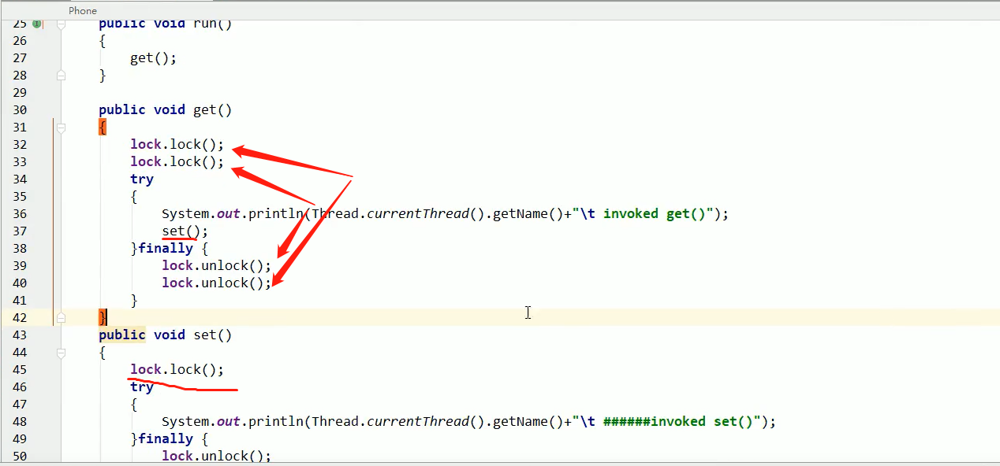

**java锁（公平/非公平/可重入/自旋/独占锁(写锁)/共享锁(读锁)/互斥锁）**

**一、公平锁和非公平锁**

1.什么是公平锁和非公平锁？

​	公平锁：是指多个线程按照申请锁的顺序来获取锁，和排队一样先来后到。

​	非公平锁：获取锁不按申请锁的顺序，可以插队。在高并发的情况下，有可能会造成优先级反转或者饥饿现象.

非公平锁上来就尝试占有锁，如果尝试失败，就采用类似于公平锁的哪种方式。

​	new ReentrantLock()默认为非公平锁.Synchronized也是一种非公平锁 , 优点是比公平锁吞吐量大。


**二、可重入锁（也叫做递归锁）**	

1.什么是可重入锁.

​		指的是同一线程外层获取锁之后，内层递归函数任然能获取该锁的代码，同一个线程在外层方法获取锁的时候，再进入内层方法会自动获取锁。也就是说，**线程可以进入任何一个它已经拥有的锁所同步着的代码块。**(就像进了家里的大门，再进卫生间啥的就不用再开锁了)

ReentrantLock/Synchronized就是典型的可重入锁.

2.可重入锁最大的作用是什么？

​	防止死锁.

3.代码示例如下，最外层进入后，内部就算有其他锁也一马平川. 两个lock(),两个unlock()只要配对也能正常编译运行，不配对能编译但是运行会卡在那里，因为锁不配对.



```java
//jvm指令层面
每个锁对象拥有一个锁计数器和一个指向持有该锁的线程的指针.
 
当执行monitorenter时，如果目标所对象的计数器为零，那么说明它没有被其他线程所持有，Java虚拟机会将该锁对象的持有线程设置为当前线程，并且将其计数器加1。

在目标对象的计数器不为零的情况下，如果锁对象的持有线程是当前线程，那么Java虚拟机可以将其计数器加1，否则需要等待，知道持有线程释放该锁。

当执行monitorexit时，Java虚拟机则需将锁对象的计数器减1。计数器为零代表锁已被释放。


```

**三、自旋锁（spinlock）**

​	是指获取锁的线程**不会立即阻塞，而是采用循环的方式去尝试获取锁**，这样做的好处是减少线程上下文切换的资源消耗，缺点是循环会消耗CPU。


**四、独占锁(写锁)、共享锁(读锁)和互斥锁**

独占锁：指该锁一次只能被一个线程持有，对ReentrantLock和Synchronized而言都是独占锁.

共享锁：该锁可被多个线程持有.

对ReentrantReadWriteLock其读锁是共享锁，其写锁是独占锁。

读锁的共享锁可保证并发读是非常高效的，读写、写读、写写的过程都是互斥的。


