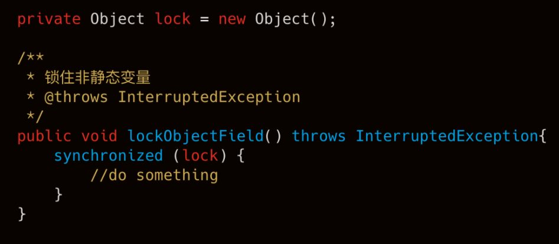
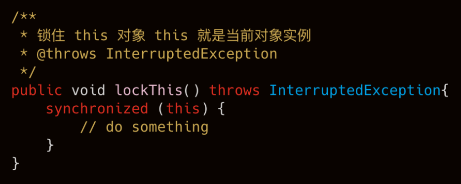
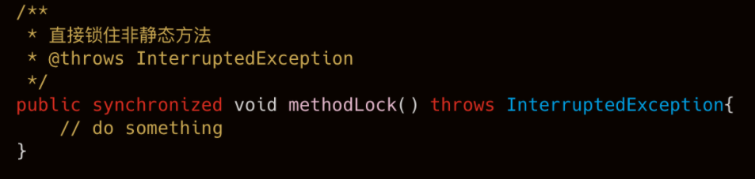
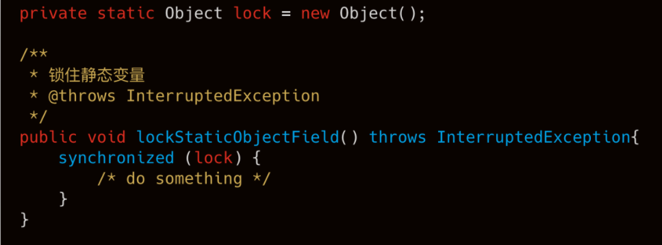
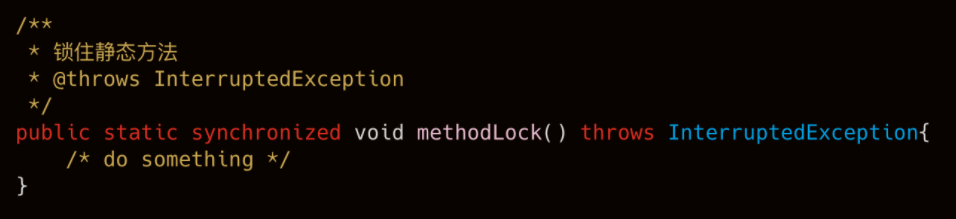
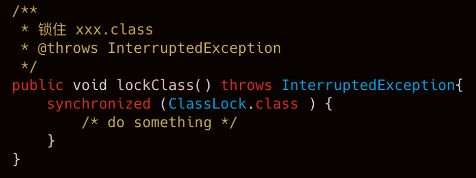

### **对象锁和类锁的区别**（synchronized）

#### **一.实例锁**

​	类声明后，我们可以 new 出来很多的实例对象。这时候，每个实例在 JVM 中都有自己的引用地址和堆内存空间，这时候，我们就认为这些实例都是独立的个体，很显然，在实例上加的锁和其他的实例就没有关系，互不影响了。

通常我们使用实例锁的方式有下面三种：

**1、 锁住实体里的非静态变量**

​	非静态变量是实例自身变量，不会与其他实例共享，所以锁住实体内声明的非静态变量可以实现对象锁。锁住同一个变量的方法块共享同一把锁。

**2、锁住 this 对象**

​	this 指的是当前对象实例本身，所以，所有使用 `synchronized(this) `方式的方法都共享同一把锁。

**3、直接锁非静态方法**

最简单、最直观的一种方式，直接加在方法返回类型前。

​      **使用对象锁的情况，只有使用同一实例的线程才会受锁的影响，多个实例调用同一方法也不会受影响。**

#### **二、类锁**

​	类锁是加载类上的，而类信息是存在 JVM 方法区的，并且整个 JVM 只有一份，方法区又是所有线程共享的，所以类锁是所有线程共享的。

​	使用类锁的方式有如下方式：

**1、锁住类中的静态变量**

​	因为静态变量和类信息一样也是存在方法区的并且整个 JVM 只有一份，所以加在静态变量上可以达到类锁的目的。

**2、直接在静态方法上加 synchronized**

​	因为静态方法同样也是存在方法区的并且整个 JVM 只有一份，所以加在静态方法上可以达到类锁的目的。

**3、锁住 xxx.class**

​	对当前类的 `.class` 属性加锁，可以实现类锁。

**类锁是所有线程共享的锁，所以同一时刻，只能有一个线程使用加了锁的方法或方法体，不管是不是同一个实例。**

