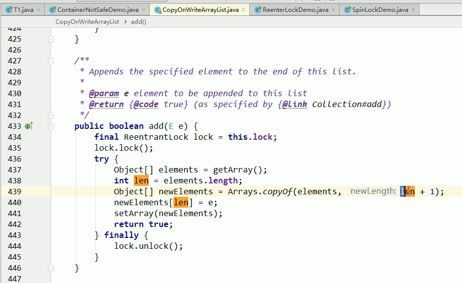
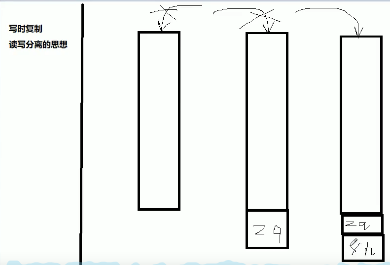

**集合类不安全之并发修改异常**

1.new ArrayList()默认大小是10，扩容机制是1.5倍扩容.(add第1个和add第11个会触发扩容..)

2.ArrayList()、Map、Set是线程不安全的，并发下非常常见的异常：java.util.ConcurrentModificationException

3.java.util.ConcurrentModificationException解决办法； --》写时复制

```java
/*
 *	//不要只是会用，会用撑死就是一个API调用工程师，底层原理？？？
 *	
 *	1.故障现象
 *		Java.util.ConcurrentModifitionException
 *		
 *	2.导致原因
 *		并发争抢修改导致，参考我们花名册的情况。
 *		一个人正在写入，另外一个同学过来争抢，导致数据不一致异常。并发修改异常。
 *	
 *	3.解决方案
 *		3.1 new Vector();//Vector是jdk1.0版本就有的并发安全的类，但是在方法上加synchronized效率低
 *		3.2 Collections.synchronizedList(new ArrayList<>());//用集合工具类Collections
 *		3.3 new CopyOnWriteArrayList();//**写时复制！**
 *
 *	4.优化建议（同样的错误不犯第二次）
 *
 *
 *
 **/


```

4.写时复制CopyOnWrite

​	CopyOnWrite容器即写时复制容器。往一个容器添加元素的时候，不直接往当前容易Object[]添加，而是先将当前容器复制一份，往复制出来的新的Object[] newElements写,添加完元素后，再将原容器的引用指向新的容器setArray(newElements); 这样做的好处是可以对CopyOnWrite容器进行并发的读，而不需要加锁，因为当前容器不会添加任何元素。所以CopyOnWrite容器也是一种读写分离的思想，读和写不同的容器。



