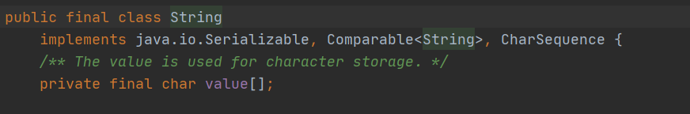
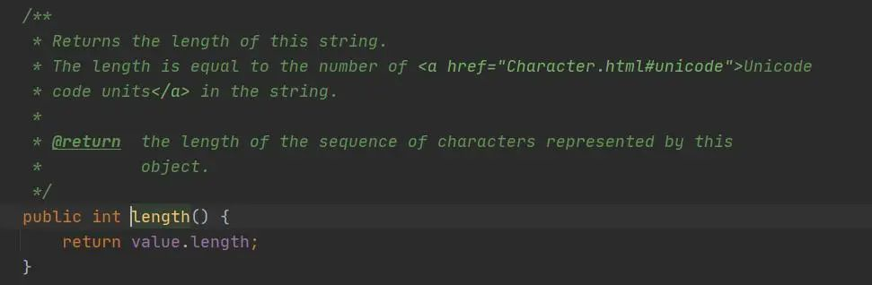
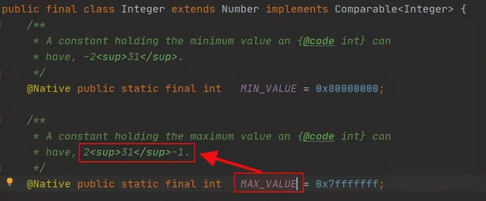
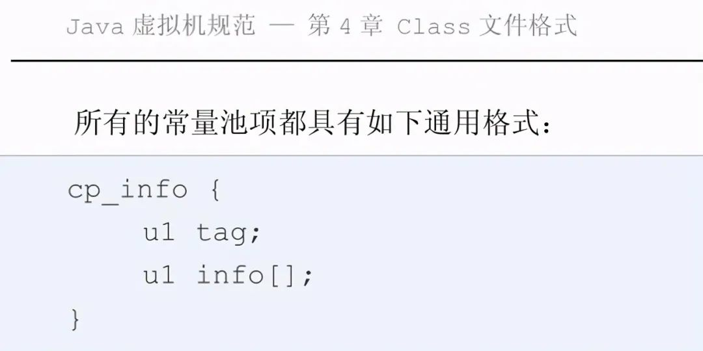
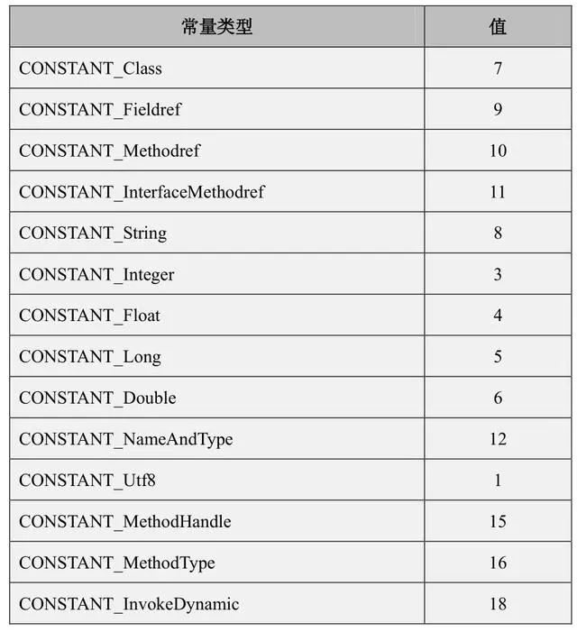
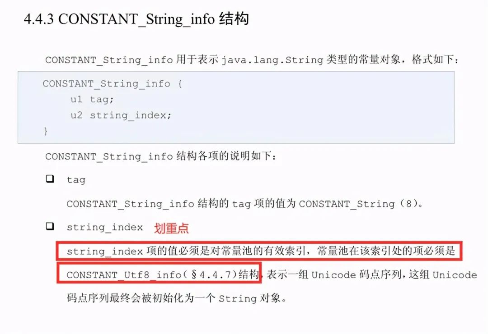
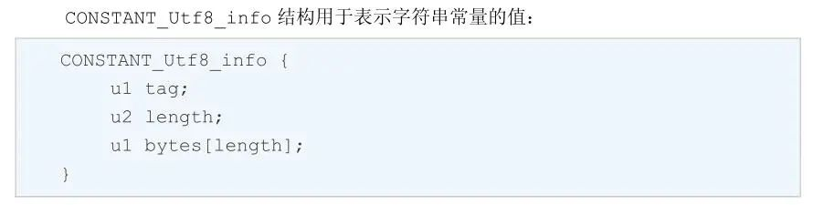

### **String长度有限制吗？是多少？**

#### **1.String底层是用什么存储？**

​		首先要知道String的长度限制我们就需要知道String是怎么存储字符串的，String其实是使用的一个char类型的数组来存储字符串中的字符的。



​		那么String既然是数组存储那数组会有长度的限制吗？是的有限制，但是是在有先提条件下的，我们看看String中返回length的方法。



​		由此我们看到返回值类型是int类型，Java中定义数组是可以给数组指定长度的，当然不指定的话默认会根据数组元素来指定：

```java
int[] arr1 = new int[10]; // 定义一个长度为10的数组
int[] arr2 = {1,2,3,4,5}; // 那么此时数组的长度为5
```

​		整数在java中是有限制的，我们通过源码来看看int类型对应的包装类Integer可以看到，其长度最大限制为2^31 -1，那么说明了数组的长度是0~2^31-1，那么计算一下就是（2^31-1 = 2147483647 = 4GB）



看到这我们尝试通过编码来验证一下上述观点。(发现 String test = "aaaa......";十万个a字符就报错了)

​		以上是我通过定义字面量的形式构造的10万个字符的字符串，编译之后虚拟机提示报错，说我们的字符串长度过长，不是说好了可以存21亿个吗？为什么才10万个就报错了呢？

​		其实这里涉及到了JVM编译规范的限制了，其实JVM在编译时，如果我们将字符串定义成了字面量的形式，编译时JVM是会将其存放在常量池中，这时候JVM对这个常量池存储String类型做出了限制，接下来我们先看下手册是如何说的。

​		

​		常量池中，每个 cp_info 项的格式必须相同，它们都以一个表示 cp_info 类型的单字节 “tag”项开头。后面 info[]项的内容 由tag 的类型所决定。



​		我们可以看到 String类型的表示是 CONSTANT_String ，我们来看下CONSTANT_String具体是如何定义的。



​		这里定义的 u2 string_index 表示的是常量池的有效索引，其类型是CONSTANT_Utf8_info 结构体表示的，这里我们需要注意的是其中定义的length我们看下面这张图。



​		在class文件中u2表示的是无符号数占2个字节单位，我们知道1个字节占8位，2个字节就是16位 ，那么2个字节能表示的范围就是2^16- 1 = 65535 。范中class文件格式对u1、u2的定义的解释做了一下摘要：

> 这里对java虚拟机规摘要部分
> 1、class文件中文件内容类型解释
> 定义一组私有数据类型来表示 Class 文件的内容，它们包括 u1，u2 和 u4，分别代
> 表了 1、2 和 4 个字节的无符号数。
> 每个 Class 文件都是由 8 字节为单位的字节流组成，所有的 16 位、32 位和 64 位长度的数
> 据将被构造成 2 个、4 个和 8 个 8 字节单位来表示。
>
> 
>
> 2、程序异常处理的有效范围解释
> start_pc 和 end_pc 两项的值表明了异常处理器在 code[]数组中的有效范围。
> start_pc 必须是对当前 code[]数组中某一指令的操作码的有效索引，end_pc 要
> 么是对当前 code[]数组中某一指令的操作码的有效索引，要么等于 code_length
> 的值，即当前 code[]数组的长度。start_pc 的值必须比 end_pc 小。
> 当程序计数器在范围[start_pc, end_pc)内时，异常处理器就将生效。即设 x 为
> 异常句柄的有效范围内的值，x 满足：start_pc ≤ x < end_pc。
> 实际上，end_pc 值本身不属于异常处理器的有效范围这点属于 Java 虚拟机历史上
> 的一个设计缺陷：如果 Java 虚拟机中的一个方法的 code 属性的长度刚好是 65535
> 个字节，并且以一个 1 个字节长度的指令结束，那么这条指令将不能被异常处理器
> 所处理。不过编译器可以通过限制任何方法、实例初始化方法或类初始化方法的
> code[]数组最大长度为 65534，这样可以间接弥补这个 BUG。
>
> 
>
> 注意：这里对个人认为比较重要的点做了标记，首先第一个加粗说白了就是说数组有效范围就是【0-65565】但是第二个加粗的地方又解释了，因为虚拟机还需要1个字节的指令作为结束，所以其实真正的有效范围是【0-65564】，这里要注意这里的范围仅限编译时期，如果你是运行时拼接的字符串是可以超出这个范围的。

​		接下来我们通过一个小实验来测试一下我们构建一个长度为65534的字符串，看看是否就能编译通过。
首先通过一个for循环构建65534长度的字符串，在控制台打印后，我们通过自己度娘的一个在线字符统计工具计算了一下确实是65534个字符，具体代码省略，可自行测试。==》String a = 65534个字符，运行成功。


#### **2.总结**

```java
//问：字符串有长度限制吗？是多少？
	答：首先字符串的内容是由一个字符数组 char[] 来存储的，由于数组的长度及索引是整数，且String类中返回字符串长度的方法length() 的返回值也是int ，所以通过查看java源码中的类Integer我们可以看到Integer的最大范围是2^31 -1,由于数组是从0开始的，所以数组的最大长度可以使【0~2^31-1】通过计算是大概4GB。
	//常量池下（jvm在常量池中对String有规定）
	但是通过翻阅java虚拟机手册对class文件格式的定义以及常量池中对String类型的结构体定义我们可以知道对于索引定义了u2，就是无符号占2个字节，2个字节可以表示的最大范围是2^16 -1 = 65535。
其实是65535，但是由于JVM需要1个字节表示结束指令，所以这个范围就为65534了。超出这个范围在编译时期是会报错的，但是运行时拼接或者赋值的话范围是在整形的最大范围。
```


