**每日两道算法题**

## 00Hash相关

- ###### 2021年10月20日 (twosum问题)

```java
//【手写】1.twosum(1)	===================================================
	问题描述：给定一个整数数组 nums 和一个目标值 target，请你在该数组中找出和为目标值的那两个整数，并返回他们的数组下标。你可以假设每种输入只会对应一个答案。但是，你不能重复利用这个数组中同样的元素。
	1)暴力解法 ： 嵌套双重循环
	2)散列表解法：使用散列表，借助hashmap.containsKey()方法.nums[i]依次往hashmap里面丢。
	// 按照上述流程，代码如下
    public int[] twosum(int[] nums, int target){
        // 用于存储数组值（key）和下标（value） 
        HashMap<Integer, Integer> record = new HashMap<>();
        // 存储结果下标数组
        int[] res = new int[2];
        // 开始遍历
        for (int i = 0; i <nums.length ; i++) {
            // 目标与当前值差值
            int complement = target - nums[i];
            // 判断map中是否存在差值
            if(record.containsKey(complement)){
                // 保存当前下标，并退出
                res[0] = i;
                res[1] = record.get(complement);
                break;
            }
            // 将当前值存入hash中
            record.put(nums[i], i);
        }
        return res;
     }


//2.twosum问题：输入不存在相同数，但输出的对数不唯一 =============================

整数数组 nums 中有多对整数相加可以得到 target，根据①的实现方式，只要遍历完整个数组即可。

代码如下：时间复杂度 O(n)，空间复杂度 O(n)

public ArrayList<int[]> twosum_output_contain_duplication(int[] nums, int target){
        // 存储输出结果
        ArrayList<int[]> arrayList = new ArrayList<>();
        // 值和下标的映射
        HashMap<Integer, Integer> hashMap = new HashMap<>();
        for (int i = 0; i < nums.length ; i++) {
            int t = target - nums[i];
            if(hashMap.containsKey(t)){
                // 添加目标值
                int[] res = new int[2];
                res[0] = i;
                res[1] = hashMap.get(t);
                // 保存输出结果
                arrayList.add(res);
            }
            hashMap.put(nums[i], i);
        }
        return arrayList;
    }


```


- ###### 2021年10月21日 （冒泡排序、快速排序、堆排序、归并排序）

**问题：数据量较大时用什么排序方法比较好？**

​	   普遍认为：当N很小时，快速排序慢，归并排序快 ；当N很大时，并且有序程度高时，快速排序最快； 当N很大时，并且有序程序低时，堆排序最快。

​		快速排序是目前基于比较的内部排序中被认为是最好的方法，当待排序的关键字是随机分布时，快速排序的平均时间最短；
​		堆排序所需的辅助空间少于快速排序，并且不会出现快速排序可能出现的最坏情况。这两种排序都是不稳定的。
​		若要求排序稳定，则可选用归并排序。先利用直接插入排序求得较长的有序子文件，然后再两两归并之。因为直接插入排序是稳定的，所以改进后的归并排序仍是稳定的。

​	  但是：由于快速排序不稳定，因此数据量极大时不如选用堆排序。

```java
//【手写】1.冒泡排序	==================================================
1）比较相邻的元素。如果第一个比第二个大，就交换它们两个；
2）对每一对相邻元素作同样的工作，从开始第一对到结尾的最后一对，这样在最后的元素应该会是最大的数；
3）针对所有的元素重复以上的步骤，除了最后一个；
4）重复步骤1~3，直到排序完成。
	/**
      * 冒泡排序
      *
      * @param array
      * @return
      */
     public static int[] bubbleSort(int[] array) {
         if (array.length == 0)
             return array;
         for (int i = 0; i < array.length; i++)
             for (int j = 0; j < array.length - 1 - i; j++)
                 if (array[j + 1] < array[j]) {
                     int temp = array[j + 1];
                     array[j + 1] = array[j];
                     array[j] = temp;
                 }
         return array;
     }

//【手写】2.快速排序	==================================================
快速排序采用分而治之的思想，主要步骤分为以下几步：
	1）从数列中挑出一个元素，称为 "基准"（pivot）;
	2）重新排序数列，所有元素比基准值小的摆放在基准前面，所有元素比基准值大的摆在基准的后面（相同的数可以到任一边）。在这个分区退出之后，该基准就处于数列的中间位置。这个称为分区（partition）操作；
	3）递归地（recursive）把小于基准值元素的子数列和大于基准值元素的子数列排序；
	
	@Override
    public int[] sort(int[] sourceArray) throws Exception {
        // 对 arr 进行拷贝，不改变参数内容
        int[] arr = Arrays.copyOf(sourceArray, sourceArray.length);

        return quickSort(arr, 0, arr.length - 1);
    }

    private int[] quickSort(int[] arr, int left, int right) {
        if (left < right) {
            int partitionIndex = partition(arr, left, right);
            quickSort(arr, left, partitionIndex - 1);
            quickSort(arr, partitionIndex + 1, right);
        }
        return arr;
    }

	/**
	* 核心方法。
	*/
    private int partition(int[] arr, int left, int right) {
        // 设定基准值（pivot）
        int pivot = left;
        int index = pivot + 1;
        for (int i = index; i <= right; i++) {
            if (arr[i] < arr[pivot]) {
                swap(arr, i, index);
                index++;
            }
        }
        swap(arr, pivot, index - 1);
        return index - 1;
    }

    private void swap(int[] arr, int i, int j) {
        int temp = arr[i];
        arr[i] = arr[j];
        arr[j] = temp;
    }

//3.堆排序	     ==================================================
弄清楚什么是堆：完全二叉树&&父节点的值全都大于子节点的值。
答案：https://www.cnblogs.com/guoyaohua/p/8600214.html

//4.归并排序	==================================================
解题思路：
1、申请空间，使其大小为两个已经排序序列之和，该空间用来存放合并后的序列
2、设定两个指针，最初位置分别为两个已经排序序列的起始位置
3、比较两个指针所指向的元素，选择相对小的元素放入到合并空间，并移动指针到下一位置
4、重复步骤3直到某一指针达到序列尾
5、将另一序列剩下的所有元素直接复制到合并序列尾
答案：
https://blog.csdn.net/apei830/article/details/6591632

```


- ###### 2021年10月22日(字符串中的第一个唯一字符（简单）、有效的括号（简单）)

```java
//【手写】1.字符串中的第一个唯一字符（简单）
	题目描述：给定一个字符串，找到它的第一个不重复的字符，并返回它的索引。如果不存在，则返回 -1。【示例：s = "leetcode"，返回 0；s = "loveleetcode"，返回 2。】
	思路与算法(出现和次数有关的，不要犹豫，用hashMap);
/***
	我们可以对字符串进行两次遍历。
	在第一次遍历时，我们使用哈希映射统计出字符串中每个字符出现的次数(这里要熟悉hashMap的getOrDefault(a,"默认值")方法)。在第二次遍历时，我们只要遍历到了一个只出现一次的字符，那么就返回它的索引，否则在遍历结束后返回 -1−1。
*/
	class Solution {
    public int firstUniqChar(String s) {
        Map<Character, Integer> frequency = new HashMap<Character, Integer>();
        for (int i = 0; i < s.length(); ++i) {
            char ch = s.charAt(i);
            frequency.put(ch, frequency.getOrDefault(ch, 0) + 1);
        }
        for (int i = 0; i < s.length(); ++i) {
            if (frequency.get(s.charAt(i)) == 1) {
                return i;
            }
        }
        return -1;
    }
}

//【手写】2.有效的括号（简单）
	题目描述：给定一个只包括 '('，')'，'{'，'}'，'['，']' 的字符串 s ，判断字符串是否有效。有效字符串需满足：
左括号必须用相同类型的右括号闭合。
左括号必须以正确的顺序闭合。

示例 1：
输入：s = "()"
输出：true
示例 2：
输入：s = "()[]{}"
输出：true
示例 3：
输入：s = "(]"
输出：false
示例 4：
输入：s = "([)]"
输出：false
示例 5：
输入：s = "{[]}"
输出：true
提示
1 <= s.length <= 104
s 仅由括号 '()[]{}' 组成

思路：利用栈+哈希表来解决。哈希表将右括号作为键,左括号作为值；利用hashMap.containsKey(x)来找到第一个右括号，然后匹配压入的栈的第一个值，匹配得上就出栈，匹配不上就返回false.->stack空了

class Solution {
    public boolean isValid(String s) {
        int n = s.length();
        if (n % 2 == 1) {
            return false;
        }

        Map<Character, Character> pairs = new HashMap<Character, Character>() {{
            put(')', '(');
            put(']', '[');
            put('}', '{');
        }};
        Deque<Character> stack = new LinkedList<Character>();
        for (int i = 0; i < n; i++) {
            char ch = s.charAt(i);
            if (pairs.containsKey(ch)) {
                if (stack.isEmpty() || stack.peek() != pairs.get(ch)) {
                    return false;
                }
                stack.pop();
            } else {
                stack.push(ch);
            }
        }
        return stack.isEmpty();
    }
}

```


- **2021年10月23日(最小栈(简单)、q316去除重复字母（困难）)**

```java
//1.最小栈(简单)==================================================
题目描述：设计一个支持 push ，pop ，top 操作，并能在常数时间内检索到最小元素的栈。
push(x) —— 将元素 x 推入栈中。
pop() —— 删除栈顶的元素。
top() —— 获取栈顶元素。
getMin() —— 检索栈中的最小元素。

示例:
输入：
["MinStack","push","push","push","getMin","pop","top","getMin"]
[[],[-2],[0],[-3],[],[],[],[]]
输出：
[null,null,null,null,-3,null,0,-2]
解释：
MinStack minStack = new MinStack();
minStack.push(-2);
minStack.push(0);
minStack.push(-3);
minStack.getMin();   --> 返回 -3.
minStack.pop();
minStack.top();      --> 返回 0.
minStack.getMin();   --> 返回 -2.

提示：
pop、top 和 getMin 操作总是在 非空栈 上调用。

class MinStack {
    Deque<Integer> xStack;
    Deque<Integer> minStack;

    public MinStack() {
        xStack = new LinkedList<Integer>();
        minStack = new LinkedList<Integer>();
        minStack.push(Integer.MAX_VALUE);
    }
    
    public void push(int x) {
        xStack.push(x);
        minStack.push(Math.min(minStack.peek(), x));
    }
    
    public void pop() {
        xStack.pop();
        minStack.pop();
    }
    
    public int top() {
        return xStack.peek();
    }
    
    public int getMin() {
        return minStack.peek();
    }
}


```


## 01堆相关

- **2021年10月25日(q295_数据流的中位数（困难）、q480_滑动窗口的中位数（困难）)**

```java
//3.q215_数组中的第k个最大元素（中等）
	快速排序。
//4.q347_前k个高频元素（中等）
	hash、放入数组，再借助快速排序。


```


## 02递归

```java
//1.q21_合并两个有序链表（简单）
	递归

//2.q101_对称二叉树（简单）
	递归

//3.q104_二叉树的最大深度（简单）、手写二叉树的最大宽度。
	递归

//4.q226_翻转二叉树（简单）
	递归

//5.q236_二叉树的最近公共祖先（中等）
	递归解法未理解。暂跳


```

## 03链表操作

```java
//1.q2_两数相加（中等）
	https://leetcode-cn.com/problems/add-two-numbers/solution/hua-jie-suan-fa-2-liang-shu-xiang-jia-by-guanpengc/

//2.q19_删除链表的倒数第N个节点（中等）
	https://leetcode-cn.com/problems/remove-nth-node-from-end-of-list/solution/shan-chu-lian-biao-de-dao-shu-di-nge-jie-dian-b-61/
	（尽量思考多种解法，此处快慢指针待看。）
	
//3.q61_旋转链表（中等）
	https://leetcode-cn.com/problems/rotate-list/solution/xuan-zhuan-lian-biao-by-leetcode-solutio-woq1/

//4.q138_复制带随机指针的链表（中等）
	https://leetcode-cn.com/problems/copy-list-with-random-pointer/solution/fu-zhi-dai-sui-ji-zhi-zhen-de-lian-biao-rblsf/
	
//5.q206_反转链表（简单）

//6.q92_反转链表II（中等）
	https://leetcode-cn.com/problems/reverse-linked-list-ii/solution/fan-zhuan-lian-biao-ii-by-leetcode-solut-teyq/


```

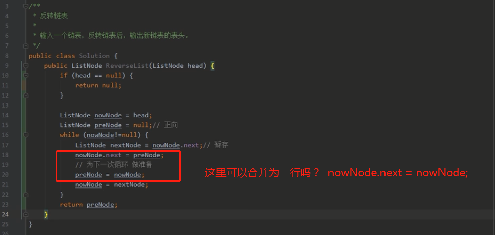


## 04双指针遍历/滑动窗口

```java
//1.q26_删除排序数组中的重复项（简单）
	https://leetcode-cn.com/problems/remove-duplicates-from-sorted-array/solution/shan-chu-pai-xu-shu-zu-zhong-de-zhong-fu-tudo/

//2.q121_买卖股票的最佳时机（简单）
	https://leetcode-cn.com/problems/best-time-to-buy-and-sell-stock/solution/121-mai-mai-gu-piao-de-zui-jia-shi-ji-by-leetcode-/

//3.q977_有序数组的平方（简单）
	方法一：暴力双重循环(差)；  方法二：双指针分情况处理，归并排序。
	https://leetcode-cn.com/problems/squares-of-a-sorted-array/solution/you-xu-shu-zu-de-ping-fang-by-leetcode-solution/

//4.q3_无重复字符的最长子串（中等）
	https://leetcode-cn.com/problems/longest-substring-without-repeating-characters/solution/wu-zhong-fu-zi-fu-de-zui-chang-zi-chuan-by-leetc-2/

//5.q11_盛最多水的容器（中等）
	暂跳
	
//6.q15_三数之和（中等）
	暂跳（解析很长，不过评论中的题解倒是不错，可以看看）
	
//7.q16_最接近的三数之和（中等----未解决）
	暂跳（解析很长）

//8.q209_长度最小的子数组（中等）
	连续的数组长度，可以联想到滑动窗口尝试解决、
https://leetcode-cn.com/problems/minimum-size-subarray-sum/solution/chang-du-zui-xiao-de-zi-shu-zu-by-leetcode-solutio/

//9.q325. 和等于k的最长子数组长度中等----未解决
	暂跳

//10.q904. 水果成篮（中等）
	连续的最值可以想到滑动窗口，尝试解决。
	https://leetcode-cn.com/problems/fruit-into-baskets/solution/shui-guo-cheng-lan-by-leetcode/

//11.q424. 替换后的最长重复字符（中等）
	还需细究，只看了个大概。
	https://leetcode-cn.com/problems/longest-repeating-character-replacement/solution/ti-huan-hou-de-zui-chang-zhong-fu-zi-fu-n6aza/

//12.q713. 乘积小于K的子数组（中等）
	与上题很类似，控制好左右指针，找到左右指针移动的点并做好记录即可。
	https://leetcode-cn.com/problems/subarray-product-less-than-k/


```


## 05快慢指针遍历

```java
//● q141_环形链表LinkedList Cycle简单
	哈希表的解法方式需要手写出来。快慢指针需要看懂思路。
https://leetcode-cn.com/problems/linked-list-cycle/solution/huan-xing-lian-biao-by-leetcode-solution/

//● q202_快乐数Happy Number简单
	解析中在逻辑上排除了第三种情况，故代码比较简单。
https://leetcode-cn.com/problems/happy-number/solution/kuai-le-shu-by-leetcode-solution/

//● q876_链表的中间结点Middle of the LinkedList简单
	简单，应该自己很快就能写出来。
	https://leetcode-cn.com/problems/middle-of-the-linked-list/solution/lian-biao-de-zhong-jian-jie-dian-by-leetcode-solut/

//142. 环形链表II(寻找环起点)
	https://leetcode-cn.com/problems/linked-list-cycle-ii/solution/huan-xing-lian-biao-ii-by-leetcode-solution/


```


## 06分治法/二分法

```java
//33. 搜索旋转排序数组(中等)
二分查找
https://leetcode-cn.com/problems/search-in-rotated-sorted-array/

//34. 在排序数组中查找元素的第一个和最后一个位置(中等)---未解决
https://leetcode-cn.com/problems/find-first-and-last-position-of-element-in-sorted-array/solution/zai-pai-xu-shu-zu-zhong-cha-zhao-yuan-su-de-di-3-4/

```


## 07字符串操作

```java
5.最长回文子串（中等）
	涉及动态规划，暂时跳过，等后续需要先了解动态规划。
https://leetcode-cn.com/problems/longest-palindromic-substring/solution/zui-chang-hui-wen-zi-chuan-by-leetcode-solution/

14. 最长公共前缀（简单）
	https://leetcode-cn.com/problems/longest-common-prefix/solution/zui-chang-gong-gong-qian-zhui-by-leetcode-solution/
6. Z字形变换（中等）
	要写出来不容易。
	https://leetcode-cn.com/problems/zigzag-conversion/solution/z-zi-xing-bian-huan-by-leetcode-solution-4n3u/

763. 划分字母区间（中等）
	大意理解，细节再究。
	https://leetcode-cn.com/problems/partition-labels/solution/hua-fen-zi-mu-qu-jian-by-leetcode-solution/

```

## 08数字操作

```java
7. 整数反转（简单）
	思想简单，但是特殊情况的考虑会复杂一点。
	https://leetcode-cn.com/problems/reverse-integer/solution/tu-jie-7-zheng-shu-fan-zhuan-by-wang_ni_ma/
9. 回文数（简单）
	https://leetcode-cn.com/problems/palindrome-number/solution/hui-wen-shu-by-leetcode-solution/
172. 阶乘后的零（简单）
	https://leetcode-cn.com/problems/factorial-trailing-zeroes/solution/jie-cheng-hou-de-ling-by-leetcode-soluti-1egk/
258. 各位相加（简单）
	寻常思想、和O(1)复杂度的解法都试试
	https://leetcode-cn.com/problems/add-digits/solution/java-o1jie-fa-de-ge-ren-li-jie-by-liveforexperienc/
43. 字符串相乘（中等）
	面的概率不大，但是可以刷，主要培养思路。就算熟练了15分钟也应该基本搞不定。
	https://leetcode-cn.com/problems/multiply-strings/solution/you-hua-ban-shu-shi-da-bai-994-by-breezean/


```

## 09区间合并

```java
56. 合并区间（中等）
	太晚了，没甚耐心，暂跳。
https://leetcode-cn.com/problems/merge-intervals/solution/he-bing-qu-jian-by-leetcode-solution/
986. 区间列表的交集（中等）
	暂跳。
```

## 10数组操作

```java
581. 最短无序连续子数组（简单）
	https://leetcode-cn.com/problems/shortest-unsorted-continuous-subarray/solution/zui-duan-wu-xu-lian-xu-zi-shu-zu-by-leet-yhlf/
54. 螺旋矩阵（中等）
	看懂思路，看不太懂代码。
	https://leetcode-cn.com/problems/spiral-matrix/solution/cxiang-xi-ti-jie-by-youlookdeliciousc-3/
73. 矩阵置零（中等）
	https://leetcode-cn.com/problems/set-matrix-zeroes/solution/ju-zhen-zhi-ling-by-leetcode-solution-9ll7/
384. 打乱数组（中等）
	https://leetcode-cn.com/problems/shuffle-an-array/solution/da-luan-shu-zu-by-leetcode-solution-og5u/
945. 使数组唯一的最小增量（中等）
	https://leetcode-cn.com/problems/minimum-increment-to-make-array-unique/solution/shi-shu-zu-wei-yi-de-zui-xiao-zeng-liang-by-leet-2/
```

## 11树的遍历

```java
110. 平衡二叉树（简单）
	https://leetcode-cn.com/problems/balanced-binary-tree/
107. 二叉树的层次遍历 II（简单）
	https://leetcode-cn.com/problems/binary-tree-level-order-traversal-ii/solution/er-cha-shu-de-ceng-ci-bian-li-ii-by-leetcode-solut/
637. 二叉树的层平均值（简单）
	https://leetcode-cn.com/problems/average-of-levels-in-binary-tree/solution/er-cha-shu-de-ceng-ping-jun-zhi-by-leetcode-soluti/
111. 二叉树的最小深度（简单）
	https://leetcode-cn.com/problems/minimum-depth-of-binary-tree/solution/er-cha-shu-de-zui-xiao-shen-du-by-leetcode-solutio/
112. 路径总和（简单）
	https://leetcode-cn.com/problems/path-sum/solution/lu-jing-zong-he-by-leetcode-solution/
257. 二叉树的所有路径（简单）
	https://leetcode-cn.com/problems/binary-tree-paths/solution/er-cha-shu-de-suo-you-lu-jing-by-leetcode-solution/
94. 二叉树的中序遍历（中等）
102. 二叉树的层序遍历（中等）
144. 二叉树的前序遍历（中等）
145. 二叉树的后序遍历（中等）
	https://blog.csdn.net/My_Jobs/article/details/43451187
● 27 二叉树的镜像
	https://leetcode-cn.com/problems/er-cha-shu-de-jing-xiang-lcof/solution/er-cha-shu-de-jing-xiang-by-leetcode-sol-z44i/
● 28. 对称的二叉树
	https://leetcode-cn.com/problems/dui-cheng-de-er-cha-shu-lcof/solution/dui-cheng-de-er-cha-shu-by-leetcode-solu-rgks/
● 34. 二叉树中和为某一值的路径
	https://leetcode-cn.com/problems/er-cha-shu-zhong-he-wei-mou-yi-zhi-de-lu-jing-lcof/solution/er-cha-shu-zhong-he-wei-mou-yi-zhi-de-lu-68dg/
● 68 二叉树的最近公共祖先（二叉树和二叉搜索树）
	https://leetcode-cn.com/problems/er-cha-sou-suo-shu-de-zui-jin-gong-gong-zu-xian-lcof/solution/er-cha-sou-suo-shu-de-zui-jin-gong-gong-0wpw1/
	https://leetcode-cn.com/problems/er-cha-shu-de-zui-jin-gong-gong-zu-xian-lcof/solution/er-cha-shu-de-zui-jin-gong-gong-zu-xian-6fdt7/
● 54  二叉搜索树的第k大节点
	https://leetcode-cn.com/problems/er-cha-sou-suo-shu-de-di-kda-jie-dian-lcof/solution/mian-shi-ti-54-er-cha-sou-suo-shu-de-di-k-da-jie-d/
103. 二叉树的锯齿形层次遍历（中等）
	https://leetcode-cn.com/problems/binary-tree-zigzag-level-order-traversal/solution/er-cha-shu-de-ju-chi-xing-ceng-xu-bian-l-qsun/
113. 路径总和 II（中等）
	https://leetcode-cn.com/problems/path-sum-ii/solution/lu-jing-zong-he-ii-by-leetcode-solution/

博客题目：前序遍历、中序遍历、后序遍历（这三种属于深度优先）；层次遍历（即广度优先）。
```

## 12二叉搜索树有关

```java
****二叉搜索树的中序遍历的序列是递增排序的序列。****
● q98_验证二叉搜索树（中等）
	https://leetcode-cn.com/problems/validate-binary-search-tree/solution/yan-zheng-er-cha-sou-suo-shu-by-leetcode-solution/
● q450_删除二叉搜索树中的节点（中等）
	https://leetcode-cn.com/problems/delete-node-in-a-bst/solution/shan-chu-er-cha-sou-suo-shu-zhong-de-jie-dian-by-l/
● q701_二叉搜索树中的插入操作（中等）
	https://leetcode-cn.com/problems/insert-into-a-binary-search-tree/solution/er-cha-sou-suo-shu-zhong-de-cha-ru-cao-zuo-by-le-3/
```

## 13.字典树（前缀树）

```java
● q648_单词替换（中等）
	https://leetcode-cn.com/problems/replace-words/solution/dan-ci-ti-huan-by-leetcode/
```

## 14.回溯法

```java
22. 括号生成（中等）
40. 组合总和 II（中等）
78. 子集（中等）
46. 全排列 &    47. 全排列 II（中等）
784. 字母大小写全排列（中等）
494. 目标和（中等）
```

## 15.动态规划

```java
● q53_最大子序和（简单）
● q70_爬楼梯（简单）
● q118_杨辉三角（简单）
● q5_最长回文子串（中等）
● q62_不同路径（中等）
● q64_最小路径和（中等）
● q300_最长上升子序列（中等）
● q1143_最长公共子序列（中等）
● q1277_统计全为1的正方形子矩阵（中等）
● 01背包问题

● 207.课程表（中等）
● 210.课程表2（中等）
● 444.序列重建（中等）

```


=================================》算法视频记录

**20220121第一节**

=========>在面算法的时候，可以准备一直笔一张白纸，面试官不会介意，反而会觉得你准备的很充分。

=========>所有的复杂数据结构都是在数组和链表的基础上改进，所以数组和链表基本操作要熟悉。手写。

=========》手写数组和链表的增删改查操作。要很熟悉。

=========》如果面试官出的题目你没有思路，自信点直接说没有思路，面试官会换一道或引导你。

=========》源码不会就直接说没看过这个源码，没关系。

最佳时间复杂度、平均时间复杂度、最坏时间复杂度。O（n）

空间复杂度：S(n)

int[] [] a = new int[] [] {{},{},{}};

不仅要会写，还要会分析时间、空间复杂度(这里占一半)，还要思考有没有优化空间。

**排序我喜欢考快速排序。**

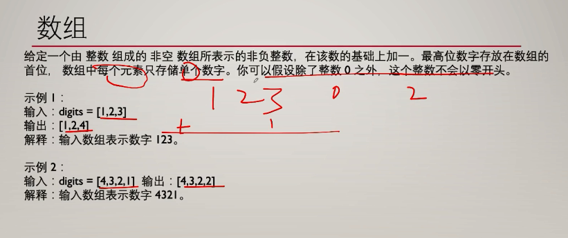

**字符串考察**(物理结构：可以顺序存储，也可以链式存储)

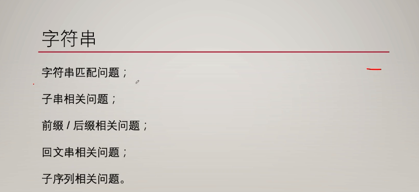


===========》如果 给一个str类型的输入值呢？需要熟悉str的基本方法。

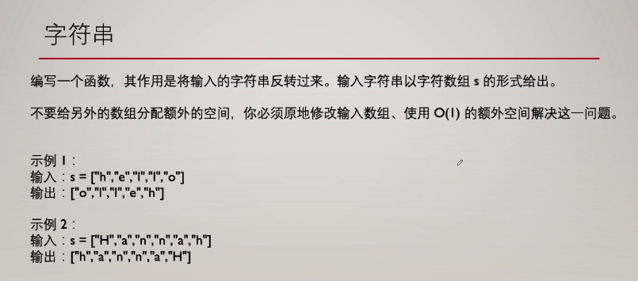 


===========》**链表喜欢考察**：注意链表的结构，是一个Node节点(data+next)

首先链表创建要会定义。(创建的是一个Node节点)

链表增删改查，写的时候最好拿张白纸，把节点和指针给画出来，会更加清晰。

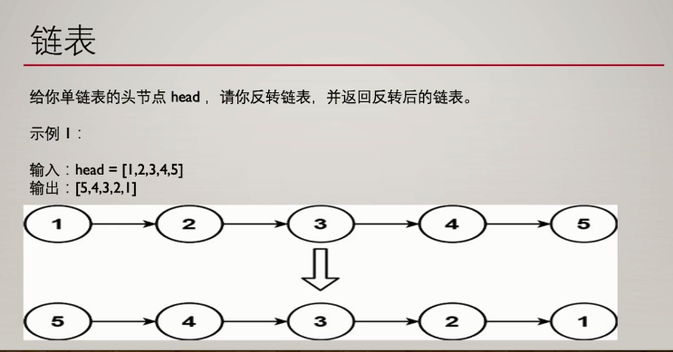


===========》**队列：先进先出**

===========>**堆栈：**只允许在表的一端进行插入和删除操作的线性表。

堆栈经常使用在：操作系统中的函数调用栈，浏览器中的前进、后退功能，翻转一组元素的顺序、铁路列车车辆调度。

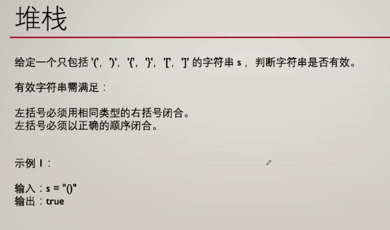


数组的排序：冒泡、选择、插入、快速


===================》2022年2月28日


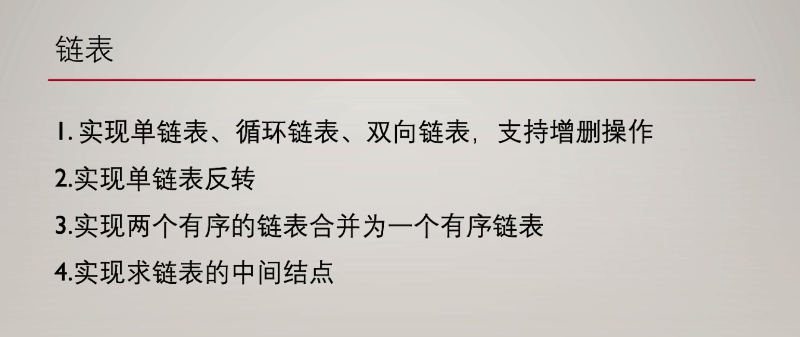


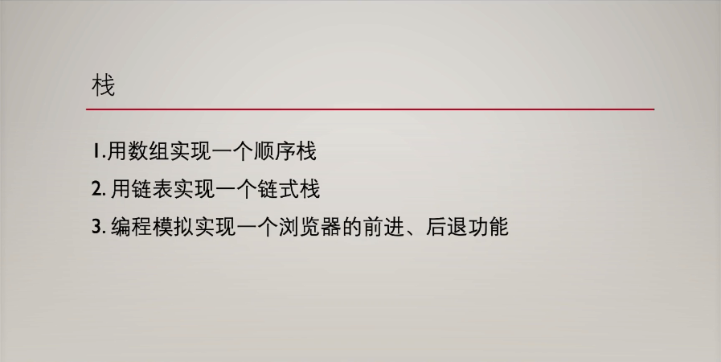

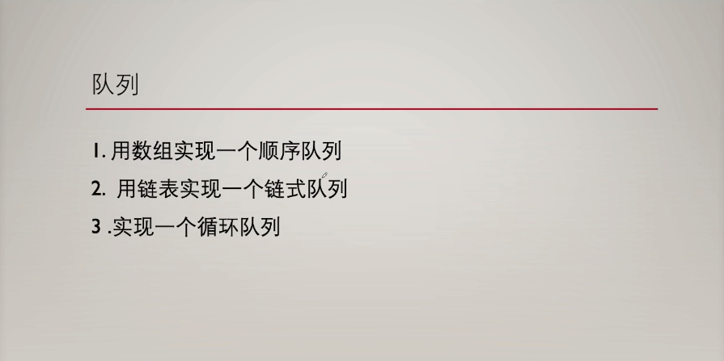

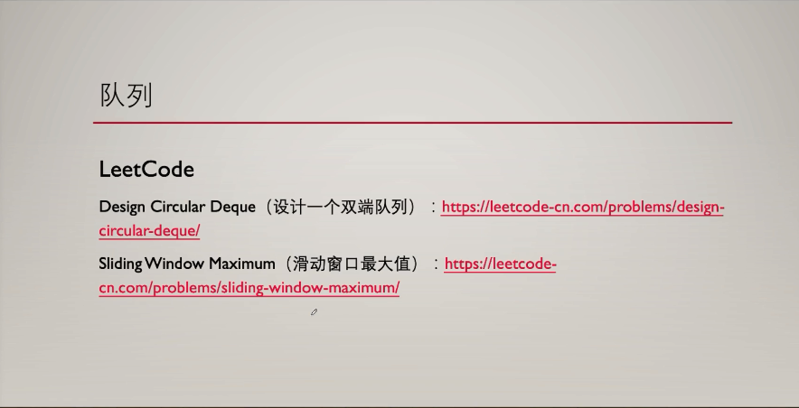

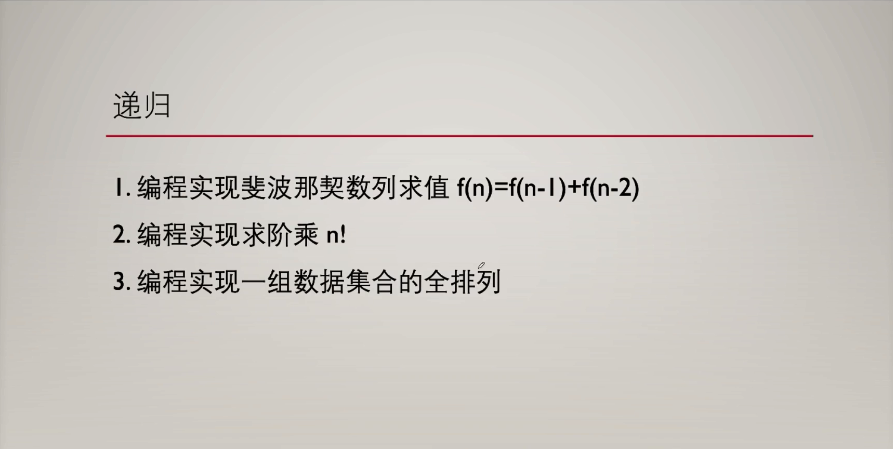

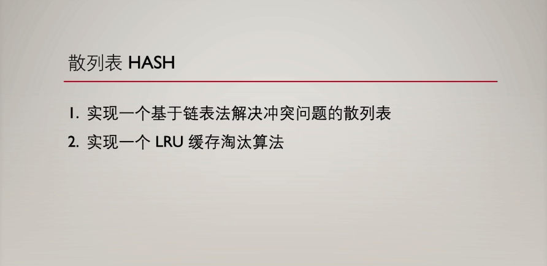

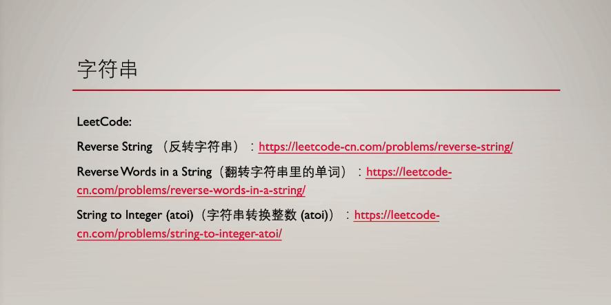

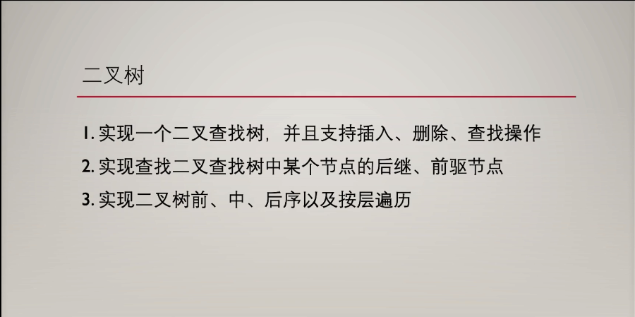

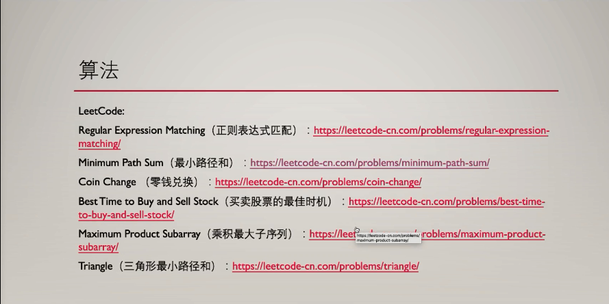

  


 