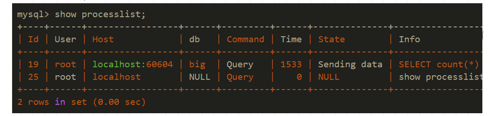

### mysql服务器cpu爆满的解决办法

碰到一个mysql cpu爆满的问题，简单记录下


步骤：

1、通过show processlist找到耗时最长的




2、先杀掉该进程

```
mysql> kill 19;Query OK, 0 rows affected (0.01 sec)
```


3、通过慢查询日志找到具体的sql语句

开启慢查询：

```
[mysqld]slow_query_log=1  #开启慢查询long_query_time=5 #慢查询时间log-slow-queries = /var/log/mysql/slowquery.log #需有写入权限
```


4、使用explain 优化sql语句，

引起cpu过高的sql一般集中在order by、group by、批量insert、嵌套子查询等sql语句中


5、调整my.cnf的query_cache_size和tmp_table_size的值