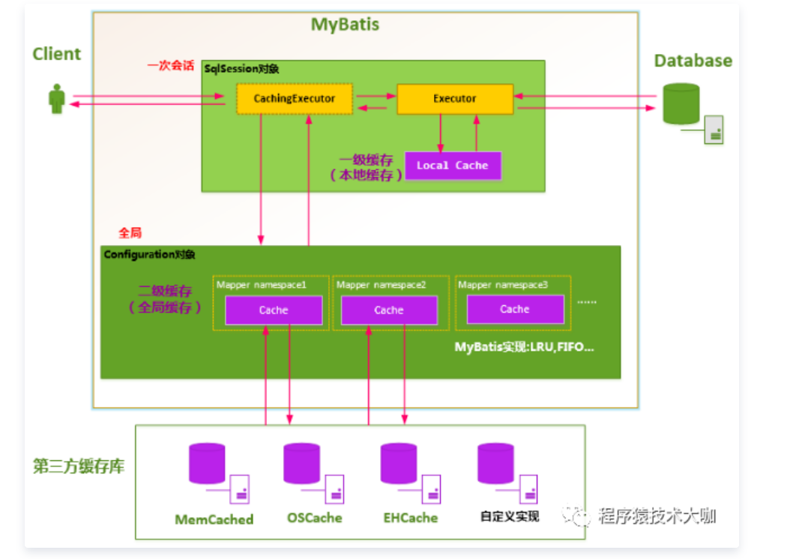
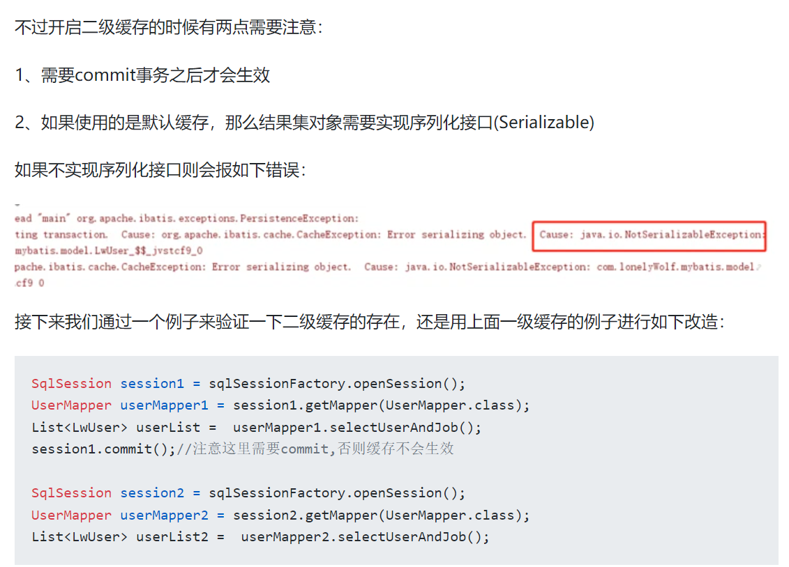

### Mybatis一级、二级缓存

#### 一、mybatis的缓存使用。

​		大体就是首先根据你的sqlid，参数的信息自己算出一个key值，然后你查询的时候，会先把这个key值去缓存中找看有没有value，如果有，直接返回出来，就不查询db了。如果没有，那么查询db，然后将key，value保存到缓存中，以便下次使用。

##### 1.一级缓存

​		Mybatis对缓存提供支持，但是在没有配置的默认情况下，它只开启一级缓存，**一级缓存只是相对于同一个SqlSession而言**。

​		所以在参数和SQL完全一样的情况下，我们使用同一个SqlSession对象调用一个Mapper方法，往往只执行一次SQL，因为使用SelSession第一次查询后，MyBatis会将其放在缓存中，以后再查询的时候，如果没有声明需要刷新，并且缓存没有超时的情况下，SqlSession都会取出当前缓存的数据，而不会再次发送SQL到数据库。


###### 	1.1 一级缓存的生命周期有多长？

​		**1）**MyBatis在开启一个数据库会话时，会 创建一个新的SqlSession对象，SqlSession对象中会有一个新的Executor对象。Executor对象中持有一个新的PerpetualCache对象；当会话结束时，SqlSession对象及其内部的Executor对象还有PerpetualCache对象也一并释放掉。

​		2）如果SqlSession调用了close()方法，会释放掉一级缓存PerpetualCache对象，一级缓存将不可用。

​		3）如果SqlSession调用了clearCache()，会清空PerpetualCache对象中的数据，但是该对象仍可使用。

​		4）SqlSession中执行了任何一个update操作(update()、delete()、insert()) ，都会清空PerpetualCache对象的数据，但是该对象可以继续使用。


###### 	1.2 怎么判断某两次查询是完全相同的查询？

Mybatis认为，对于两次查询，如果以下条件都完全一样，那么就认为它们是完全相同的两次查询。

1）传入的statementId。

2）查询时要求的结果集中的结果范围。

3）这次查询所产生的最终要传递给JDBC java.sql.Preparedstatement的Sql语句字符串（boundSql.getSql() ）。

4）传递给java.sql.Statement要设置的参数值。


###### 	1.3 从源码角度分析mybaits的会话机制。

​	问题：**在同一个方法中，Mybatis多次请求数据库，是否要创建多个SqlSession会话？**

​	回答：**如果多个请求同一个事务中，那么多个请求都在共用一个SqlSession，反之每个请求都会创建一个SqlSession**。(线程事务管理器会获取当前线程ThreadLocal是否有SqlsessionHolder,有就从SqlsessionHolder取出当前sqlSession,没有就从sessionFactory中创建一个SqlSession)

此处详见：https://objcoding.com/2019/03/20/mybatis-sqlsession/


##### 2.二级缓存

​		MyBatis的二级缓存范围是按照每个namepace缓存来存贮和维护，同一个namespace放到一个缓存对象中，当这个namaspace中执行了！insert、update和delete语句的时候，整个namespace中的缓存全部清除掉。



SqlSessionFactory层面上的二级缓存默认是不开启的，二级缓存的开启需要进行配置，实现二级缓存的时候，MyBatis要求返回的POJO必须是可序列化的。也就是要求实现Serializable接口，配置方法很简单，只需要在映射XML文件配置就可以开启缓存了<cache/>，如果我们配置了二级缓存就意味着：

- 映射语句文件中的所有select语句将会被缓存。
- 映射语句文件中的所欲insert、update和delete语句会刷新缓存。
- 缓存会使用默认的Least Recently Used（LRU，最近最少使用的）算法来收回。
- 根据时间表，比如No Flush Interval,（CNFI没有刷新间隔），缓存不会以任何时间顺序来刷新。
- 缓存会存储列表集合或对象(无论查询方法返回什么)的1024个引用
- 缓存会被视为是read/write(可读/可写)的缓存，意味着对象检索不是共享的，而且可以安全的被调用者修改，不干扰其他调用者或线程所做的潜在修改。


#### 二、Cache(二级缓存)使用时的注意事项。

##### 2.1 只能在【只有单表操作】的表上使用缓存

​		 不只是要保证这个表在整个系统中只有单表操作，而且和该表有关的全部操作必须全部在一个namespace下。

##### 2.2 在可以保证查询远远大于insert,update,delete操作的情况下使用缓存

​		这一点不需要多说，所有人都应该清楚。记住，这一点需要保证在1的前提下才可以！

2.3 二级缓存需要commit、结果集对象需要实现序列化接口Serializable.



#### 三、尽可能避免使用二级缓存

​		可能会有很多人不理解这里，二级缓存带来的好处远远比不上他所隐藏的危害。

​		缓存是以namespace为单位的，不同namespace下的操作互不影响。 insert,update,delete操作会清空所在namespace下的全部缓存。 通常使用MyBatis Generator生成的代码中，都是各个表独立的，每个表都有自己的namespace。

##### 3.1 为什么避免使用二级缓存？

​		在符合【Cache使用时的注意事项】的要求时，并没有什么危害。 其他情况就会有很多危害了。

针对一个表的某些操作不在他独立的namespace下进行。 例如在UserMapper.xml中有大多数针对user表的操作。但是在一个XXXMapper.xml中，还有针对user单表的操作。 这会导致user在两个命名空间下的数据不一致。如果在UserMapper.xml中做了刷新缓存的操作，在XXXMapper.xml中缓存仍然有效，如果有针对user的单表查询，使用缓存的结果可能会不正确。 更危险的情况是在XXXMapper.xml做了insert,update,delete操作时，会导致UserMapper.xml中的各种操作充满未知和风险。 有关这样单表的操作可能不常见。但是你也许想到了一种常见的情况。

##### 3.2 多表操作一定不能使用二级缓存

​		为什么不能？ 首先不管多表操作写到那个namespace下，都会存在某个表不在这个namespace下的情况。 例如两个表：role和user_role，如果我想查询出某个用户的全部角色role，就一定会涉及到多表的操作。 

```javascript
<select id="selectUserRoles" resultType="UserRoleVO">
    select * from user_role a,role b where a.roleid = b.roleid and a.userid = #{userid}
</select>
```

像上面这个查询，你会写到那个xml中呢？？

​		不管是写到RoleMapper.xml还是UserRoleMapper.xml，或者是一个独立的XxxMapper.xml中。如果使用了二级缓存，都会导致上面这个查询结果可能不正确。 如果你正好修改了这个用户的角色，上面这个查询使用缓存的时候结果就是错的。 这点应该很容易理解。

​		 在我看来，就以MyBatis目前的缓存方式来看是无解的。**多表操作根本不能缓存。** 如果你让他们都使用同一个namespace（通过<cache-ref>）来避免脏数据，那就失去了缓存的意义。

#### 四、挽救二级缓存(了解)

​		想更高效率的使用二级缓存是解决不了了。但是解决多表操作避免脏数据还是有法解决的。解决思路就是通过拦截器判断执行的sql涉及到那些表（可以用jsqlparser解析），然后把相关表的缓存自动清空。但是这种方式对缓存的使用效率是很低的。 设计这样一个插件是相当复杂的，既然我没想着去实现，就不废话了。

​		最后还是建议，放弃二级缓存，在业务层使用可控制的缓存代替更好。


