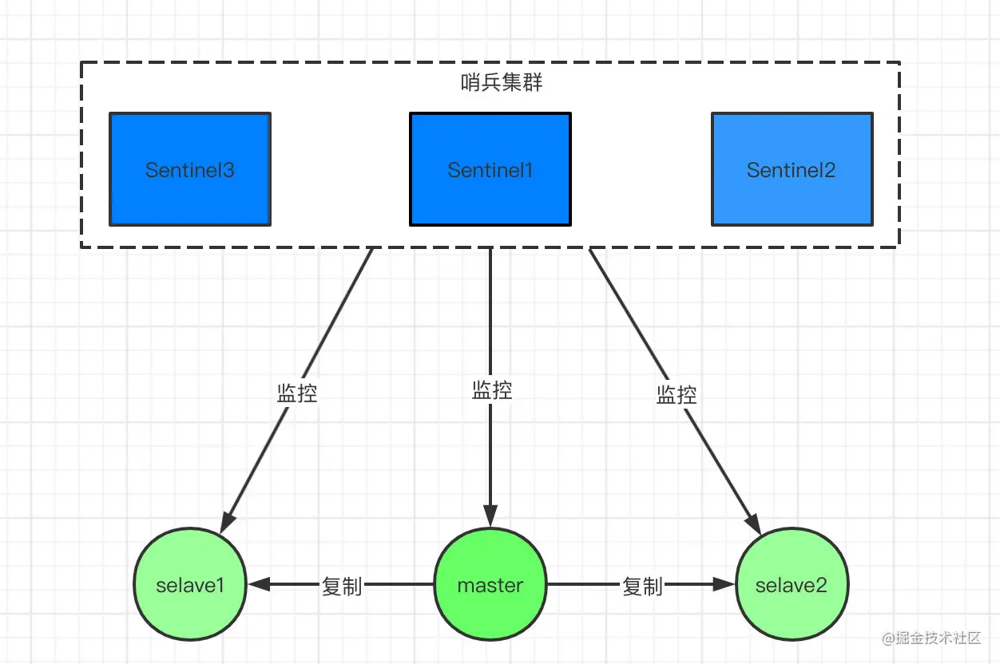

# **redis总结**

#### 1.redis 5大数据类型及使用场景（6.0以后是9大数据类型）


#### 2.基于redis的分布式锁

- **redis命令说明**

```java
//redis命令说明：
（1）setnx命令：set if not exists，当且仅当 key 不存在时，将 key 的值设为 value。若给定的 key 已经存在，则 SETNX 不做任何动作。
返回1，说明该进程获得锁，将 key 的值设为 value
返回0，说明其他进程已经获得了锁，进程不能进入临界区。
命令格式：setnx lock.key lock.value

（2）get命令：获取key的值，如果存在，则返回；如果不存在，则返回nil
命令格式：get lock.key

（3）getset命令：该方法是原子的，对key设置newValue这个值，并且返回key原来的旧值。
命令格式：getset lock.key newValue

（4）del命令：删除redis中指定的key
命令格式：del lock.key

```

##### 2.1 基于set命令的分布式锁

​	1、加锁：使用setnx进行加锁，当该指令返回1时，说明成功获得锁

​	2、解锁：当得到锁的线程执行完任务之后，使用del命令释放锁，以便其他线程可以继续执行setnx命令来获得锁

```
（1）存在的问题：假设线程获取了锁之后，在执行任务的过程中挂掉，来不及显示地执行del命令释放锁，那么竞争该锁的线程都会执行不了，产生死锁的情况。

（2）解决方案：设置锁超时时间
```

​	3、设置锁超时时间：setnx 的 key 必须设置一个超时时间，以保证即使没有被显式释放，这把锁也要在一定时间后自动释放。可以使用expire命令设置锁超时时间

```
（1）存在问题：
setnx 和 expire 不是原子性的操作，假设某个线程执行setnx 命令，成功获得了锁，但是还没来得及执行expire 命令，服务器就挂掉了，这样一来，这把锁就没有设置过期时间了，变成了死锁，别的线程再也没有办法获得锁了。

（2）解决方案：redis的set命令支持在获取锁的同时设置key的过期时间（使之成为一个原子操作）
```

​	**4、使用set命令加锁并设置锁过期时间：**

命令格式：set <lock.key> <lock.value> nx ex <expireTime>

详情参考redis使用文档：http://doc.redisfans.com/string/set.html

```
（1）存在问题：
① 假如线程A成功得到了锁，并且设置的超时时间是 30 秒。如果某些原因导致线程 A 执行的很慢，过了 30 秒都没执行完，这时候锁过期自动释放，线程 B 得到了锁。

② 随后，线程A执行完任务，接着执行del指令来释放锁。但这时候线程 B 还没执行完，线程A实际上删除的是线程B加的锁。

（2）解决方案：
可以在 del 释放锁之前做一个判断，验证当前的锁是不是自己加的锁。在加锁的时候把当前的线程 ID 当做value，并在删除之前验证 key 对应的 value 是不是自己线程的 ID。但是，这样做其实隐含了一个新的问题，get操作、判断和释放锁是两个独立操作，不是原子性。对于非原子性的问题，我们可以使用Lua脚本来确保操作的原子性
```

​	**5、锁续期：**（这种机制类似于redisson的看门狗机制，文章后面会详细说明）

虽然步骤4避免了线程A误删掉key的情况，但是同一时间有 A，B 两个线程在访问代码块，仍然是不完美的。怎么办呢？我们可以让获得锁的线程开启一个**守护线程**，用来给快要过期的锁“续期”。

```
① 假设线程A执行了29 秒后还没执行完，这时候守护线程会执行 expire 指令，为这把锁续期 20 秒。守护线程从第 29 秒开始执行，每 20 秒执行一次。

② 情况一：当线程A执行完任务，会显式关掉守护线程。

③ 情况二：如果服务器忽然断电，由于线程 A 和守护线程在同一个进程，守护线程也会停下。这把锁到了超时的时候，没人给它续命，也就自动释放了。
```


##### 2.2 基于setnx、get、getset的分布式锁

​	**1、实现原理：**

```
（1）setnx(lockkey, 当前时间+过期超时时间) ，如果返回1，则获取锁成功；如果返回0则没有获取到锁，转向步骤(2)

（2）get(lockkey)获取值oldExpireTime ，并将这个value值与当前的系统时间进行比较，如果小于当前系统时间，则认为这个锁已经超时，可以允许别的请求重新获取，转向步骤(3)

（3）计算新的过期时间 newExpireTime=当前时间+锁超时时间，然后getset(lockkey, newExpireTime) 会返回当前lockkey的值currentExpireTime

（4）判断 currentExpireTime 与 oldExpireTime 是否相等，如果相等，说明当前getset设置成功，获取到了锁。如果不相等，说明这个锁又被别的请求获取走了，那么当前请求可以直接返回失败，或者继续重试。

（5）在获取到锁之后，当前线程可以开始自己的业务处理，当处理完毕后，比较自己的处理时间和对于锁设置的超时时间，如果小于锁设置的超时时间，则直接执行del命令释放锁（释放锁之前需要判断持有锁的线程是不是当前线程）；如果大于锁设置的超时时间，则不需要再锁进行处理。
```


​	**2、代码实现：**

（1）获取锁的实现方式：

```java
public boolean lock(long acquireTimeout, TimeUnit timeUnit) throws InterruptedException {
    acquireTimeout = timeUnit.toMillis(acquireTimeout);
    long acquireTime = acquireTimeout + System.currentTimeMillis();
    //使用J.U.C的ReentrantLock
    threadLock.tryLock(acquireTimeout, timeUnit);
    try {
    	//循环尝试
        while (true) {
        	//调用tryLock
            boolean hasLock = tryLock();
            if (hasLock) {
                //获取锁成功
                return true;
            } else if (acquireTime < System.currentTimeMillis()) {
                break;
            }
            Thread.sleep(sleepTime);
        }
    } finally {
        if (threadLock.isHeldByCurrentThread()) {
            threadLock.unlock();
        }
    }
 
    return false;
}
 
public boolean tryLock() {
 
    long currentTime = System.currentTimeMillis();
    String expires = String.valueOf(timeout + currentTime);
    //设置互斥量
    if (redisHelper.setNx(mutex, expires) > 0) {
    	//获取锁，设置超时时间
        setLockStatus(expires);
        return true;
    } else {
        String currentLockTime = redisUtil.get(mutex);
        //检查锁是否超时
        if (Objects.nonNull(currentLockTime) && Long.parseLong(currentLockTime) < currentTime) {
            //获取旧的锁时间并设置互斥量
            String oldLockTime = redisHelper.getSet(mutex, expires);
            //旧值与当前时间比较
            if (Objects.nonNull(oldLockTime) && Objects.equals(oldLockTime, currentLockTime)) {
            	//获取锁，设置超时时间
                setLockStatus(expires);
                return true;
            }
        }
 
        return false;
    }
}
```

tryLock方法中，主要逻辑如下：lock调用tryLock方法，参数为获取的超时时间与单位，线程在超时时间内，获取锁操作将自旋在那里，直到该自旋锁的保持者释放了锁。

（2）释放锁的实现方式：

```java
public boolean unlock() {
    //只有锁的持有线程才能解锁
    if (lockHolder == Thread.currentThread()) {
        //判断锁是否超时，没有超时才将互斥量删除
        if (lockExpiresTime > System.currentTimeMillis()) {
            redisHelper.del(mutex);
            logger.info("删除互斥量[{}]", mutex);
        }
        lockHolder = null;
        logger.info("释放[{}]锁成功", mutex);
 
        return true;
    } else {
        throw new IllegalMonitorStateException("没有获取到锁的线程无法执行解锁操作");
    }
}
```

```
存在问题：

（1）这个锁的核心是基于System.currentTimeMillis()，如果多台服务器时间不一致，那么问题就出现了，但是这个bug完全可以从服务器运维层面规避的，而且如果服务器时间不一样的话，只要和时间相关的逻辑都是会出问题的

（2）如果前一个锁超时的时候，刚好有多台服务器去请求获取锁，那么就会出现同时执行redis.getset()而导致出现过期时间覆盖问题，不过这种情况并不会对正确结果造成影响

（3）存在多个线程同时持有锁的情况：如果线程A执行任务的时间超过锁的过期时间，这时另一个线程就可以获得这个锁了，造成多个线程同时持有锁的情况。类似于方案一，可以使用“锁续期”的方式来解决。
————————————————
```


##### 2.3 前两种分布式锁存在的问题

​		前面两种redis分布式锁的实现方式，如果从“高可用”的层面来看，仍然是有所欠缺，也就是说当 redis 是单点的情况下，当发生故障时，则整个业务的分布式锁都将无法使用。

​		为了提高可用性，我们可以使用主从模式或者哨兵模式，但在这种情况下仍然存在问题，在主从模式或者哨兵模式下，正常情况下，如果加锁成功了，那么master节点会异步复制给对应的slave节点。但是如果在这个过程中发生master节点宕机，主备切换，slave节点从变为了 master节点，而锁还没从旧master节点同步过来，这就发生了锁丢失，会导致多个客户端可以同时持有同一把锁的问题。来看个图来想下这个过程：


那么，如何避免这种情况呢？redis 官方给出了基于多个 redis 集群部署的高可用分布式锁解决方案：RedLock.【但是目前国内互联网大厂都没有用RedLock，因为RedLock目前还存在一些安全性的争议，存在一些可能引发的问题】


##### 2.4 基于RedLock的分布式锁

​	【但是目前国内互联网大厂都没有用RedLock，都是用类似于看门狗的机制，因为RedLock目前还存在一些安全性的争议，存在一些可能引发的问题】

```
基于RedLock的分布式锁有点类似于Zookeeper分布式锁。master节点获取锁后，它需要半数以上salve从master那里拿到该锁，master才会通知客户端加锁成功。假设master挂了，它有一套自己的机制(Zookeeper中是ZBA)保证接下来选举的节点是已经拿到锁的salve节点。
```


##### 2.5 基于Redisson看门狗的分布式锁

​		前面说了，如果某些原因导致持有锁的线程在锁过期时间内，还没执行完任务，而锁因为还没超时被自动释放了，那么就会导致多个线程同时持有锁的现象出现，而为了解决这个问题，可以进行“锁续期”。其实，在JAVA的Redisson包中有一个"看门狗"机制，已经帮我们实现了这个功能。

​	**1、redisson原理：**

redisson在获取锁之后，会维护一个看门狗线程，当锁即将过期还没有释放时，不断的延长锁key的生存时间


​	**2、加锁机制：**

线程去获取锁，获取成功：执行lua脚本，保存数据到redis数据库。

线程去获取锁，获取失败：一直通过while循环尝试获取锁，获取成功后，执行lua脚本，保存数据到redis数据库。

​	**3、watch dog自动延期机制：**

```java
	看门狗启动后，对整体性能也会有一定影响，默认情况下看门狗线程是不启动的。如果使用redisson进行加锁的同时设置了锁的过期时间，也会导致看门狗机制失效。【看门狗会默认处理设置锁的过期时间为30s，然后每隔10s续命一次】
```

redisson在获取锁之后，会维护一个看门狗线程，在每一个锁设置的过期时间的1/3处，如果线程还没执行完任务，则不断延长锁的有效期。看门狗的检查锁超时时间默认是30秒，可以通过 lockWactchdogTimeout 参数来改变。

```
加锁的时间默认是30秒，如果加锁的业务没有执行完，那么每隔 30 ÷ 3 = 10秒，就会进行一次续期，把锁重置成30秒，保证解锁前锁不会自动失效。
```

那万一业务的机器宕机了呢？如果宕机了，那看门狗线程就执行不了了，就续不了期，那自然30秒之后锁就解开了呗。

​	**4、redisson分布式锁的关键点：**

```
a. 对key不设置过期时间，由Redisson在加锁成功后给维护一个watchdog看门狗，watchdog负责定时监听并处理，在锁没有被释放且快要过期的时候自动对锁进行续期，保证解锁前锁不会自动失效

b. 通过Lua脚本实现了加锁和解锁的原子操作

c. 通过记录获取锁的客户端id，每次加锁时判断是否是当前客户端已经获得锁，实现了可重入锁。
```


#### 3.redis的主从、哨兵和集群模式

##### **3.1 主从模式**

​	主从复制，是指将一台Redis服务器的数据，复制到其他的Redis服务器。

​	前者称为主节点(master)，后者称为从节点(slave)；数据的复制是单向的，只能由主节点到从节点。

			

​	主从模式配置很简单，只需要在从节点配置主节点的ip和端口号即可。

```shell
slaveof <masterip> <masterport>
# 例如
# slaveof 192.168.1.214 6379
```

​	启动**主从**节点的所有服务，查看日志即可以看到**主从**节点之间的服务连接。

​	从上面很容易就想到一个问题，既然主从复制，意味着master和slave的数据都是一样的，有数据冗余问题。

​	在程序设计上，为了高可用性和高性能，是允许有冗余存在的。这点希望大家在设计系统的时候要考虑进去，不用为公司节省这一点资源。

​	对于追求极致**用户体验**的产品，是绝对不允许有**宕机**存在的。

​	主从模式在很多系统设计时都会考虑，一个master挂在多个slave节点，当master服务宕机，会**选举**产生一个新的master节点，从而保证服务的高可用性。

###### **主从模式的优点：**

```java
//1.一旦 主节点宕机，从节点 作为 主节点 的 备份 可以随时顶上来。
//2.扩展 主节点 的 读能力，分担主节点读压力。
//3.高可用基石：除了上述作用以外，主从复制还是哨兵模式和集群模式能够实施的基础，因此说主从复制是Redis高可用的基石。
```

###### **主从模式的缺点：**

```java
//1.一旦 主节点宕机，从节点 晋升成 主节点，同时需要修改 应用方 的 主节点地址，还需要命令所有 从节点 去 复制 新的主节点，整个过程需要 人工干预。
//2.主节点 的 写能力 受到 单机的限制。
//3.主节点 的 存储能力 受到 单机的限制。
```


##### **3.2 哨兵模式**

​		刚刚提到了，主从模式，当主节点宕机之后，从节点是可以作为主节点顶上来，继续提供服务的。但是有一个问题，主节点的IP已经变动了，此时应用服务还是拿着**原**主节点的地址去访问，这...

​		于是，在Redis 2.8版本开始引入，就有了哨兵这个概念。在**复制的基础**上，哨兵实现了**自动化**的故障恢复。



如图，哨兵节点由两部分组成，哨兵节点和数据节点：

- 哨兵节点：哨兵系统由一个或多个哨兵节点组成，哨兵节点是特殊的redis节点，不存储数据。

- 数据节点：主节点和从节点都是数据节点。

  访问redis集群的数据都是通过哨兵集群的，哨兵监控整个redis集群。

​       一旦发现redis集群出现了问题，比如刚刚说的主节点挂了，从节点会顶上来。但是主节点地址变了，这时候应用服务无感知，也不用更改访问地址，因为哨兵才是和应用服务做交互的。

​       Sentinel 很好的解决了故障转移，在高可用方面又上升了一个台阶，当然Sentinel还有其他功能。

​       比如 **主节点存活检测**、**主从运行情况检测**、**主从切换**。

​       Redis的Sentinel最小配置是 **一主一从**。

###### **说下哨兵模式监控的原理**

​		每个Sentinel以 每秒钟 一次的频率，向它**所有**的 **主服务器**、**从服务器** 以及其他Sentinel**实例** 发送一个PING 命令。


​		如果一个 实例（instance）距离最后一次有效回复 PING命令的时间超过 down-after-milliseconds 所指定的值，那么这个实例会被 Sentinel标记为 **主观下线**。

​		如果一个 **主服务器** 被标记为 **主观下线**，那么正在 监视 这个 主服务器 的**所有** Sentinel 节点，要以 **每秒一次** 的频率确认 该主服务器是否的确进入了 **主观下线** 状态。

​		如果一个 主服务器 被标记为 主观下线，并且有 **足够数量** 的 Sentinel（至少要达到配置文件指定的数量）在指定的 **时间范围** 内同意这一判断，那么这个该主服务器被标记为 **客观下线**。

​		在一般情况下， 每个 Sentinel 会以每 10秒一次的频率，向它已知的所有 主服务器 和 从服务器 发送 INFO 命令。

​		当一个 **主服务器** 被 Sentinel标记为 **客观下线** 时，Sentinel 向 下线主服务器 的所有 从服务器 发送 INFO 命令的频率，会从10秒一次改为 每秒一次。

​		Sentinel和其他 Sentinel 协商 **主节点** 的状态，如果 主节点处于 **SDOWN`状态，则投票自动选出**新的主节点。将剩余的 **从节点** 指向 **新的主节点** 进行 **数据复制**。

​		当没有足够数量的 Sentinel 同意 主服务器 下线时， 主服务器 的 **客观下线状态** 就会被移除。当 **主服务器** 重新向 Sentinel的PING命令返回 有效回复 时，主服务器 的 **主观下线状态** 就会被移除。

###### **哨兵模式的优缺点**

```java
   优点：
	哨兵模式是基于主从模式的，所有主从的优点，哨兵模式都具有。主从可以自动切换，系统更健壮，可用性更高。Sentinel 会不断的检查 主服务器 和 从服务器 是否正常运行。当被监控的某个 Redis 服务器出现问题，Sentinel 通过API脚本向管理员或者其他的应用程序发送通知。
​   缺点：
Redis较难支持在线扩容，对于集群，容量达到上限时在线扩容会变得很复杂。

```


##### **3.3集群模式**

​		主从不能解决故障自动恢复问题，哨兵已经可以解决故障自动恢复了，那到底为啥还要集群模式呢？

​		主从和哨兵都还有另外一些问题没有解决，单个节点的存储能力是有上限，访问能力是有上限的。

​		Redis Cluster 集群模式具有 **高可用**、**可扩展性**、**分布式**、**容错** 等特性。

###### **Cluster 集群模式的原理**

​		通过数据分片的方式来进行数据共享问题，同时提供数据复制和故障转移功能。

​		之前的两种模式数据都是在一个节点上的，单个节点存储是存在上限的。集群模式就是把数据进行分片存储，当一个分片数据达到上限的时候，就分成多个分片。

###### **数据分片怎么分？**

​		集群的键空间被分割为16384个slots（即hash槽），通过hash的方式将数据分到不同的分片上的。

```java
HASH_SLOT = CRC16(key) & 16384 
```

​		CRC16是一种循环校验算法，这里不是我们研究的重点，有兴趣可以看看。

​		这里用了**位运算**得到取模结果，位运算的速度高于取模运算。


有一个很重要的问题，为什么是分割为16384个槽？这个问题可能会被面试官随口一问

###### **数据分片之后怎么查，怎么写？**


​		读请求分配给slave节点，写请求分配给master，数据同步从master到slave节点。

​		**读写分离**提高并发能力，增加高性能。

###### 如何做到水平扩展？


​		master节点可以做扩充，数据迁移redis内部自动完成。

​		当你新增一个master节点，需要做数据迁移，redis服务不需要下线。举个栗子：上面的有三个master节点，意味着redis的槽被分为三个段，假设三段分别是0~7000，7001~12000、12001~16383。

​		现在因为业务需要新增了一个master节点，四个节点共同占有16384个槽。

​		槽需要重新分配，数据也需要重新迁移，但是服务不需要下线。

​		redis集群的重新分片由redis内部的管理软件redis-trib负责执行。redis提供了进行重新分片的所有命令，redis-trib通过向节点发送命令来进行重新分片。

###### 如何做故障转移？


​	假如途中红色的节点故障了，此时master3下面的从节点会通过 **选举** 产生一个主节点。替换原来的故障节点。

此过程和哨兵模式的故障转移是一样的。


#### 4.redis常见问题


#### 5.其他

```java
/**************************************早期笔记**************************************/
1.redis本质是一个key-value类型的内存数据库，定期通过异步操作把数据库数据flush到硬盘上进行保存。因为是纯内存操作，redis最大可以处理10万次读写操作/s，是目前最快的key-value数据库。Redis最大的魅力是它支持保存多种数据结构，此外单个value最大限制是1GB，不像memcached只能保存1MB的数据。

2.redis的主要缺点是数据库容量受到物理内存的限制，不能用作海量数据的高性能读写，因此Redis主要应用场景限制在较小数据量的高性能操作上。

3.redis的并发竞争问题如何解决？

​	Redis是单进程单线程的模式，采用队列模式将并发访问变为串行访问。Redis本身没有锁的概念，Redis对于多个客户端连接并不存在竞争，Jedis客户端进行并发访问时产生的问题可以对客户端读写Redis操作采用内部锁Synchronized来解决。

4.Redis中事务的实现特征.

- 在事务中所有命令都将会被串行化的顺序执行，事务执行期间，Redis不会再为其他客户端的请求提供任何服务，从而保证了事务中的所有命令原子执行。
- Redis事务中如果有一条命令执行失败，其后的命令仍然会继续执行。这一点和mysql有些不同。
- 开启事务用MULTI命令，提交/回滚事务用EXEC/DISCARD命令.
- 如果事务MULTIK开启且刚好在EXEC命令结束之后宕机，那么该事务中的所有命令都会被服务器执行。因为此时所有写操作会被写入磁盘，开机后会进行一致性检测，不一致会报错并回滚。

5.使用过Redis分布式锁么，它是什么回事？
```

#### **6.参考文献**

1）https://juejin.cn/post/6844904191236767751【redis分布式锁】


