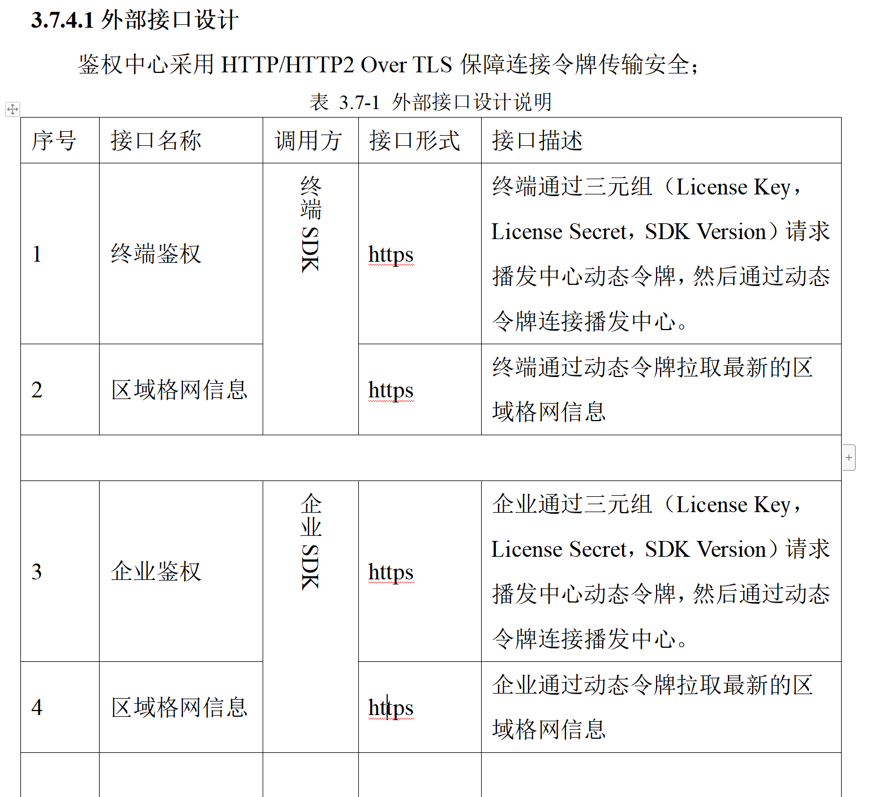

大网运营系统

#### 一、业务领域划分图

#### 二、业务运营系统架构

#### 三、物理部署与内部模块关系图

#### 四、服务之间交互

#### 五、模块详设

//============>先理解业务需求和技术架构

##### 5.1 产品中心(**)

​		运营系统有轨道、钟差、码偏差、相位偏差、斜路径电离层、垂直电离层、格网对流层、区域定义等八种数据产品，系统提供给用户的是这几种数据产品的组装服务产品。

产品管理主要包括了用户对系统所提供的数据产品的查看，包括数据和服务产品列表、数据产品详情、产品覆盖范围等，而运维人员不仅可以查看还可以添加和修改服务产品及服务节点的配置信息等。

##### 5.2 客户中心

​		系统的客户分为个人、企业两大类。其中企业客户分为线下签订合同的大客户和线上购买产品及服务的中小企业客户。本期项目仅提供对大客户的管理功能。

市场销售人员完成与客户合同签署后，向运营人员提供客户营业执照、联系人等相关信息。

​		客户资料管理主要包括了对客户、帐户进行的日常管理，包括创建和更新客户基本资料、扩展资料，创建和更新帐户资料；客户资料管理的主要目的是建立并维护完整的客户资料数据，实现统一的客户视图。

##### 5.3 合同订单中心

​		至2021年6月，满足我公司对大型企业客户和政府业务的服务需求。在此阶段，上述两类客户将通过合同的方式，与我公司签订产品及服务购买合同。

​		一个合同订单可对应一个或多个服务实例。

##### 5.4 服务中心

​	**5.4.1服务中心流程处理**

​	描述了服务管理、license管理的业务流程。

​	**5.4.1.1购买**

​	运维人员根据合同或试用说明的内容，选择产品，创建相应的服务实例，并设定服务实例的开始和结束时间；根据服务实例的开始时间和产品信息创建license，并设置license激活开始时间和产品信息，自分发服务实例只允许创建一个license。

​	**5.4.1.2续费**

​	运维人员根据续费合同或试用说明内的时间和产品，创建新的服务实例；新服务实例绑定续费的license或创建新的license。续费的license进行有效期延后处理。若是已过期的license进行续费，则重置激活状态和激活时间，并根据合同重新设定激活开始时间。

​	**5.4.1.3认证**

​	系统接收license认证结果消息，更新license的激活状态、激活时间、认证时间、认证结果信息。

##### 5.5 客服中心

​		故障申告：用户可以选择常用故障类型（如：硬件产品、定位服务），输入问题标题、故障名称、描述、地点及时间，并可上传故障图片、预留联系人等信息。

​		故障查询：默认展示全部当前故障，用户可按照故障类型、时间段等信息对当前或历史故障进行查询。故障信息应至少包括：故障类型、服务实例信息、故障状态、关联设备信息、故障描述等，并针对每条故障提供故障操作功能。

​		流程查看：系统能够以可视化流程图的方式，及时展示故障处理所在节点及处理时间等信息。

​		详单查询：用户可以查看故障的详细信息，并可对相关信息进行修改。

​		故障操作：系统应提供撤单、修改等操作，对于撤单的故障，系统应提请用户输入原因，故障单状态变为“用户关闭”，并自动归档。

##### 5.6 报表中心(**)

​		有一部分是大数据相关，有一部分是自己的相关。

##### 5.7 鉴权子中心(**)

##### 5.8 用户中心(**)

##### 5.9 权限中心(**)

数据过滤采用AOP统一进行SQL组装，筛选用户权限范围内的数据。

##### 5.10 日志中心(**)

