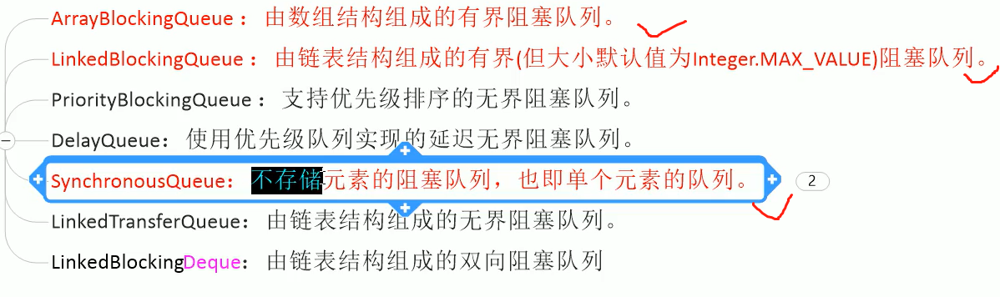
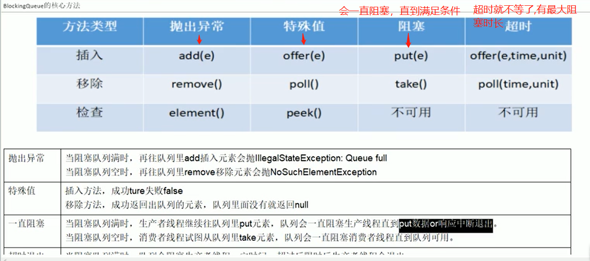
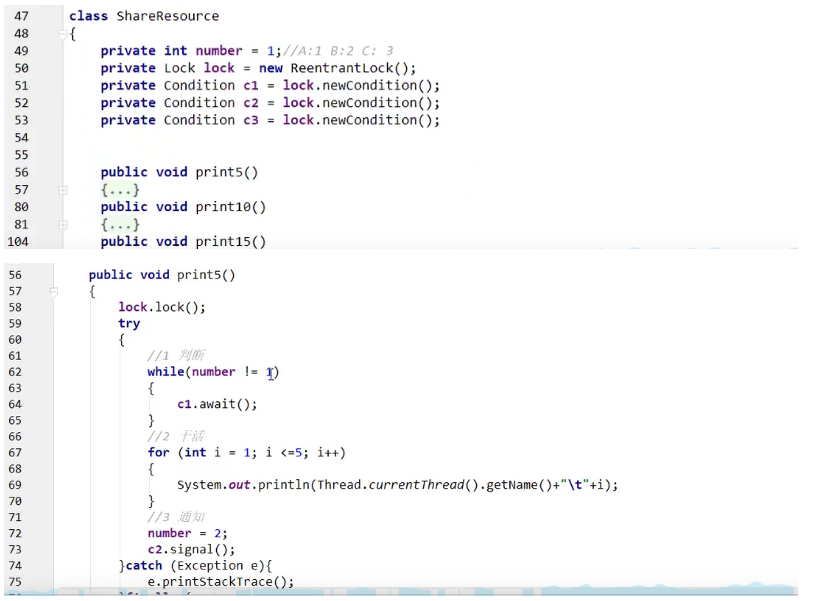
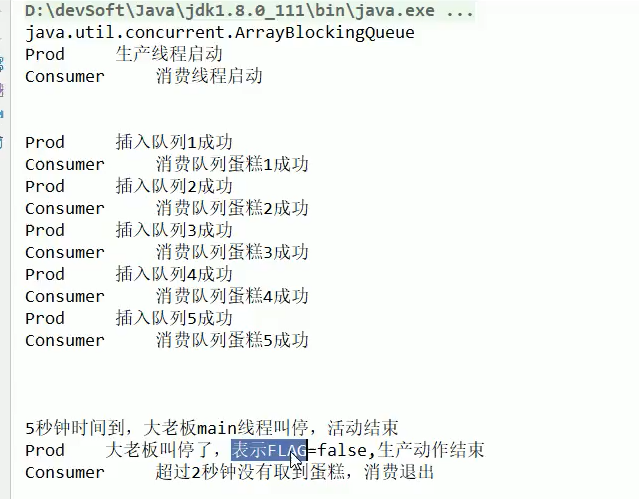

**阻塞队列**

```java
//ArrayBlockingQueue：是一个基于数组结构的阻塞队列，此队列按照FIFO(先进先出)原则对元素进行排序。
//LinkedBlockingQueue：一个基于链表结构的阻塞队列，此队列按照FIFO(先进先出)排序元素，吞吐量通常要高于ArrayBlockingQueue.
//SynchronousQueue：一个不存储元素的阻塞队列。每个插入操作必须要等到另一个线程调用移除操作，否则插入操作一直处于阻塞状态。


/**
 * 在多线程领域：所谓阻塞，在某些情况下会挂起线程（即阻塞），一旦条件满足，被挂起的线程又会自动被
 * 唤醒.
 */
```

1.为什么需要BlockingQueue?

​	好处是我们不需要关心什么时候需要阻塞线程，什么时候需要唤醒线程，因为这一切BlockingQueue都给你一手包办了。

​	在concurrent包发布以前，在多线程环境下，我们每个程序员都必须自己去控制这些细节，尤其还要兼顾效率和线程安全，这些都会给我们的程序带来不小的复杂度。


2.七种阻塞队列，重点学3种.




3.阻塞队列的几种api及其特性.




4.SynchronousQueue不存储元素的阻塞队列.(只能存一个)

​	SynchronousQueue没有容量。与其他Blocking'Queue不同，SynchronousQueue是一个不存储元素的BlockingQueue。每一个put操作必须要等待一个take操作，否则不能继续添加元素，反之亦然。


5.复习：synchronized和Lock有什么区别？用新的Lock有什么好处？你举例说说.

```java
/**
 *  题目：synchronized和Lock有什么区别？用新的Lock有什么好处？你举例说说. 
 *	1.原始构成：
 *		synchronized是关键字属于JVM层面，
 *			monitorenter(底层是monitor对象来完成，其实wait/notify等方法也依赖于monitor对象，
 *			在同步块或者方法中才能调wait/notify等方法).
 *			monitorexit
 *		Lock是具体类(java.util.concurrent.locks.Lcok)是api层面的锁.
 *
 *	2.使用方法
 *		synchronized不需要用户去手动释放锁，当synchronized代码执行完后系统会自动让线程释放对锁的占用
 *		ReentrantLock则需要用户手动去释放锁，若没有主动释放锁，就有可能导致出现死锁的现象。
 *		需要lock()和unlock()方法配合try/finally语句块来完成.
 *
 *	3.等待是否可中断
 *		synchronized不可中断，除非抛出异常或者程序正常运行完成。
 *		ReentrantLock可中断，1.设置超时方法tryLock（Long timeout，TimeUnit unit）
 *							2.lockInterruptibly（）放代码块中，调用interrupt()方法可中断.
 *	4.加锁是否公平
 *		synchronized非公平锁
 *		ReentrantLock两者都可以，默认公平锁，构造方法可以传入boolean值，true-公平锁,false-非公平
 *
 *	5.锁绑定多个条件Conditon
 *		synchronized没有
 *		ReentrantLock用来实现分组唤醒，可以精确唤醒线程。而synchronized要么随机唤醒一个，要么唤醒全部.
 *
 * ================================================================================
 * ================================================================================
 *	
 *	题目1：多线程之间按顺序调用，实现A->B->C三个线程启动，要求如下：
 *		AA打印5次，BB打印10次，CC打印15次；
 *		 紧接着
 *		AA打印5次，BB打印10次，CC打印15次；
 *		来10轮。主要代码如下图：
 *
 *	题目2：用阻塞队列写个生产者生产完1个，消费者消费1个，如此这样一直循环的程序.
 */


```



题目2：

