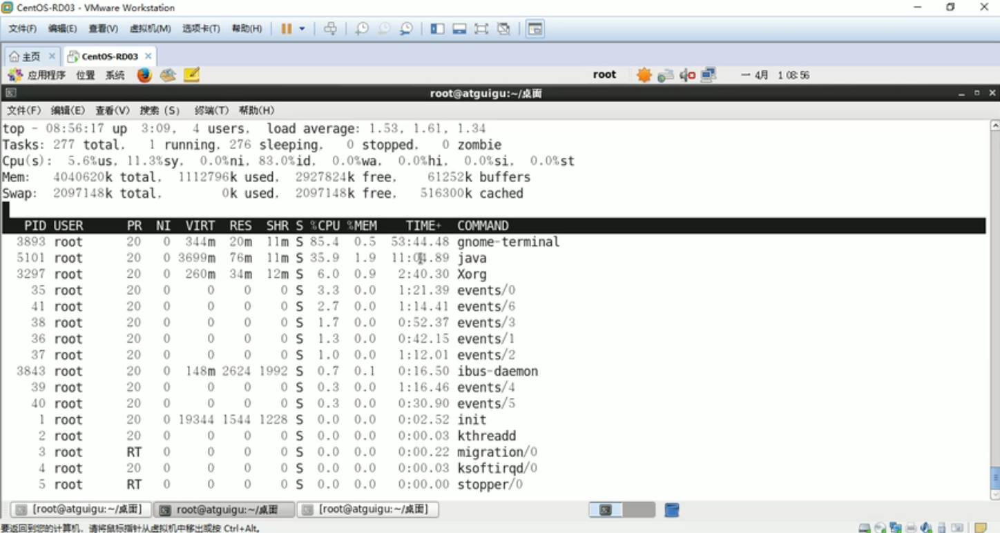
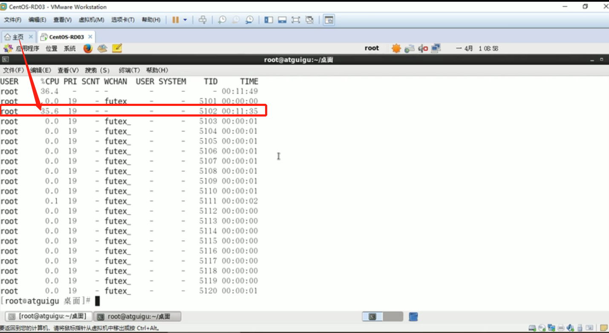
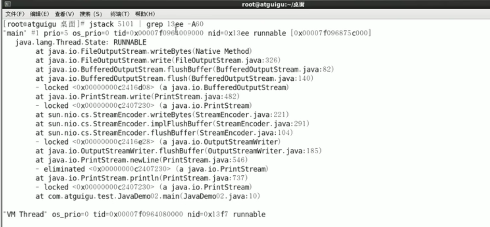

**cpu占用过高思路分析**

```java
/*****************************cpu占用过高思路分析*******************************/
1.先用top命令找出CPU占比最高的;
2.ps -ef或者jps进一步定位，得知是怎样一个后台程序(进程)给我们惹事;
3.定位到具体线程或者代码;
4.将需要的线程ID转换为16进制格式(英文小写格式);
5.jstack 进程ID | grep tid(16进制线程ID小写英文) -A60.//linux命令结合JDK命令解决
```

- **1.top**



- **2.ps -ef | grep java**


- **3.ps -mp 5101| -o THREAD,tid,time**

(-m: 显示所有的线程；-p: pid进程使用cpu的时间; -o: 该参数后是用户自定义格式.)




- **4.（print "%x\n" 有问题的线程）5102 ->13ee**

- **5. jstack 5101 | grep 13ee -A60**



