### **jvm**

#### 前言

1.jvm堆栈总结(栈管运行，堆管存储)

​	1.1 栈存放以下变量

- 存储局部变量【声明在某方法、代码段(比如说for循环)里】，执行到它的时候，会直接在栈中开辟内存,并且当它一旦脱离作用域后，就会立即释放内存。
- 所有原始类型，变量的值也保存在栈中。
- 对于引用类型，栈中保存的是堆中该指向对象的物理地址。


​	1.2 堆存放以下变量

- 存出new出来的对象


2.所有多线程是共享一个堆的，但是每个线程都有自己的一个栈内存，里面存储单独属于该线程的变量。

3.当我们进行编译操作的时候，会生成.class文件，这些文件是保存在电脑硬盘上的。只有当运行的时候，class文件才会被加载到内存中，这个时候，会甄别哪些进栈内存、哪些进堆内存。比如局部变量就进栈内存，new出来的对象就进堆内存【java虚拟机的垃圾回收就是回收堆内存中的内存】。

4.静态变量的生命周期会一直持续到整个”系统“关闭。

5.当你new对象的时候，系统给你的对象分配的不一定是连续的空间（比如说new类对象）；jvm会根据零散的堆内存地址，通过哈希算法换算成一长串数字来表示你整个对象的"物理位置".   当这个实例变量的引用丢失后，也不是立马就释放堆内存的，它会先被垃圾回收器列入可回收名单之内。

6.基本数据类型的值传递，不改变原值，因为调用后就会弹栈，原局部变量就消失了；引用数据类型的值传递，改变原值，因为即时方法弹栈，但是此时我已经知道了该对象的物理地址，并且该对象还在，所以我可以找到它并改变它的值。

7.双亲委派机制：如果一个类加载器收到了类加载的请求，他首先不会自己去加载这个类，而是把这个请求委派给自己的父加载器，每一层都是如此，因此所有的类加载器最终都会传送到顶层的Bootstrap ClassLoader中，只有当父加载器无法完成加载请求时，子加载器才会自己去加载该类。

8.jvm题目-更新

```java
//1.age=20是因为main里的age在栈里,传给外部方法只是传了一个副本；
//2.xxx是因为main里面的对象指向abc,传给外部方法传的是引用，两个都指向同一个堆内存地址“abc”,且外部方法将其改为xxx了，因为两个引用指向的是同一个地址，所以main里面的person对象指向地址的值也为xxx了;
//3.main里的str先去常量池检查有没有abc，没有则创建一个“abc”，在堆中。str指向它，这时候把str引用作为参数传给外部方法，外部方法的引用也指向abc，但是方法内部又检查或创建了一个“xxx”,并且此时外部方法的引用str指向xxx，但是main内部的str引用还是指向abc不变的.
```


```java
public class StringPool58Demo{
	public static void main(String args[]){
        String str = new StringBulider("58").append("tongcheng").toString;
        System.out.println(str);//58tongcheng
        System.out.println(str.intern());//58tongcheng
        System.out.println( str == str.intern());//true
        
        String str = new StringBulider("ja").append("va").toString;
        System.out.println(str);//java
        System.out.println(str.intern());//java
        System.out.println( str == str.intern());//false.为何这里为false呢？这是周志明老师的深入理解jvm虚拟机的原题.  intern先找常量池有没有，没有则新建一个.
    }
}
```

===========================2021年9月15日更新=============================

#### **一、JVM体系结构概览**

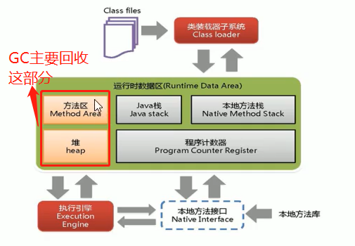

#### **二、四种GC**

- ##### **1.引用计数法**

```java
//1.引用计数法
- 优点：一般不采用了
- 缺点：
    * 每次对对象赋值时均需要维护引用计数器，且计数器本身也有一定的消耗；
    * 较难处理循环引用；
/**  JVM的实现一般不采用这种方式  */
可达性分析算法(主流)
	以方法区的静态变量或栈针变量表的变量为Root根节点,通过这个root去找其他下级节点，无法到达的对象在GC中会被清理。
```

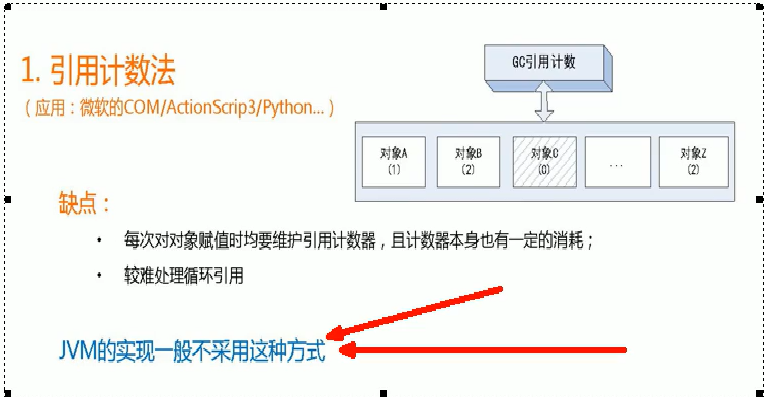


- ##### **2.复制算法（大多JVM的GC都用这个）**

```java
//优点：GC后的内存空间是连续的。
//缺点：由于分出了Survivor2不存放对象，真正存放新对象的内存区域会变少，Eden:Survivor1:Survivor2比例为8:1:1，少了10%的可用内存。
```

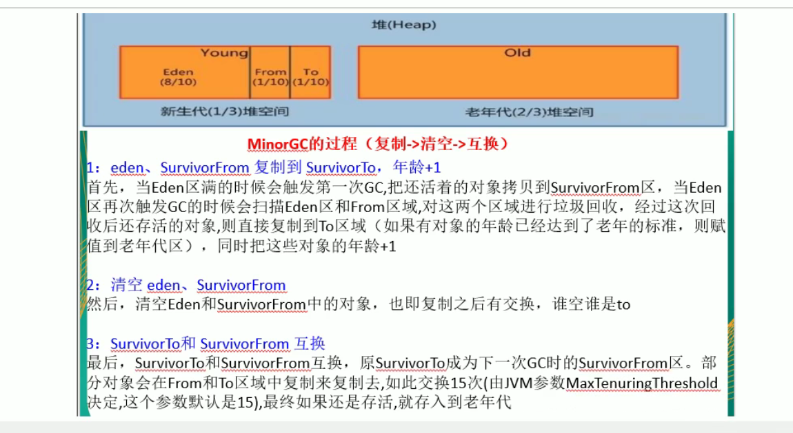


- ##### **3.标记清除法**

```java
//优点：简单
//缺点：会产生大量的内存碎片
```

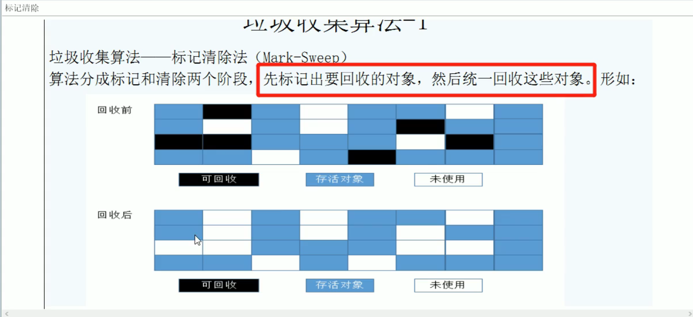


- ##### **4.标记整理法**

```java
//既不浪费空间，也不产生碎片，但是耗时间。因为滑动碎片需要时间。
```

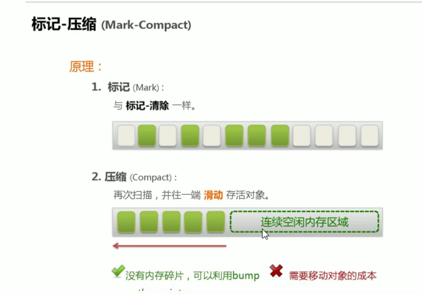

#### 三、谈谈你对GCRoots的理解

​	jvm寻找垃圾对象，可枚举根节点(GCRoots对象)做可达性分析(根搜索路径)。如下图：

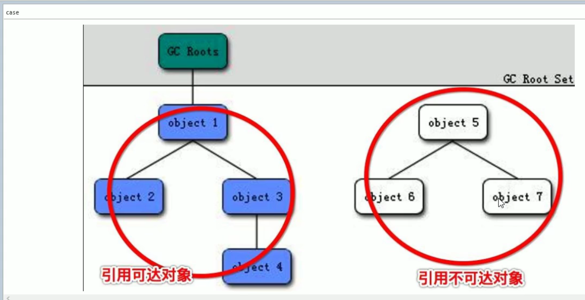

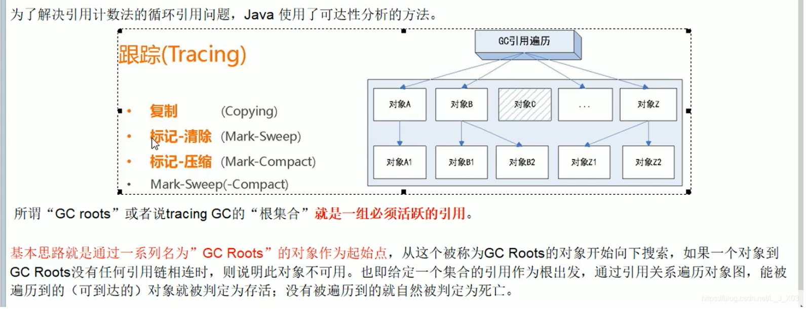

​	四类可以作为GCRoots对象的东西：

```java
//1.虚拟机栈（栈帧中的局部变量区，也叫做局部变量表）中引用的对象。
//2.方法区中的类静态属性引用的对象。
//3.方法区中常量引用的对象。
//4.本地方法栈中JNI(Native)引用的对象。
```

#### 四、jvm标配参数、X参数和**XX参数**(https://blog.csdn.net/lixinkuan328/article/details/94505882)

##### **（1）标配参数（以-开头）**

​	 在JDK各个版本之间稳定，很少有大的变化。

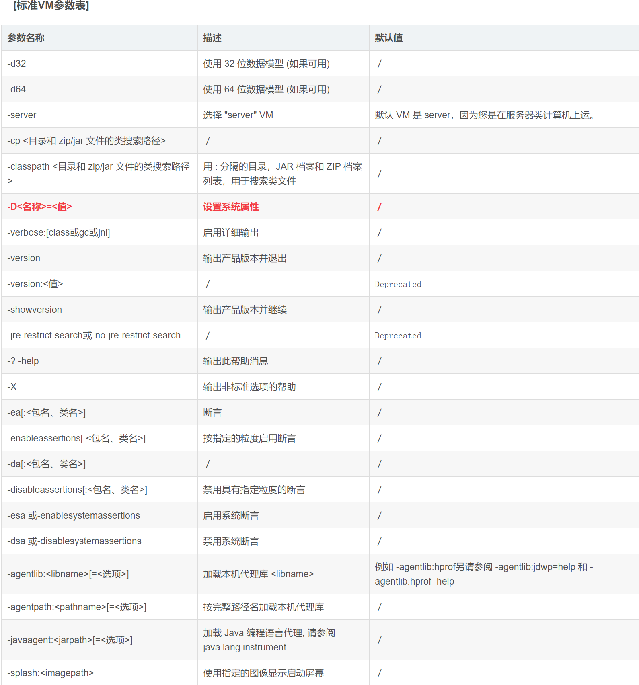

##### **（2）X参数（以-X开头）**

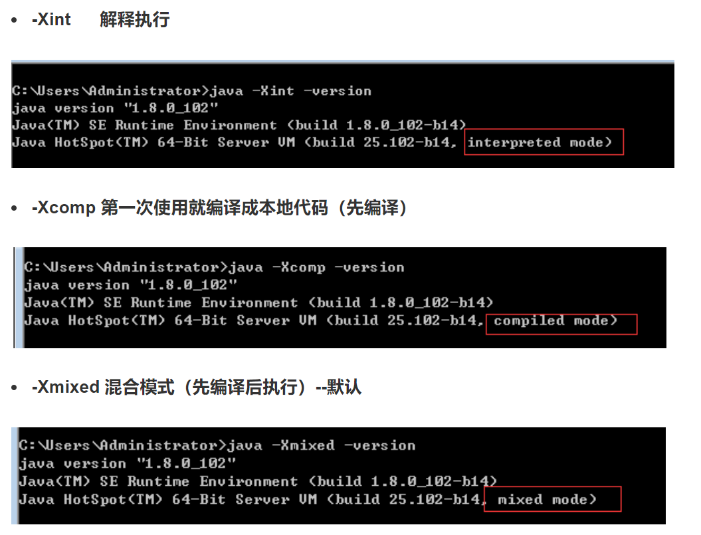

##### **（3）XX参数--只有类2种类型（以-XX开头）**

**【1】Boolean类型XX参数    公式：-XX:+ 或者-XX:- 某个属性值（+表示开启，-表示关闭）**

```java
    案例：

       1）是否打印GC收集细节
               -XX:+PrintGCDetails
               -XX:-PrintGCDetails
        2）是否使用串行垃圾收集器
               -XX:+UseSerialGC
               -XX:-UserSerialGC    
```

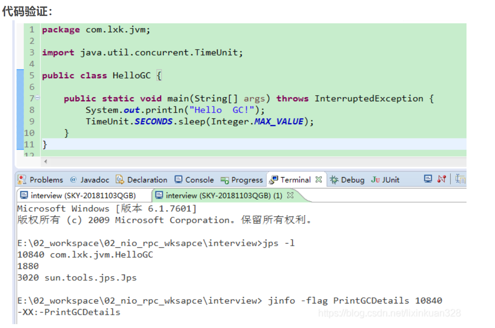

```java
       jps -l                                           表示查看java运行的进程号
       jinfo -flag PrintGCDetails  pid    表示查看JVM是否配置PrintGCDetails参数
       -XX:-PrintGCDetails                   减号表示没有配置PrintGCDetails参数
```

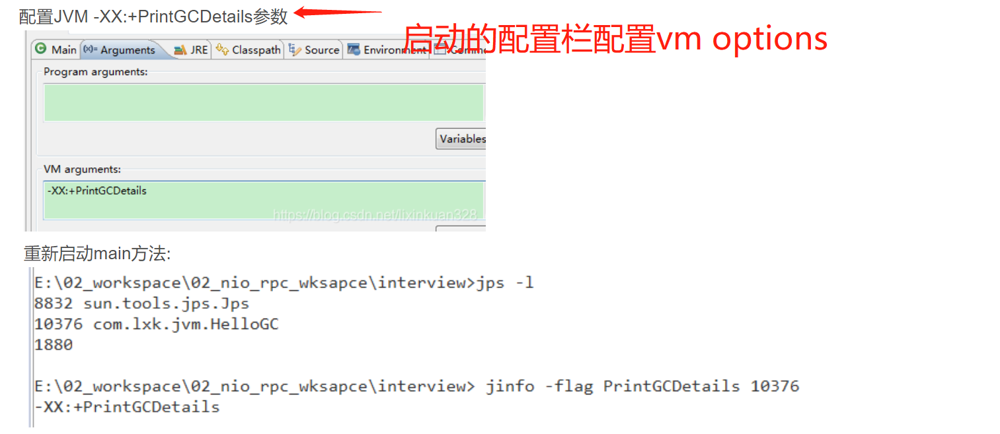

**【2】KV设值类型  公式：-XX: key（属性）= value（属性值）**

```java
// -XX:MetaspaceSize  设置元空间大小。元空间的本质和永久代类似，都是对JVM规范中方法区的实现。不过元空间与永久代之间最大的区别在于：元空间并不在虚拟机中，而是使用本地内存。因此，在默认情况下，元空间的大小仅受本地内存限制。（元空间默认情况下只用了20.8M左右）
```

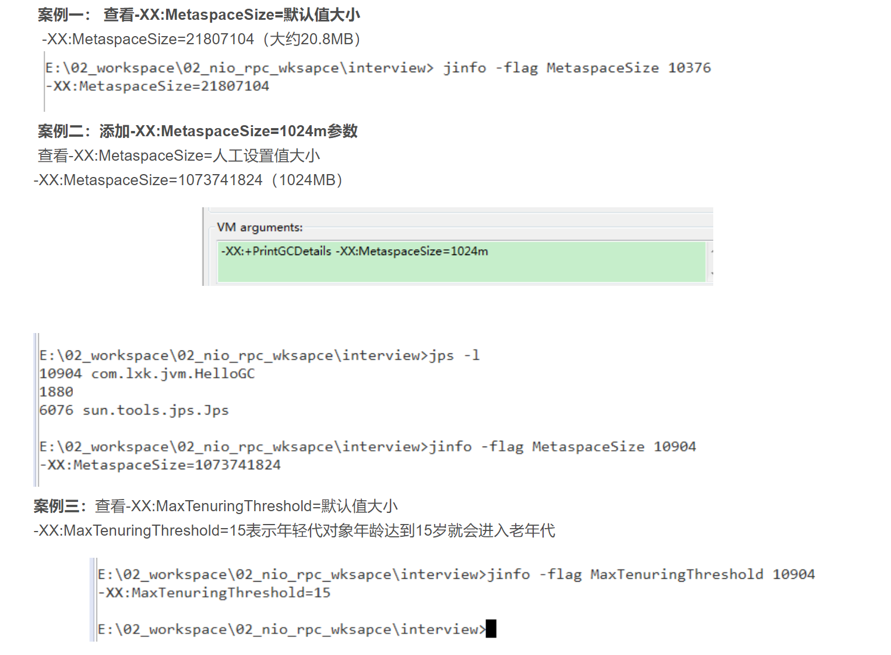

##### **（4）、jinfo查看当前运行程序配置：公式：jinfo -flag 配置项 进程号**

```java
案例：    查看JVM所有配置项（默认+人工配置）
         jinfo -flags 进程号
         Non-default VM flags表示JVM默认参数
         Command line表示人工配置参数
```

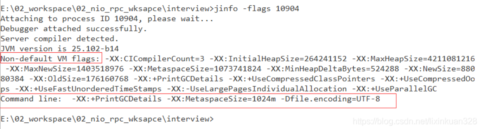

##### **（5）、如何解释-Xms和-Xmx参数属于XX参数**

```java
   -Xms和-Xmx两个经典参数看起既不像Boolean类型XX参数，也不像KV设值类型XX参数。那为什么-Xms和-Xmx又属于XX参数？
       -Xms = -XX:InitialHeapSize
       -Xmx = -XX:MaxHeapSize 
```

##### **（6）、盘点家底JVM默认值**

**（1）第一种查看JVM默认值方式**    

```java
jinfo -flag 参数项 进程号
       jinfo -flags 进程号
```

**（2）第二种查看JVM默认值方式**    

```java
公式：java -XX:+PrintFlagsInitial（查看jvm未更改的默认参数）
       公式：java -XX:+PrintFlagsFinal（查看jvm已经更改过的参数）
       :=表示jvm启动时候默认修改或者人工更改过的参数
       =表示jvm没有更改过的默认参数
    uintx InitialHeapSize   := 266338304      {product} 默认为操作系统64/1内存（我本机内存为16G）
```

 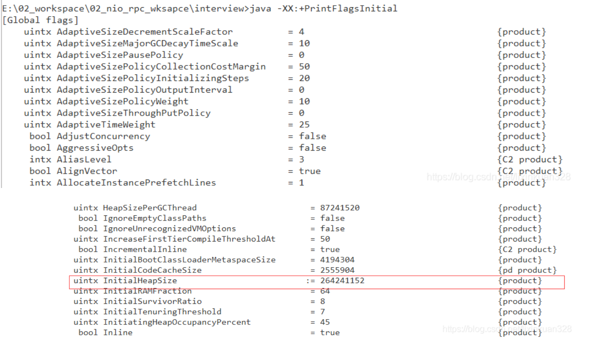
**（3）-XX:+PrintCommandLineFlags打印命令行参数**

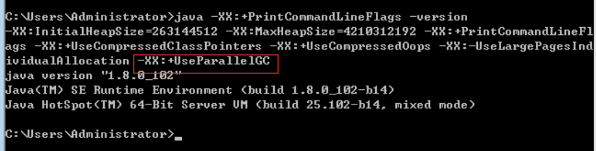

#### **五、XX参数总结**(要知道主要的几个就行，其他的当作字典来查)

```java
//查看jvm的栈大小：jinfo -flag ThreadStackSize 61156			
//给定栈空间128k的大小配置： -Xss128k    
```

- 几个主要的需要知道的参数：

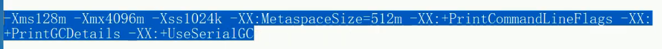

- 常用参数之 **-XX:SurvivorRatio**【设置伊甸园区和幸存区的比例】

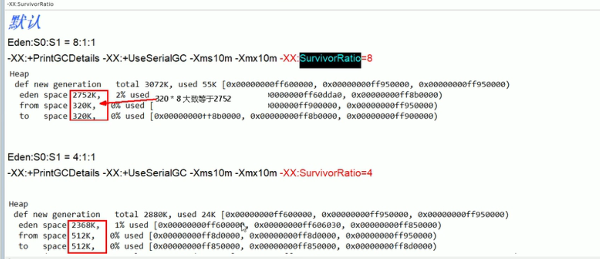

- 常用参数之 -XX:NewRatio

```java
//常用参数之 -XX:NewRatio【配置新生代与老年代在堆结构的占比】
默认
-XX:NewRatio=2.新生代占1,老年代占2，年轻代占整个堆的1/3;
加入
-XX:NewRatio=4.新生代占1,老年代占4，年轻代占整个堆的1/5。NewRatio的值就是设置老年代的占比，剩下的1给新生代.
```


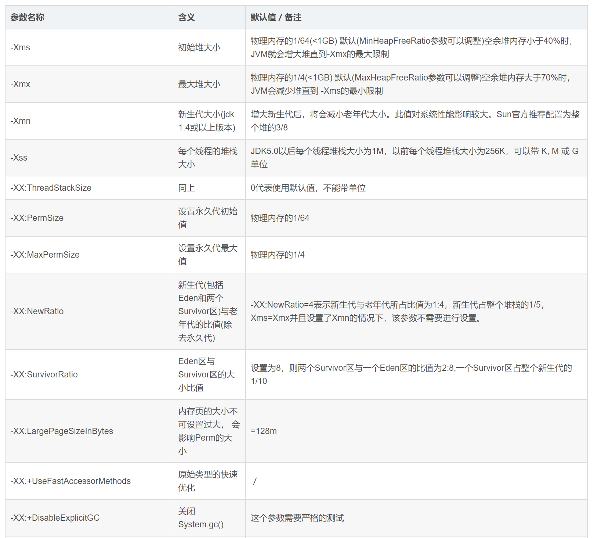

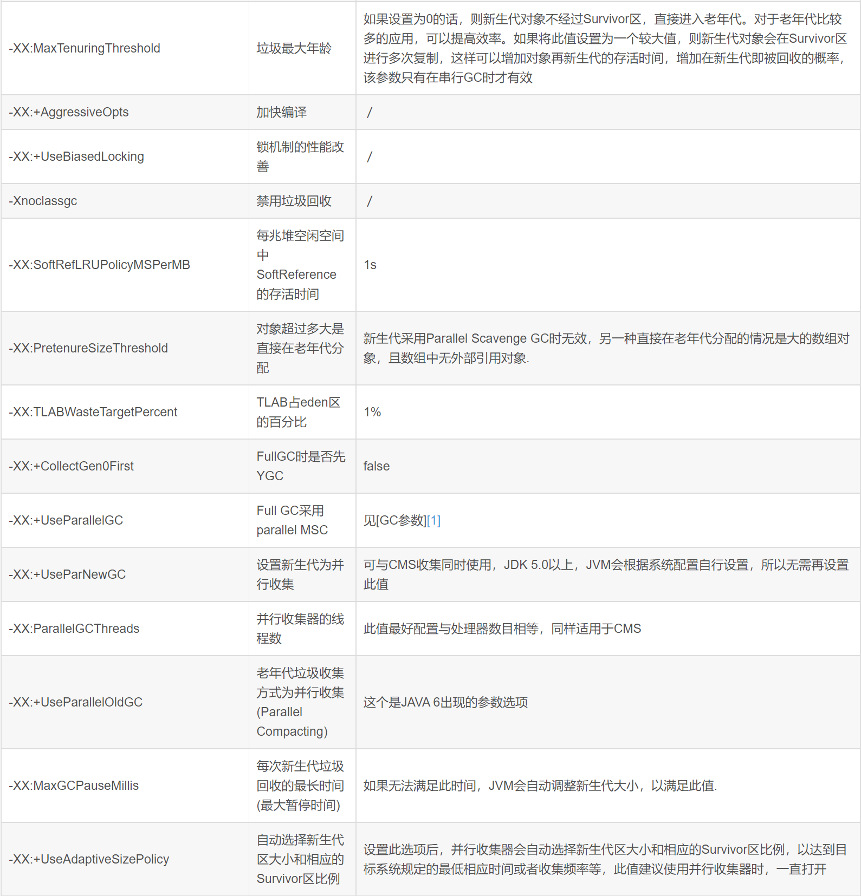

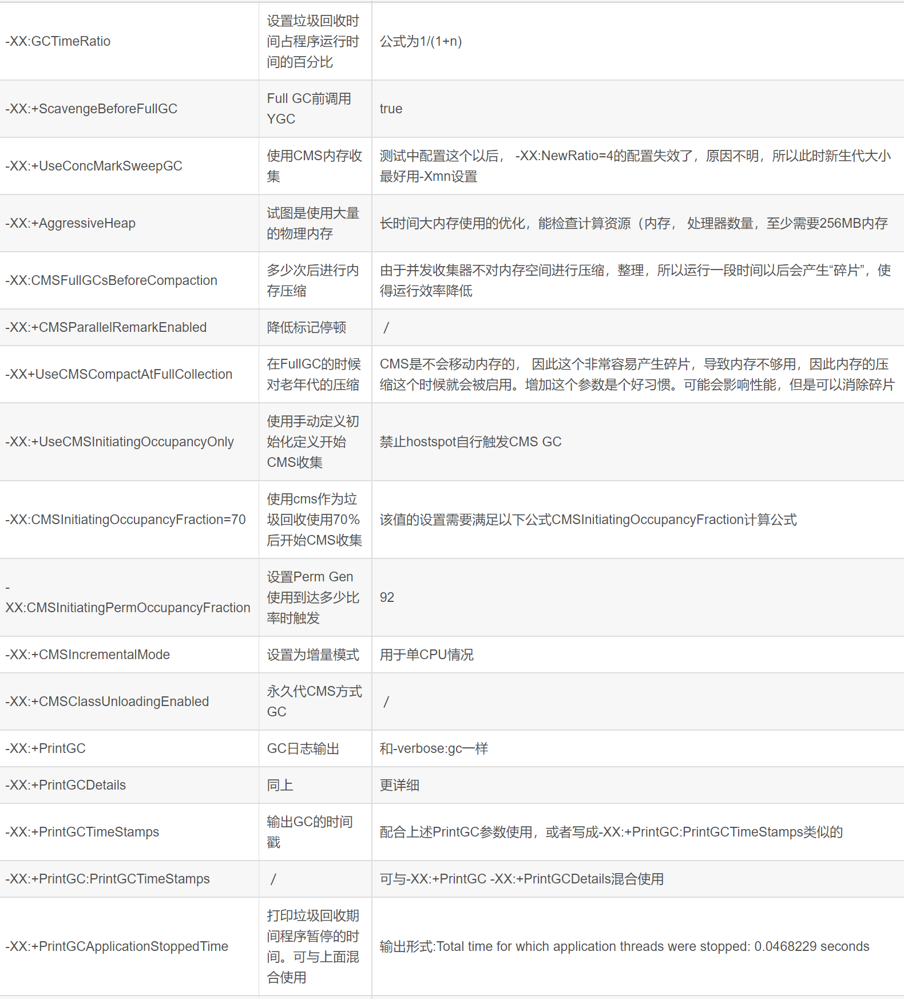

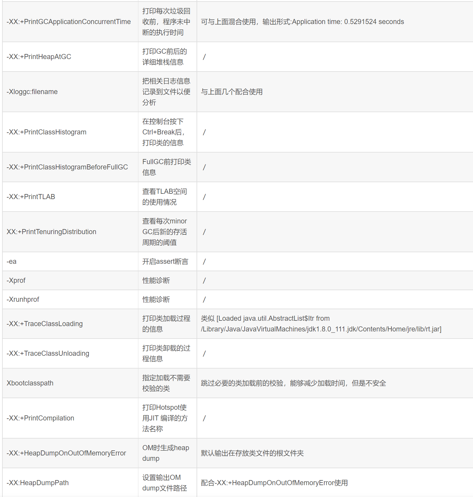


#### **六、输出详细GC收集日志信息(-XX:+PrintGCDetails)**

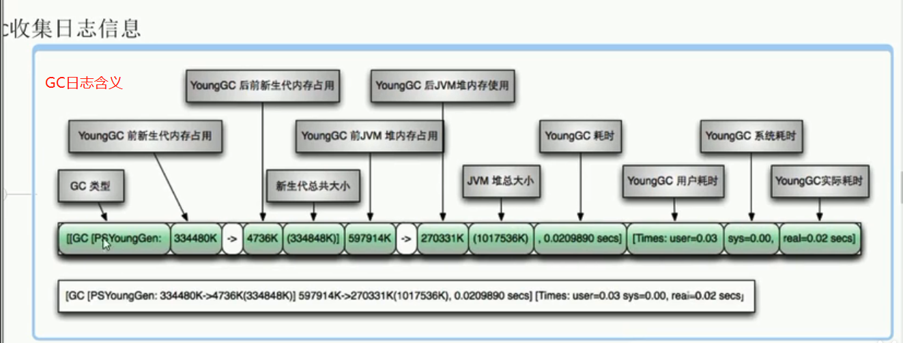

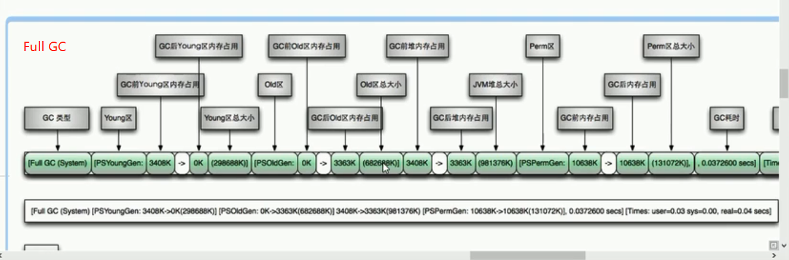

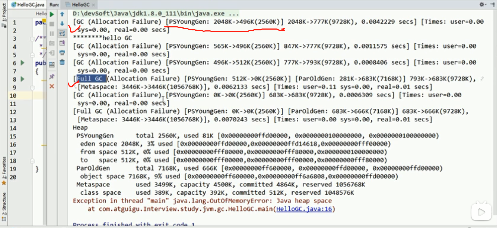


#### **七、强软弱虚引用及其适用场景**

```java
//强软弱虚引用的gc
	强引用(默认,95%以上的都是)：死都不收，就算OOM也不会回收;
	软引用(java.lang.ref.SoftReference)：当系统内存够用的时候，不会被回收；当系统内存不够用的时候，会被回收；【mybatis底层源码大量用到】
	弱引用(java.lang.ref.WeakReference)：只要有GC，一律回收,比如WeakHashMap();
	虚引用(java.lang.ref.PhantomReference)：如果一个对象仅持有虚引用，那么它就和没有任何引用一样，在任何时候都可能被垃圾回收器回收，它不能单独使用也不能通过它访问对象，虚引用必须和引用队列联合（ReferenceQueue）使用。 虚引用的主要作用是跟踪对象被垃圾回收的状态，仅仅是提供了一种对象被finalize以后，做某些事情的机制。PhantomReference的get方法总是返回null，因此无法访问对应的引用对象。其意义在于说明一个对象已经进入finalization阶段，可以被gc回收，用来实现比finalization机制更灵活的回收操作。
	
//强软弱虚引用的适用场景
	场景：假如有一个应用需要读取大量的本地图片：
	- 如果每次读取图片都从硬盘读取则会严重影响性能;
	- 如果一次全部加载到内存中又可能造成内存溢出。
	
	---> 此时软引用可以解决这个问题。
	
	设计思路是：用一个HashMap来保存图片的路径和相应图片对象关联的软引用之间的映射关系，当内存不足时，JVM会自动回收这些缓存图片对象所占用的空间，从而有效避免了OOM的问题。
	Map<...> imageCache = new HashMap<String,new SoftReference<Bitmap>>();

```

​		引用队列的使用：new WwakReference<o1,referenceQueue>

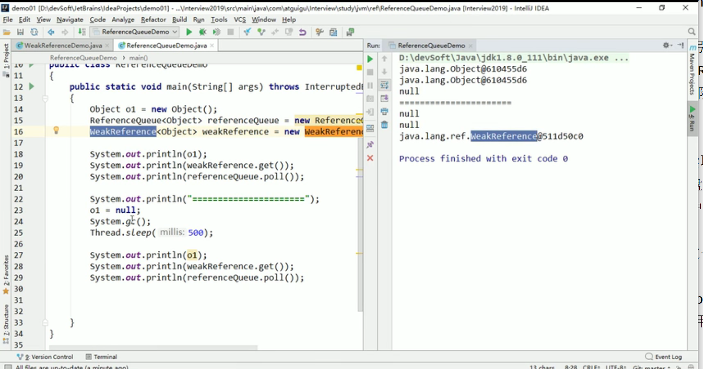

​		虚引用的使用，结合引用队列，在gc之前放入引用队列中，可以gc后做点想做的事,有点类似AOP的后置通知.

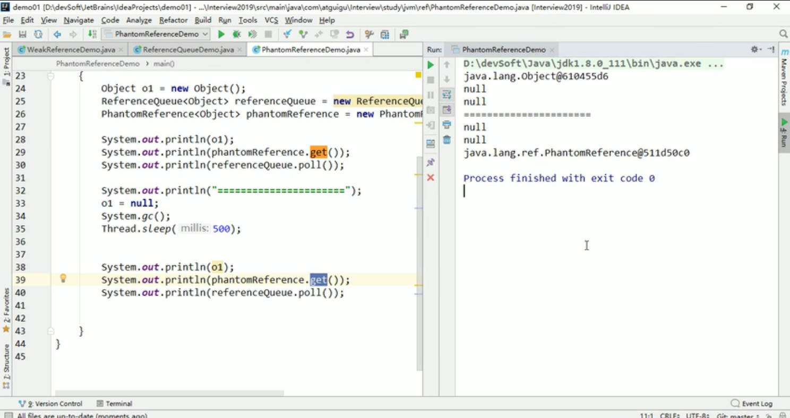


#### **八、jvm常见内存溢出**

```java
//1.java.lang.StackOverflowError
	jvm栈内存溢出，比如说深度调用方法，不断开辟栈内存。
//2.java.lang.OutOfMemoryError:Java heap space
	堆内存溢出，比如说new大对象就可能会造成。
//3.java.lang.OutOfMemoryError:GC overhead limit exceeded（垃圾回收上头）
	GC回收时间过长时会抛出OutOfMemoryError。过长的定义是，超过98%的时间用来做GC并且回收了不到2%的堆内存，连续多次GC，都只回收了不到2%的极端情况下才会抛出。假如不抛出GC overhead limit 错误会发生什么情况呢？那就是GC清理的这么点内存会很快被填满，迫使GC再次执行，这样就造成了恶性循环，cpu使用率是100%，而GC却没有任何成果。
//4.java.lang.OutOfMemoryError:Direct buffer memory(NIO常见)
	导致原因：写NIO程序经常使用ByteBuffer来读取或者写入数据，这是一种基于通道（Channel）与缓冲区（Buffer）的I/O方式，它可以使用Native函数库直接分配堆外内存，然后通过一个存储在java堆里面的DirectByteBuffer对象作为这块内存的引用进行操作。这样能在一些场景中显著提高性能。因为避免了在java堆和Native堆中来回复制数据。
	- ByteBuffer.allocate(capability):第一种方式是使用jvm堆内存，属于GC管辖范围，由于需要拷贝所以速度相对较慢。
    - ByteBuffer.allocateDirect(capability):第二种方式是分配OS本地内存，不属于GC管辖范围，由于不需要内存拷贝所以速度相对较快。
	但是如果不断分配本地内存，堆内存很少使用，那么JVM就不需要执行GC，DirectByteBuffer对象们就不会被回收，这时候堆内存充足，但本地内存可能已经使用光了，再次尝试分配内存就会OutOfMemoryError.
//5.java.lang.OutOfMemoryError:unable to creat new native thread
	- 导致原因：2.1.1 你的应用创建太多线程了，一个应用进程创建多个线程，超过系统承载极限。
			2.1.2 你的服务器不允许你的应用创建这么多线程，linux系统默认允许单个进程可以创建的线程数是1024个。
	- 解决办法：2.2.1 想办法降低你应用程序的线程数量
			  2.2.2 对于有的应用，确实需要创建很多线程，远超过linux系统单个进程的默认的1024个线程的限制，可以通过修改linux服务器配置，增大最大线程数。
//6.java.lang.OutOfMemoryError:Metaspace（原空间）
	Java8及之后的版本用Metaspace来代替永久代。模拟Metaspace空间溢出，我们不断生成类往元空间里面灌，类占据的空间总是会超过元空间的大小的。
	
```

#### **九、四大垃圾回收方式与七大垃圾回收器**

- ##### 四种主要的垃圾回收方式

```java
/*****************************四种主要的垃圾回收方式*******************************/
//1.串行垃圾回收(Serial)
	它为单线程环境设计且只是用一个线程进行垃圾回收，会暂停所有的用户线程，不适合服务器环境。

//2.并行垃圾回收(Parallel)
	多个垃圾收集线程并行工作，此时用户线程也是暂停的，适用于科学计算/大数据处理首台处理等弱交互场景。

//3.并发垃圾回收(CMS)
	用户线程和垃圾收集线程同时执行（不一定是并行，可能交替执行），不需要停顿用户线程，互联网公司多用它，适用对响应时间有要求的场景。
-- -------------------------------------------------------------------G1较特殊,java9出来的
//4.G1垃圾回收
	G1垃圾回收器将堆内存分割成不同的区域然后并发的对其进行垃圾回收。

```

- ##### 七大垃圾回收器(配对使用)

```java
/**********************************新生代********************************/
//1.串行GC(Serial/Serial Copying)
	最古老的串行单线程执行，暂停所有用户线程。

//2.并行GC(ParNew)
	ParNew收集器其实就是Serial收集器新生代的并行多线程版本，最常见的应用场景是配合老年代的CMS GC工作，它是很多java虚拟机运行在Server模式下新生代的默认垃圾收集器。
    -----> 常用对应JVM参数：-XX:+UserParNewGC 启用ParNew收集器，只影响新生代的收集，不影响老年代。开启上述参数后，会使用：ParNew(Young区用)+Serial Old 的收集器组合，新生代使用复制算法，老年代采用标记-整理算法.
    
//3.并行回收GC(Parallel/Parallel Scavenge)【java8默认用的】
	Parallel Scavenge收集器类似ParNew也是一个新生代垃圾收集器，使用复制算法，也是一个并行的多线程的垃圾收集器，俗称吞吐量优先收集器。一句话：串行收集器在新生代和老年代的并行化。
	它重点关注的是：
    可控制的吞吐量（Thought=运行用户代码时间/（运行用户代码时间+垃圾收集时间）,也即比如程序运行100分钟，垃圾手机时间1分钟，吞吐量就是99%）。高吞吐量意味着高效利用cpu的时间，它多用于在后台运算而不需要太多交互的任务。
    自适应调节策略也是ParallelScavenge收集器与ParNew收集器的一个重要区别。（自适应调节策略：虚拟机会根据当前的系统运行情况收集性能监控信息，动态调整这些参数以提供最合适的停顿时间（-XX:MaxGCPauseMillis）或最大的吞吐量）
    -----> 常用JVM参数：-XX:+UseParallelGC或-XX:+UseParallelOldGC（可互相激活）使用Parallel Scanvenge收集器。开启该参数后：新生代使用复制算法，老年代使用标记整理算法。
    多说一句：-XX:ParallelGCThreads=N 表示启动多少个GC线程。cpu>8,N=5/8;cpu<8,N=cpu实际个数
    
/**********************************老年代********************************/
    //1.并行GC(Parallel Old)/(Parallel MSC)
        Parallel Old收集器是Parallel Scavenge的老年代版本，使用多线程的标记-整理算法，Parallel Old收集器在JDK1.6才开始提供。主要是为了在老年代也以吞吐量优先.
    
    //2.并发标记清除GC(CMS收集器【重要】)
    CMS收集器（Concurrent Mark Sweep:并发标记清除）是一种以获取最短回收停顿时间为目标的收集器。适合应用在互联网站或者B/S系统的服务器上，这类应用尤其重视服务器的响应速度，希望系统停顿时间最短。CMS非常适合堆内存大、CPU核数多的服务器端应用，也是G1出现之前大型应用的首选收集器。
    -----> 开启该收集器的JVM参数：-XX:+UseConcMarkSweepGC 开启该参数后会自动将-XX:+UseParNewGC打开。开启该参数后，使用ParNew(Young区用)+CMS(Old区用)+Serial Old的收集器组合，Serial Old将作为CMS出错的后备收集器。
    ---》四步过程（具体如下图）：
	    1)初始标记(CMS initial mark)：只是标记一下GC Roots能直接关联的对象，速度很快，仍然需要暂停所有的工作线程。
	    2)并发标记(CMS concurrent mark):进行GC Roots跟踪的过程，和用户线程一起工作，不需要暂停工作线程。主要标记过程，标记全部对象。
    	3)重新标记(CMS remark)：为了修正在并发标记期间，因用户程序继续运行而导致标记产生变动的那一部分对象的标记记录，仍然需要暂停所有的工作线程。由于并发标记时，用户线程依然运行，因此在正式清理前，再做修正。
    	4)并发清除(CMS concurrent sweep)和用户线程一起：清除GC Roots不可达对象，和用户线程一起工作，不需要暂停工作线程。基于标记结果，直接清理对象。
    ===》由于耗时最长的并发标记和并发清除过程中，垃圾收集器线程可以和用户线程一起并发工作，所以总体上来看CMS收集器的内存回收和用户线程是一起并发地执行。  
    ===》总结优缺点：
    	优点：并发收集低停顿。
    	缺点：a.并发执行，对cpu资源压力大（由于并发进行，CMS垃圾收集线程与用户线程同时进行会增加堆内存的使用，也就是说，CMS必须要在老年代堆内存用尽之前完成垃圾回收，否则CMS回收失败时，将触发担保机制，串行老年代收集器将会以STW的方式进行一次GC，从而造成较大停顿时间）；
    	b.采用的标记清除算法会导致大量的碎片(标记清除算法无法整理空间碎片，老年代空间会会随着应用时长被逐步耗尽，最后将不得不通过担保机制对堆内存进行压缩。CMS也提供了参数-XX:CMSFullGCsBeForeCompaction(默认0，即每次都进行内存整理)来指定多少次CMS收集之后，进行一次压缩的Full GC)。
    	
    //3.串行GC(Serial Old)/(Serial MSC)
        Serial Old是Serial垃圾收集器老年代版本，它同样是个单线程的收集器，使用标记-整理算法，这个收集器也主要是运行在Client默认的java虚拟机默认的老年代垃圾收集器。
      	在Server模式下，主要有两个用途（了解一下，因为现在版本都到java8以后了）：
      	1）1.5版本以前，主要与新生代中的Parallel Scavenge收集器搭配使用;
		2)作为老年代版本中使用CMS收集器的后备垃圾收集方案。
    	
/**********************************G1垃圾回收器********************************/    	
//1.以前收集器特点：
	1）年轻代和老年代是各自独立且连续的内存块；
	2）年轻代收集使用单eden+S0+S1进行复制算法；
	3）老年代收集必须扫描整个老年代区域；
	4）都是以尽可能少而快速地执行GC为设计原则；
//2.G1是什么？
	G1(Garbage-First)收集器，是一款面向服务端应用的收集器，能应用在多处理器和大容量内存环境中，在实现高吞吐量的同时，尽可能的满足垃圾收集暂停时间的要求，它还和CMS收集器一样能与应用程序线程并发执行。G1与CMS相比，在以下方面表现的更出色：更少的内存碎片、Stop The World(SWT)更可控，预测机制可以指定期望停顿时间.
//3.G1的特点
    1）G1能充分利用多CPU、多核环境硬件优势，尽量缩短STW;
    2）G1整体上采用标记-整理算法，局部是通过复制算法，不会产生内存碎片(或者说很少);
    3）宏观上看G1之中不再区分连续的年轻代和老年代，而是内存划分成多个连续的子区域(Region),1MB~32MB之间，且必须是2的幂，默认将整堆划分为2048个分区（也就是最大32MB*2048=64G）;
    4）小范围（Region）还是区分了年轻代和老年代，但是他们不需要是连续的，G1依然会采用不同的GC方式来处理不同的区域，避免了全内存的GC操作；
    5）G1虽然也是分代收集器，但G1只有逻辑上的分代概念，每个分区都可能随着G1的运行在不同代之间切换。


```

G1垃圾收集器图解


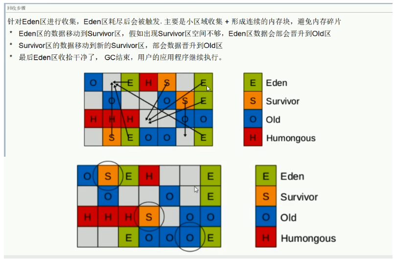

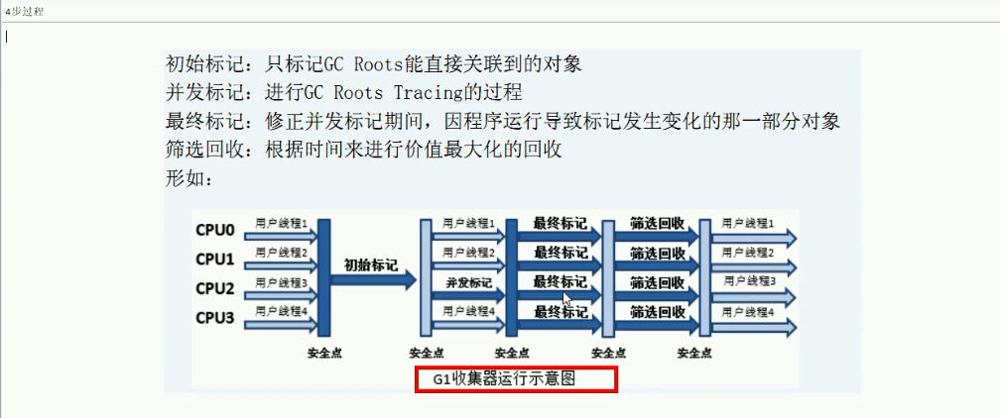

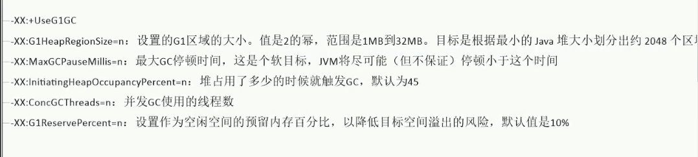

七大垃圾回收器

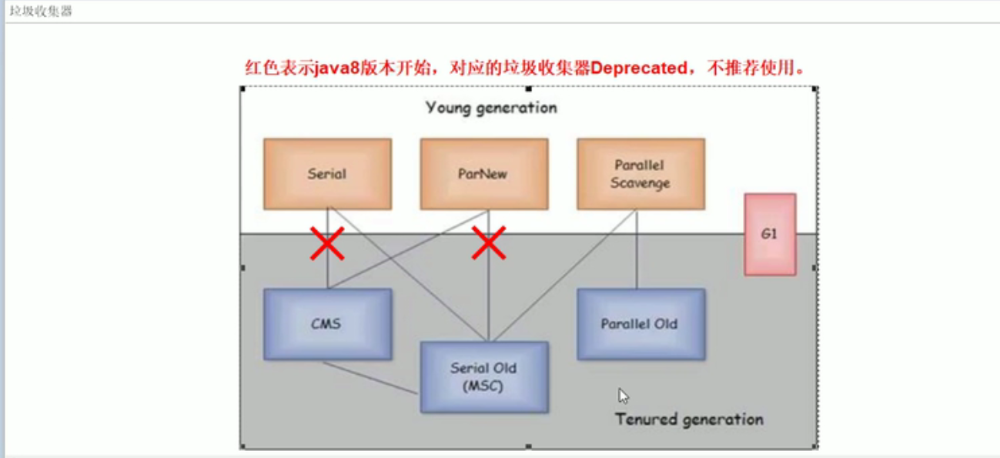


并发标记清除-CMS

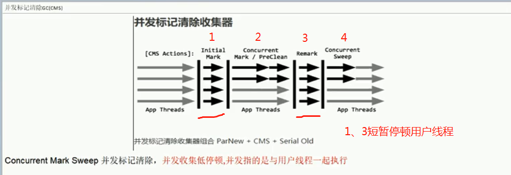


#### **十、GC之如何选择垃圾收集器**

- **单CPU或小内存，单机程序**

  -XX:UseSerialGC-

- **多CPU，需要最大吞吐量，如后台计算型应用**

  -XX:+UserParallelGC	或者

  -XX:+UserParallelOldGC

- **多CPU，追求低停顿时间，需快速响应如互联网应用**

  -XX:+UseConcMarkSweepGC

  -XX:+ParNewGC

具体表格如下：

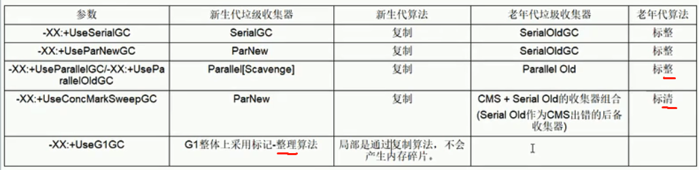

#### **十一、JVM结合SpringBoot微服务优化简介**

​		打成jar包后，部署公式:java -server  jvm的各种参数  -jar  jar/war包的全名


