### kafka

//kafka是比较适合吞吐量大，快的要求;  RibbitMQ适合低延迟的要求.

//kafka可以做到60/s，每小时200GB/单机，相当牛逼.

#### 一、kafka基础知识

#### 1.kafka速度如何？

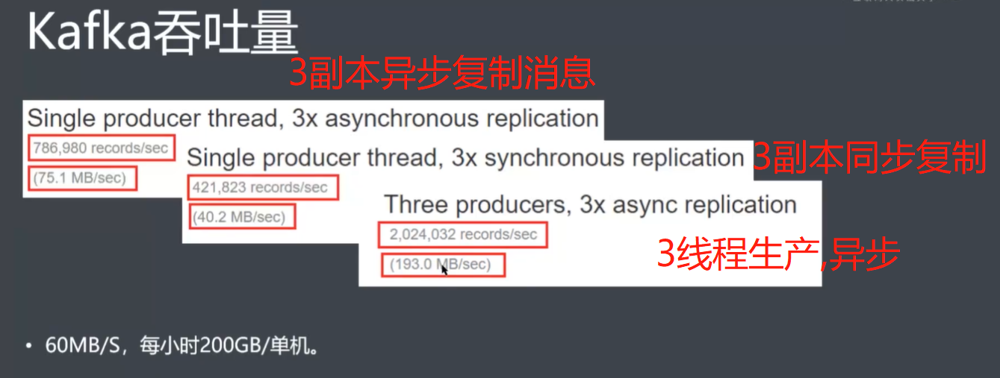


#### 2.为什么kafka这么快？

##### 	1）集群扩展:生产者多了也就快了.(做集群负载均衡 要先做好)

​		//既然有分区这一概念，那么生产者每次生产数据该向哪个分区发送？ ==> 常用分区写入策略:轮询分区策略(默认)、随机分区策略、按key分区分配策略、自定义分区策略.

​		//正是因为这个分区的策略，使得kafka只能保证一个分区的消息顺序，多个分区之间不能保证消息的顺序.

​		//消费者可以横向扩展,做好消费分配策略就好（一个消费者消费一个或多个分区,一个分区只能对应一个消费者组里的一个消费者,所以消费者如果比分区数还多，就是一种浪费.一个分区对一个消费者也防止逻辑上消息重复消费.）

​		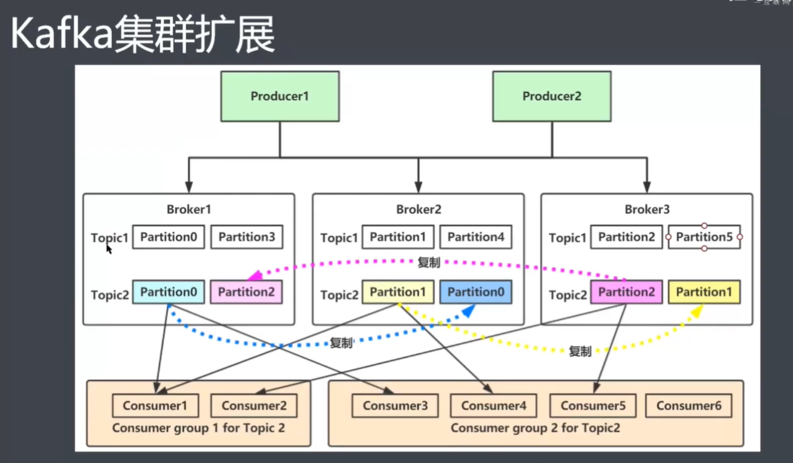

​		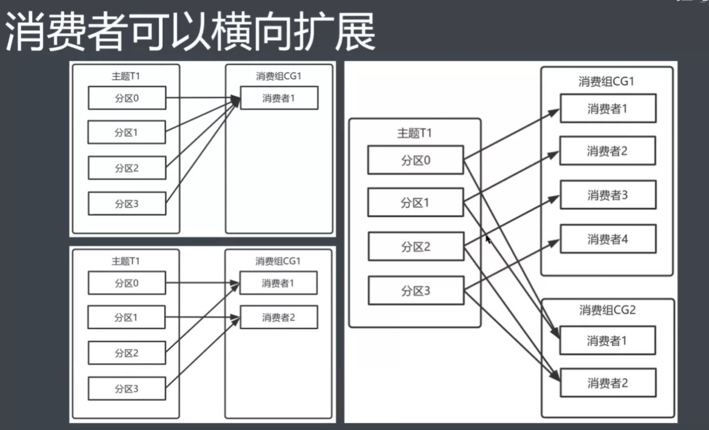

##### 	2）零拷贝

​		//内核空间到用户空间切换非常耗时，以及调用内核函数调用驱动去用户空间处理磁盘数据也耗时.正常情况下的拷贝这里涉及到四次上下文切换:

​		第一次：将磁盘文件，读取到操作系统的内核缓冲区；

​		第二次：将内核缓冲区的数据，copy到application应用程序的buffer；

​		第三次：将application应用程序buffer中的数据，copy到socket网络发送缓冲区(属于操作系统内核的缓冲区);

​		第四次：将socket buffer的数据,copy到网卡，由网卡进行网络传输。

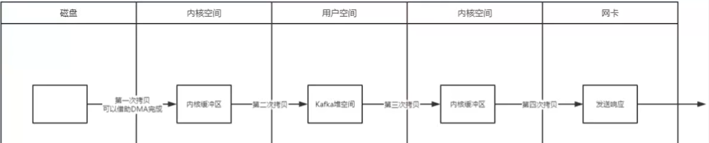

​	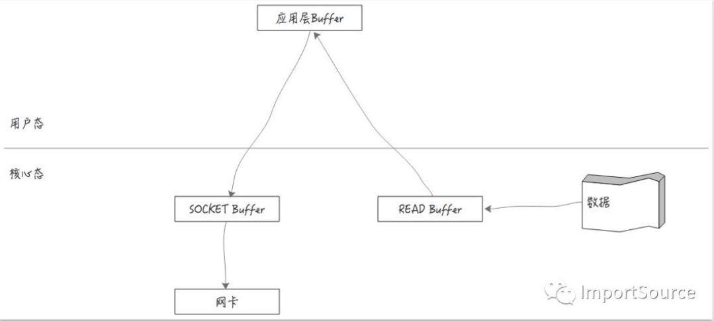

如果减少了用户态与核心态之间的切换，是不是就会更快了呢？如下图：

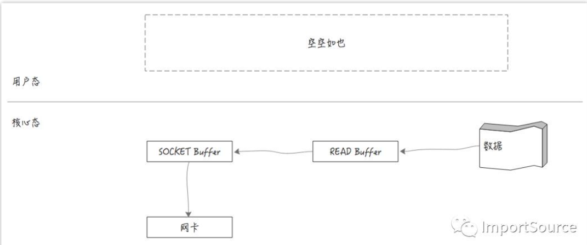

此时我们发现用户态“空空如也”。数据没有来到用户态，而是直接在核心态就进行了传输，但是这样依然还有一次磁盘到内存和两次buffer之间的复制。首先磁盘数据被读取到read buffer中，然后发送到socket buffer，最后才发到网卡。虽然减少了用户态和核心态的切换，但依然存在多次数据复制。如何进一步减少数据复制，甚至没有数据复制而坐到最快呢？===>

**DMA**:全称叫Direct Memory Access，一种可让某些硬件子系统去直接访问系统主内存，而不用依赖CPU的计算机系统的功能。跳过CPU，直接访问主内存，而传统的内存访问都要经过CPU。如下图：

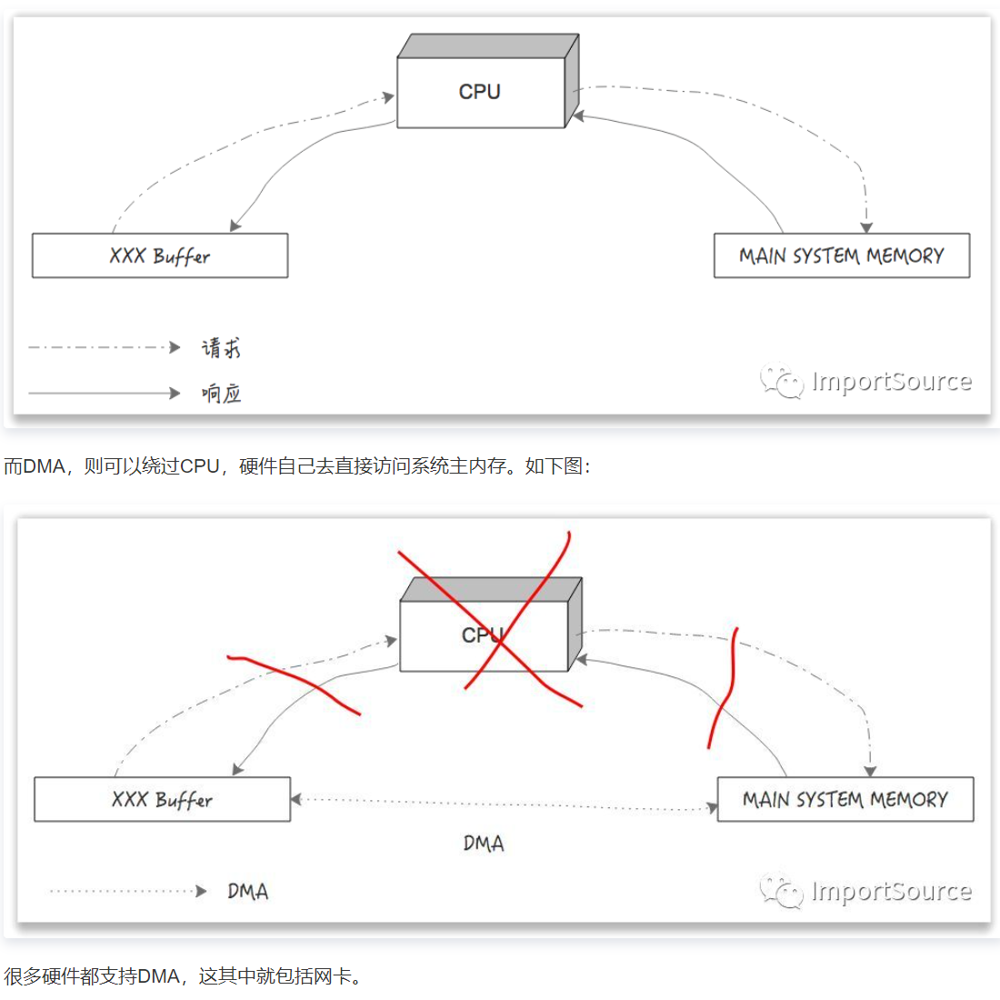

回到零拷贝，借助DMA，直接让网卡访问系统主内存的kafka的READ Buffer数据。如下图:

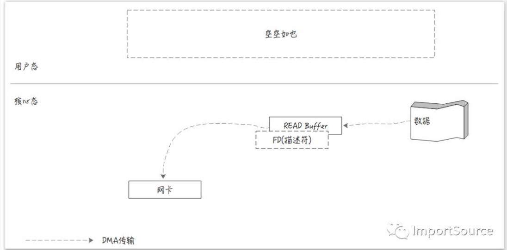

kafka写入数据的时候，也是写到内核缓冲区，然后操作系统内核负责调度线程把内核缓冲区的数据(脏页)同步到磁盘中.

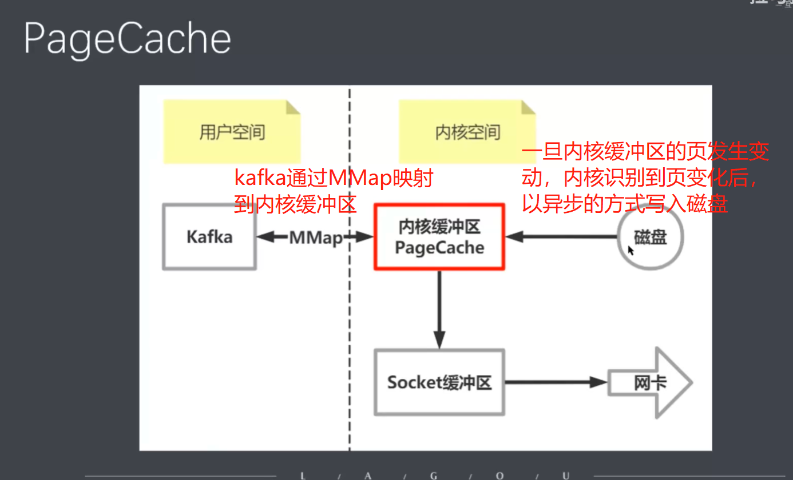

```java
/**=========java的零拷贝实现=========*/
//在Java中的零拷贝实现是在FileChannel中，其中有个方法transferTo(position,fsize,src)。

//传统的文件传输是通过java.io.DataOutputStream，java.io.FileInputStream来实现的，然后通过while循环来读取input，然后写入到output中。

public class Test{
    String fname="readfile.txt";
    long fsize = 183678375L,sendsize=4094;
    ...
    FileChannel fc = new FileInputStream(fname).getChannel();
    curnset = fc.transferTo(0,fsize,sc);
    ...
}

```

- 零拷贝总结：通过DMA技术网卡直接读取系统主内存的kafka的Read Buffer，减少了拷贝过程中用户态和内核态之间的上下文切换、数据多次无用拷贝消耗的时间。


##### 	3）磁盘顺序写:

​		在磁盘上读写的速度可能比较慢，因为寻址会比较消耗时间。但是kafka保证了磁盘顺序写，所以寻址消耗的时间可以省去，就非常快了。

##### 	4）NIO网络通信

##### 	5）PageCache

​		kafka写入数据的时候，也是写到内核缓冲区(PageChahe)，然后操作系统内核负责调度线程把内核缓冲区的数据(脏页)同步到磁盘中。写入内核缓冲区这里使用了MMap技术，核心思想是多个用户态的kafka进程把数据写入一个java虚拟内存(可以认为是内核态)，然后跟内核缓冲区进行数据交换与写入，这样就不用在用户态和内核态之间频繁切换上下文。


##### 	6）消息压缩

​			kafkaproducer生产数据到各个partition后，会有一个消息累加器计算消息数量，达到一定数量后，然后再进行分批次的发送。同时再发送过程中会进行一个压缩。

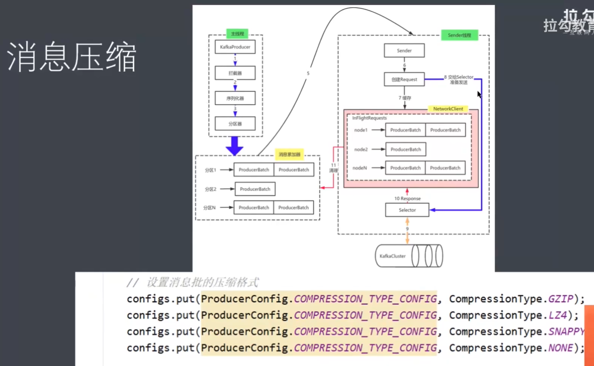


#### 3.kafka如何保证消息的顺序性？

   	 1）因为单个partition内是有序的，所以可以一个topic对应一个partition来保证kafka生产/消费的顺序性。	

​		2)  可以满足局部有序。只需要在发送消息的时候指定Partition Key，kafka对其进行Hash计算，根据计算结果决定放入哪个partition。这样Partition Key相同的消息会放入同一个Partition。然后消费者消费的时候可以考虑再次hash唯一标识（例如订单orderId），将需要放在一起的数据，分发到同一个队列中，最后用多线程分别从各个队列中取数据。如下图：

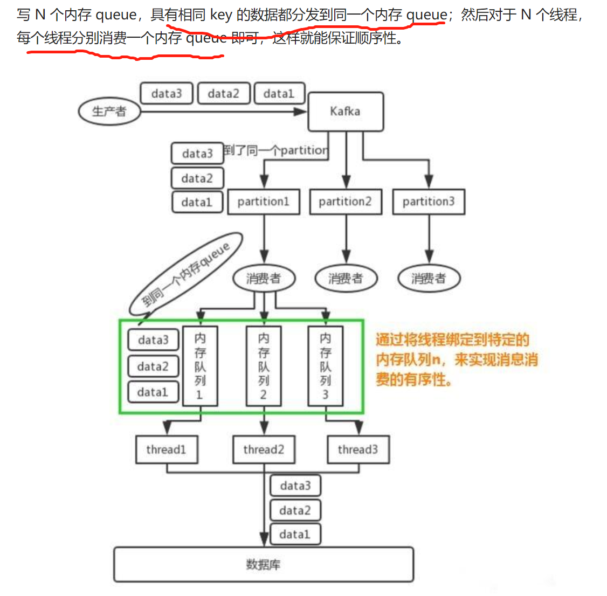

​	3)消息重试对消息顺序的影响：对于一个有着先后顺序的消息A、B，正常情况下应该是A先发送完成后再发送B，但是在异常情况下，在A发送失败的情况下，B发送成功，而A由于重试机制在B发送完成之后重试发送成功了。这时对于本身顺序为AB的消息顺序变成了BA。

​	针对这种问题，严格的顺序消费还需要`max.in.flight.requests.per.connection`参数的支持。

​	该参数指定了生产者在收到服务器响应之前可以发送多少个消息。它的值越高，就会占用越多的内存，同时也会提升吞吐量。把它设为1就可以保证消息是按照发送的顺序写入服务器的。

​	此外，对于某些业务场景，设置`max.in.flight.requests.per.connection`=1会严重降低吞吐量，如果放弃使用这种同步重试机制，则可以考虑在消费端增加失败标记的记录，然后用定时任务轮询去重试这些失败的消息并做好监控报警。


#### 4.kafka消息重复和丢失的场景及解决方案.

- **重复消费**

##### 	1)生产者重复生产导致消息重复

​		producer发出一条消息，broke落盘后因为网络等原因使得发送端得到一个发送失败的响应或者网络中断，然后producer收到一个可恢复的异常，进而重试消息导致消息重复。		

​		**解决方案：**

```java
1、启动kafka的幂等性
　　要启动kafka的幂等性，无需修改代码，默认为关闭，需要修改配置文件:enable.idempotence=true 同时要求 ack=all 且 retries>1。

　　幂等原理：
　　每个producer有一个producer id，服务端会通过这个id关联记录每个producer的状态，每个producer的每条消息会带上一个递增的sequence，服务端会记录每个producer对应的当前最大sequence，producerId + sequence ，如果新的消息带上的sequence不大于当前的最大sequence就拒绝这条消息，如果消息落盘会同时更新最大sequence，这个时候重发的消息会被服务端拒掉从而避免消息重复。该配置同样应用于kafka事务中。

2、ack=0，不重试。
　　可能会丢消息，适用于吞吐量指标重要性高于数据丢失，例如：日志收集。
```


##### 	2)消费者重复消费同一个offset的数据

​		根本原因是数据消费完没有及时提交offset到broke.

​		场景：消息消费端在消费过程中挂掉没有及时提交offset到broke，另一个消费端启动拿之前记录的offset开始消费，由于offset的滞后性可能会导致新启动的客户端有少量重复消费。

​		**解决方案：**

```java
1、取消自动自动提交
每次消费完或者程序退出时手动提交。这可能也没法保证一条重复。

2、下游做幂等
一般的解决方案是让下游做幂等或者尽量每消费一条消息都记录offset，对于少数严格的场景可能需要把offset或唯一ID,例如订单ID和下游状态更新放在同一个数据库里面做事务来保证精确的一次更新或者在下游数据表里面同时记录消费offset，然后更新下游数据的时候用消费位点做乐观锁拒绝掉旧位点的数据更新。
```

​	**无论是生产者还是消费者的重复消息，一般都会在消费端卡死，做幂等性处理。**
​        幂等性可以用redis的setnx分布式锁来实现。比如操作订单消息，可以把订单id作为key，在消费消息时，通过setnx命令设置一下，offset提交完成后，在redis中删除订单id的key。setnx命令保证同样的订单消息，只有一个能被消费，可有效保证消费的幂等性！

- **消息丢失**

  ##### 1)生产者端消息丢失.

​         生产者在发送消息时，会有一个ack机制，当ack=0 或者 ack=1时，都可能会丢消息。如下所示：

```java
//acks=0
	表示producer不需要等待任何broker确认收到消息的回复，就可以继续发送下一条消息。性能最高，但是最容易丢消息。大数据统计报表场景，对性能要求很高，对数据丢失不敏感的情况可以用这种。
//acks=1
	至少要等待leader已经成功将数据写入本地log，但是不需要等待所有follower是否成功写入。就可以继续发送下一条消息。这种情况下，如果follower没有成功备份数据，而此时leader又挂掉，则消息会丢失。
//acks=-1或all（解决消息丢失）
	这意味着leader需要等待所有备份(min.insync.replicas配置的备份个数)都成功写入日志，这种策略会保证只要有一个备份存活就不会丢失数据。这是最强的数据保证。一般除非是金融级别，或跟钱打交道的场景才会使用这种配置。当然如果min.insync.replicas配置的是1则也可能丢消息，跟acks=1情况类似。
```

##### 	2)消费者端消息丢失

​		消费端丢消息最主要体现在消费端offset的自动提交，如果开启了自动提交，万一消费到数据还没处理完，此时你consumer直接宕机了，未处理完的数据 丢失了，下次也消费不到了，因为offset已经提交完毕，下次会从offset出开始消费新消息。**解决办法是采用消费端的手动提交:**

```java
    //手动提交offset
    /**
     * 注意如果要使用手动提交offset，需要以下三点
     * ①：配置文件配置手动提交方式
     * ②：加上参数Acknowledgment ack
     * ③：方法中使用ack.acknowledge();手动提交
     */
    ack.acknowledge();
```

#### 5.kafka消息积压的解决方案?

​	此种情况如果积压了上百万未消费消息需要紧急处理，可以修改消费端程序，让其将收到的消息快速转发到其他topic(可以设置很多分区)，然后再启动多个消费者同时消费新主题的不同分区。如图所示：

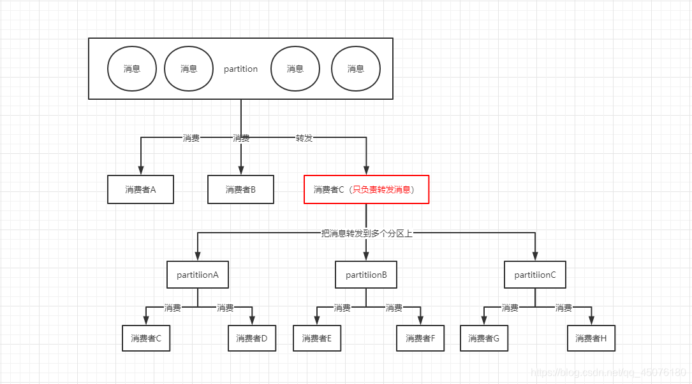


### 二、kafka常用命令行

##### 1.kafka命令行查看consumer以及topic消费情况

```shell
#####其中
TOPIC：该group里消费的topic名称
PARTITION：分区编号
CURRENT-OFFSET：该分区当前消费到的offset
LOG-END-OFFSET：该分区当前latest offset
LAG：消费滞后区间，为LOG-END-OFFSET-CURRENT-OFFSET，具体大小需要看应用消费速度和生产者速度，一般过大则可能出现消费跟不上，需要引起应用注意
CONSUMER-ID：server端给该分区分配的consumer编号
HOST：消费者所在主机
CLIENT-ID：消费者id，一般由应用指定

#0.查看所有topic
bin/kafka-topics.sh --zookeeper 10.2.8.72:2181 --list
#1.获取group列表，一般而言，应用是知道消费者group的，通常在应用的配置里，如果已知，该步骤可以省略
bin/kafka-consumer-groups.sh --bootstrap-server 10.2.8.72:9092 --list
#2.查看指定group下各个topic的具体消费情况
bin/kafka-consumer-groups.sh --bootstrap-server 10.2.8.72:9092 --group crs-protocol-group --describe
#3.查看某个topic的内容
bin/kafka-console-consumer.sh --bootstrap-server 10.2.8.72:9092 --topic crs-protocol-flight-platform --from-beginning
#4.创建一个新的topic
bin/kafka-topics.sh --zookeeper 10.2.8.72:2181 --create --topic crs-flight-platform

```


