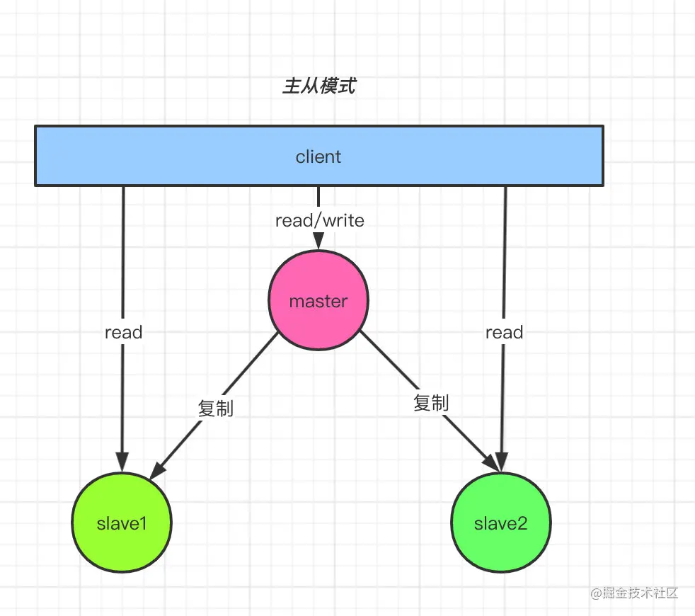
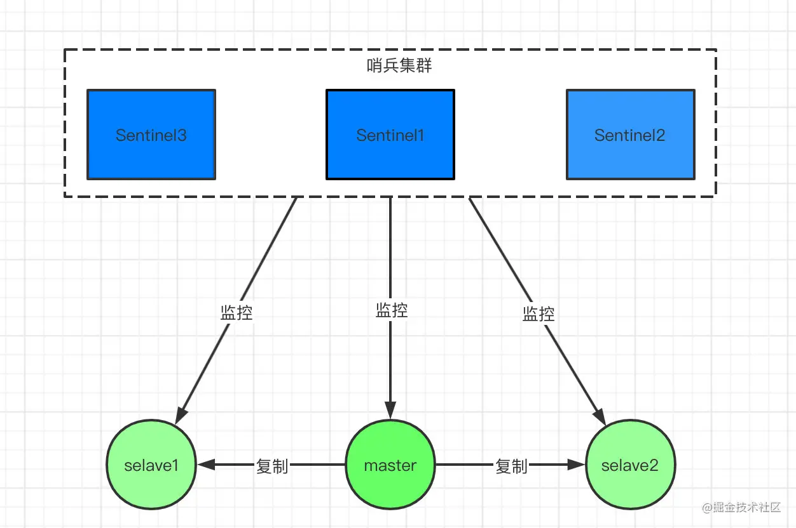
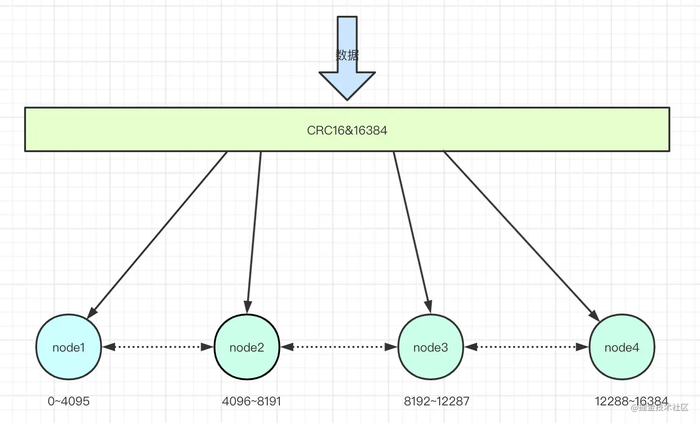
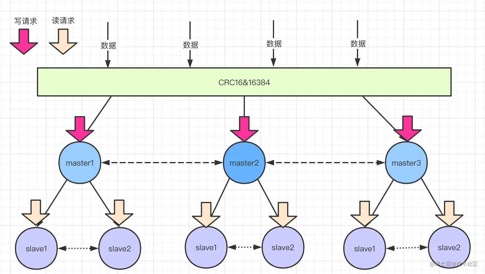
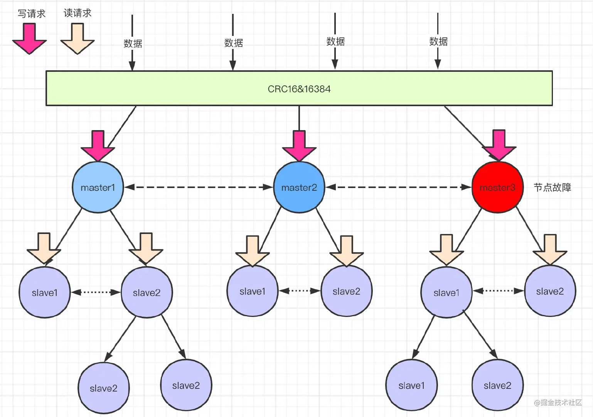

# **redis总结**

#### 1.redis 5大数据类型及使用场景（6.0以后是9大数据类型）


#### 2.基于redis的分布式锁


#### 3.redis的主从、哨兵和集群模式

##### **3.1 主从模式**

​	主从复制，是指将一台Redis服务器的数据，复制到其他的Redis服务器。

​	前者称为主节点(master)，后者称为从节点(slave)；数据的复制是单向的，只能由主节点到从节点。

			

​	主从模式配置很简单，只需要在从节点配置主节点的ip和端口号即可。

```shell
slaveof <masterip> <masterport>
# 例如
# slaveof 192.168.1.214 6379
```

​	启动**主从**节点的所有服务，查看日志即可以看到**主从**节点之间的服务连接。

​	从上面很容易就想到一个问题，既然主从复制，意味着master和slave的数据都是一样的，有数据冗余问题。

​	在程序设计上，为了高可用性和高性能，是允许有冗余存在的。这点希望大家在设计系统的时候要考虑进去，不用为公司节省这一点资源。

​	对于追求极致**用户体验**的产品，是绝对不允许有**宕机**存在的。

​	主从模式在很多系统设计时都会考虑，一个master挂在多个slave节点，当master服务宕机，会**选举**产生一个新的master节点，从而保证服务的高可用性。

###### **主从模式的优点：**

```java
//1.一旦 主节点宕机，从节点 作为 主节点 的 备份 可以随时顶上来。
//2.扩展 主节点 的 读能力，分担主节点读压力。
//3.高可用基石：除了上述作用以外，主从复制还是哨兵模式和集群模式能够实施的基础，因此说主从复制是Redis高可用的基石。
```

###### **主从模式的缺点：**

```java
//1.一旦 主节点宕机，从节点 晋升成 主节点，同时需要修改 应用方 的 主节点地址，还需要命令所有 从节点 去 复制 新的主节点，整个过程需要 人工干预。
//2.主节点 的 写能力 受到 单机的限制。
//3.主节点 的 存储能力 受到 单机的限制。
```


##### **3.2 哨兵模式**

​		刚刚提到了，主从模式，当主节点宕机之后，从节点是可以作为主节点顶上来，继续提供服务的。但是有一个问题，主节点的IP已经变动了，此时应用服务还是拿着**原**主节点的地址去访问，这...

​		于是，在Redis 2.8版本开始引入，就有了哨兵这个概念。在**复制的基础**上，哨兵实现了**自动化**的故障恢复。



如图，哨兵节点由两部分组成，哨兵节点和数据节点：

- 哨兵节点：哨兵系统由一个或多个哨兵节点组成，哨兵节点是特殊的redis节点，不存储数据。

- 数据节点：主节点和从节点都是数据节点。

  访问redis集群的数据都是通过哨兵集群的，哨兵监控整个redis集群。

​       一旦发现redis集群出现了问题，比如刚刚说的主节点挂了，从节点会顶上来。但是主节点地址变了，这时候应用服务无感知，也不用更改访问地址，因为哨兵才是和应用服务做交互的。

​       Sentinel 很好的解决了故障转移，在高可用方面又上升了一个台阶，当然Sentinel还有其他功能。

​       比如 **主节点存活检测**、**主从运行情况检测**、**主从切换**。

​       Redis的Sentinel最小配置是 **一主一从**。

###### **说下哨兵模式监控的原理**

​		每个Sentinel以 每秒钟 一次的频率，向它**所有**的 **主服务器**、**从服务器** 以及其他Sentinel**实例** 发送一个PING 命令。


​		如果一个 实例（instance）距离最后一次有效回复 PING命令的时间超过 down-after-milliseconds 所指定的值，那么这个实例会被 Sentinel标记为 **主观下线**。

​		如果一个 **主服务器** 被标记为 **主观下线**，那么正在 监视 这个 主服务器 的**所有** Sentinel 节点，要以 **每秒一次** 的频率确认 该主服务器是否的确进入了 **主观下线** 状态。

​		如果一个 主服务器 被标记为 主观下线，并且有 **足够数量** 的 Sentinel（至少要达到配置文件指定的数量）在指定的 **时间范围** 内同意这一判断，那么这个该主服务器被标记为 **客观下线**。

​		在一般情况下， 每个 Sentinel 会以每 10秒一次的频率，向它已知的所有 主服务器 和 从服务器 发送 INFO 命令。

​		当一个 **主服务器** 被 Sentinel标记为 **客观下线** 时，Sentinel 向 下线主服务器 的所有 从服务器 发送 INFO 命令的频率，会从10秒一次改为 每秒一次。

​		Sentinel和其他 Sentinel 协商 **主节点** 的状态，如果 主节点处于 **SDOWN`状态，则投票自动选出**新的主节点。将剩余的 **从节点** 指向 **新的主节点** 进行 **数据复制**。

​		当没有足够数量的 Sentinel 同意 主服务器 下线时， 主服务器 的 **客观下线状态** 就会被移除。当 **主服务器** 重新向 Sentinel的PING命令返回 有效回复 时，主服务器 的 **主观下线状态** 就会被移除。

###### **哨兵模式的优缺点**

```java
   优点：
	哨兵模式是基于主从模式的，所有主从的优点，哨兵模式都具有。主从可以自动切换，系统更健壮，可用性更高。Sentinel 会不断的检查 主服务器 和 从服务器 是否正常运行。当被监控的某个 Redis 服务器出现问题，Sentinel 通过API脚本向管理员或者其他的应用程序发送通知。
​   缺点：
Redis较难支持在线扩容，对于集群，容量达到上限时在线扩容会变得很复杂。

```


##### **3.3集群模式**

​		主从不能解决故障自动恢复问题，哨兵已经可以解决故障自动恢复了，那到底为啥还要集群模式呢？

​		主从和哨兵都还有另外一些问题没有解决，单个节点的存储能力是有上限，访问能力是有上限的。

​		Redis Cluster 集群模式具有 **高可用**、**可扩展性**、**分布式**、**容错** 等特性。

###### **Cluster 集群模式的原理**

​		通过数据分片的方式来进行数据共享问题，同时提供数据复制和故障转移功能。

​		之前的两种模式数据都是在一个节点上的，单个节点存储是存在上限的。集群模式就是把数据进行分片存储，当一个分片数据达到上限的时候，就分成多个分片。

###### **数据分片怎么分？**

​		集群的键空间被分割为16384个slots（即hash槽），通过hash的方式将数据分到不同的分片上的。

```java
HASH_SLOT = CRC16(key) & 16384 
```

​		CRC16是一种循环校验算法，这里不是我们研究的重点，有兴趣可以看看。

​		这里用了**位运算**得到取模结果，位运算的速度高于取模运算。



有一个很重要的问题，为什么是分割为16384个槽？这个问题可能会被面试官随口一问

###### **数据分片之后怎么查，怎么写？**



​		读请求分配给slave节点，写请求分配给master，数据同步从master到slave节点。

​		**读写分离**提高并发能力，增加高性能。

###### 如何做到水平扩展？


​		master节点可以做扩充，数据迁移redis内部自动完成。

​		当你新增一个master节点，需要做数据迁移，redis服务不需要下线。举个栗子：上面的有三个master节点，意味着redis的槽被分为三个段，假设三段分别是0~7000，7001~12000、12001~16383。

​		现在因为业务需要新增了一个master节点，四个节点共同占有16384个槽。

​		槽需要重新分配，数据也需要重新迁移，但是服务不需要下线。

​		redis集群的重新分片由redis内部的管理软件redis-trib负责执行。redis提供了进行重新分片的所有命令，redis-trib通过向节点发送命令来进行重新分片。

###### 如何做故障转移？



​	假如途中红色的节点故障了，此时master3下面的从节点会通过 **选举** 产生一个主节点。替换原来的故障节点。

此过程和哨兵模式的故障转移是一样的。


##### 4.redis常见问题


5.其他

```java
/**************************************早期笔记**************************************/
1.redis本质是一个key-value类型的内存数据库，定期通过异步操作把数据库数据flush到硬盘上进行保存。因为是纯内存操作，redis最大可以处理10万次读写操作/s，是目前最快的key-value数据库。Redis最大的魅力是它支持保存多种数据结构，此外单个value最大限制是1GB，不像memcached只能保存1MB的数据。

2.redis的主要缺点是数据库容量受到物理内存的限制，不能用作海量数据的高性能读写，因此Redis主要应用场景限制在较小数据量的高性能操作上。

3.redis的并发竞争问题如何解决？

​	Redis是单进程单线程的模式，采用队列模式将并发访问变为串行访问。Redis本身没有锁的概念，Redis对于多个客户端连接并不存在竞争，Jedis客户端进行并发访问时产生的问题可以对客户端读写Redis操作采用内部锁Synchronized来解决。

4.Redis中事务的实现特征.

- 在事务中所有命令都将会被串行化的顺序执行，事务执行期间，Redis不会再为其他客户端的请求提供任何服务，从而保证了事务中的所有命令原子执行。
- Redis事务中如果有一条命令执行失败，其后的命令仍然会继续执行。这一点和mysql有些不同。
- 开启事务用MULTI命令，提交/回滚事务用EXEC/DISCARD命令.
- 如果事务MULTIK开启且刚好在EXEC命令结束之后宕机，那么该事务中的所有命令都会被服务器执行。因为此时所有写操作会被写入磁盘，开机后会进行一致性检测，不一致会报错并回滚。

5.使用过Redis分布式锁么，它是什么回事？
```

**6.参考文献**

1）https://juejin.cn/post/6844904191236767751


