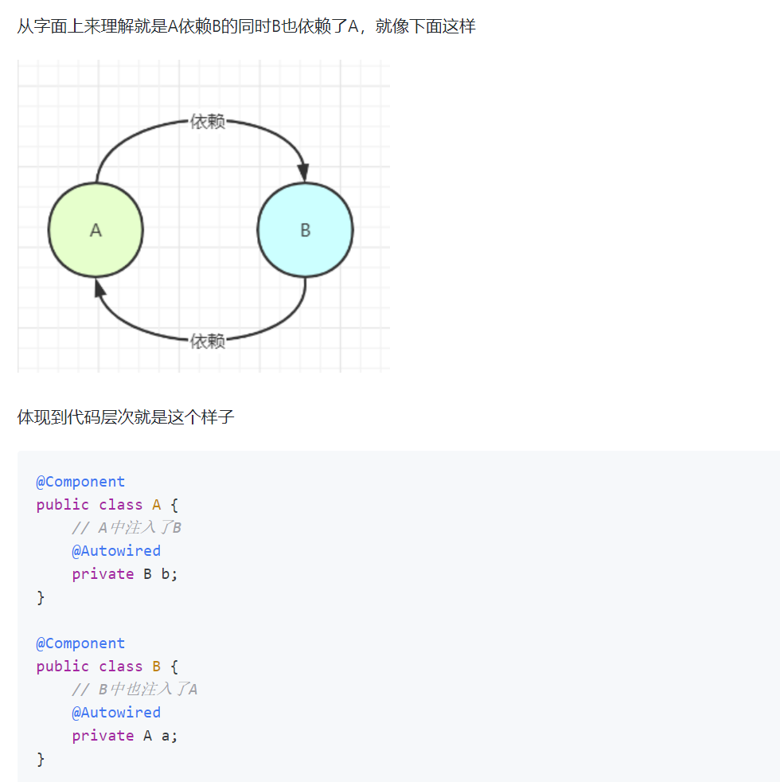
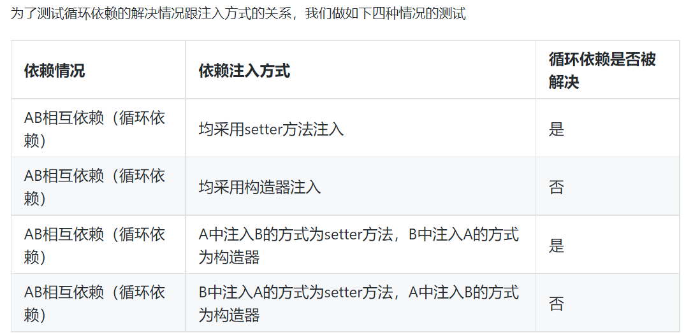

**spring循环依赖**

​	看文章暂时没看太懂，有时间看看视频做一个总结.

文章地址：https://developer.aliyun.com/article/766880

**1.什么是循环依赖？**

**2.spring解决循环依赖的前置条件**

​	1）出现循环依赖的Bean必须要是单例;

​	2）依赖注入的方式不能全是构造器注入的方式(很多博客上说，只能解决setter方法的循环依赖，这是错误的).

