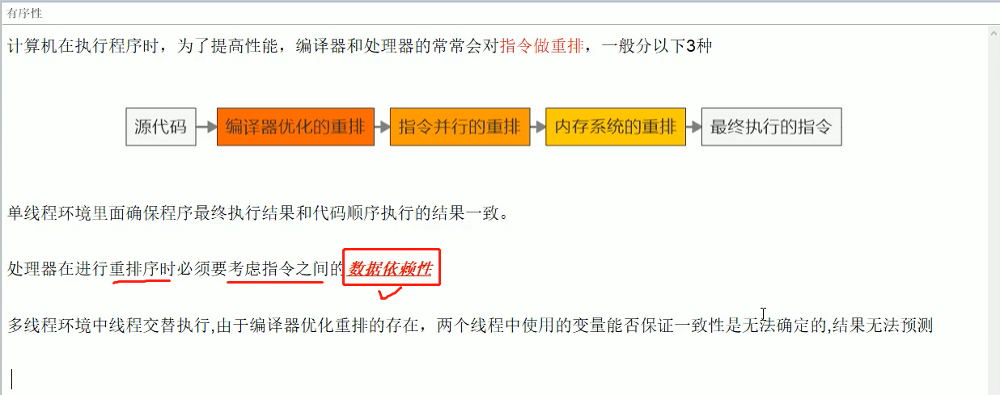
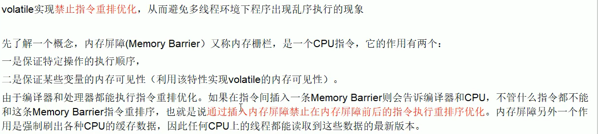
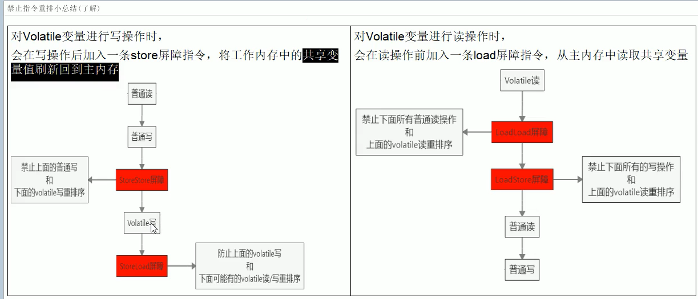

**volatile关键字**

一、前置知识准备

 1.首先要了解并发和并行的区别。并发是指多线程处理多个任务，但是从物理上只能一个一个任务轮询处理，可以通过cpu调度算法轮询执行任务，但是核(CPU)可能只有一个；并行肯定是有多核的，可以从物理上同时执行多个任务。

 2.由于JVM运行程序的实体是线程，而每个线程创建时JVM都会为其创建一个工作内存(有些地方成为栈空间)，工作内存是每个线程的私有数据区域，而Javan内存模型(JMM)中规定所有变量都存储在主内存，主内存是共享内存区域（堆），所有线程都可以访问，**但线程对变量的操作（读取赋值等）必须在工作内存中进行，首先要将变量从主内存拷贝自己的工作内存空间，然后对变量进行操作，操作完成后再将变量写回主内存**，不能直接操作主内存的变量，各个线程的工作内存中存储的是主内存的变量副本拷贝，因此不同的线程间无法访问对方的工作内存，线程间的通信（传值）必须通过主内存来实现。如下图所示:


 3.**JMM关于同步的规定（JMM是大多数多线程开发需要遵循的规范）：**

- 1.线程解锁前，必须把共享变量的值刷新回主内存内;
- 2.线程加锁前，必须读取主内存的最新值到自己的工作内存；
- 3.加锁解锁用的是同一把锁.

4.JMM =》大多数多线程开发需要遵循的规范：**可见性、原子性、有序性.**


二、volatile关键字

 1.volatile只能**保证可见性与禁止重排序**，但是volatile并**不能保证原子性**，所以不能保证线程安全，保证线程安全正确的做法是加锁或者使用Atomic类。

2.volatile不能保证原子性。比说i++; 每个线程从0开始循环加10次，开启二十个线程执行。即便加了volatile int i =  0,也不能保证最终的结果是200.	这是因为i++不是线程安全的，i++可以分为三个步骤：获取i的值、执行i+1、将i+1的结果刷给主内存.  这里就可能出现我这个线程已经知道i改变了（可见性通知的速度非常快），但是我前两步操作已经执行了，只剩下第三步操作,造成了值被覆盖的情况。

3.解决原子性的方法：

- 加sync
- 使用我们juc并发包下的AtomicInteger

4.volatile禁止指令重排序原理(volatatile最难的一点)

前置知识：

原理如下图：






5.多线程下手写一个单例模式，并保证线程的安全性.

```java
public class SingletonDemo{
    private static volatile SingletonDemo singleton = null;//1.此处一定要加volatile禁止指令重排，否则无法真正保证线程安全
    
    private SingletonDemo{
        System.out.println(Thread.currentThread().getName()+"===这是一个单例模式===");
    }
    
    //DCL (Double check Lock 双端检锁机制)
    public static SingletonDemo getSingleton(){
        if(singleton == null){
           synchronized (SingletonDemo.class){
               if(singleton == null){
                   singleton = new SingletonDemo();//2.不要加在方法上，否则太重了
               }
           } 
        }
        return singleton;
    }
    
    public static void main(String[] args){
        System.out.println(SingletonDemo.getSingleton() == SingletonDemo.getSingleton);
        System.out.println(SingletonDemo.getSingleton() == SingletonDemo.getSingleton);
        System.out.println(SingletonDemo.getSingleton() == SingletonDemo.getSingleton);
    }
}
//打印结果是：===这是一个单例模式===  只打印一次，再打印三个true.

```

原理解析：

