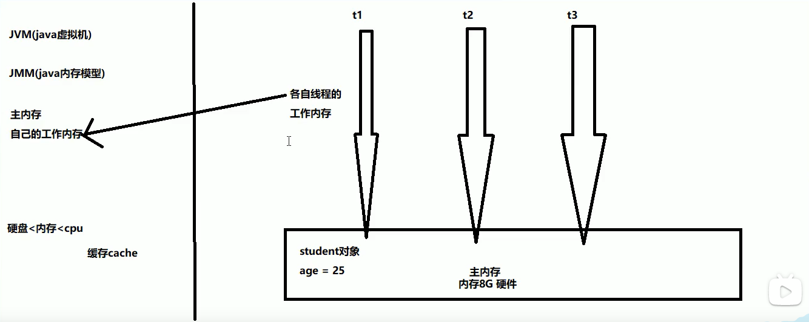

**volatile关键字**

一、前置知识准备

​	1.首先要了解并发和并行的区别。并发是指多线程处理多个任务，但是从物理上只能一个一个任务轮询处理，可以通过cpu调度算法轮询执行任务，但是核(CPU)可能只有一个；并行肯定是有多核的，可以从物理上同时执行多个任务。

​	2.由于JVM运行程序的实体是线程，而每个线程创建时JVM都会为其创建一个工作内存(有些地方成为栈空间)，工作内存是每个线程的私有数据区域，而Javan内存模型(JMM)中规定所有变量都存储在主内存，主内存是共享内存区域（堆），所有线程都可以访问，**但线程对变量的操作（读取赋值等）必须在工作内存中进行，首先要将变量从主内存拷贝自己的工作内存空间，然后对变量进行操作，操作完成后再将变量写回主内存**，不能直接操作主内存的变量，各个线程的工作内存中存储的是主内存的变量副本拷贝，因此不同的线程间无法访问对方的工作内存，线程间的通信（传值）必须通过主内存来实现。如下图所示:

​	3.**JMM关于同步的规定：**

- 1.线程解锁前，必须把共享变量的值刷新回主内存内;

- 2.线程加锁前，必须读取主内存的最新值到自己的工作内存；

- 3.加锁解锁用的是同一把锁.

  

二、volatile关键字

​	1.volatile只能保证可见性与禁止重排序，但是volatile并不能保证线程安全，保证线程安全正确的做法是加锁或者使用Atomic类。

