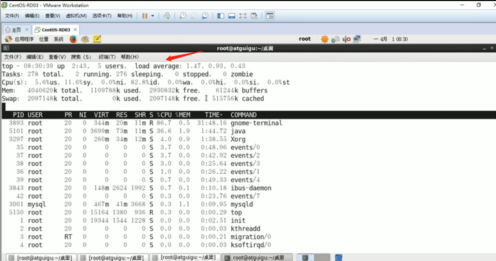
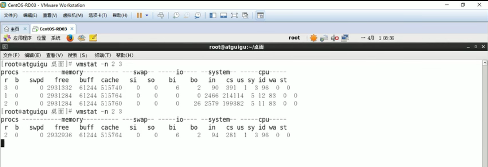

**linux命令**

```shell
#*****************************非程序员基础命令******************************#
cd /   #1.返回根目录
cd ..  #2.返回上一级目录
pwd	   #3.显示当前目录
mkdir  #4.在当前文件夹下创建一个文件
vi a.txt  #5.创建一个名为a的文本文档
cat a.txt #6.查看a.txt的内容
ps -ef #显示当前所有进程环境变量及进程间的关系
ps -ef | grep java #查找指定进程java（grep是强大的文本搜索命令）
kill -9 8001	#杀死进程号PID为8001的进程
esc+:+wq #保存并退出,若想不保存推出,esc + : + q!
cp a.txt b.txt  #在当前文件夹下将a.txt复制一份并重命名为b.txt
mv a.txt b.txt	#将a.txt重命名为b.txt
find . -name yufutian.txt #全局查找文件名为a.txt的文件的路径,若*futian*也可模糊匹配


##===================快捷键
Ctrl+c #在命令行下起着终止当前执行程序的作用
Ctrl+d #相当于exit命令，退出当前shell
Ctrl+s #挂起当前shell
Ctrl+q #解冻挂起的shell再不行就重新连接打开一个终端，reboot linux 或 kill 相关进程。
host键+c #虚拟机切换为窗口自适应模式(host键为右边的ctrl键)


```

```shell
#*****************************程序员基础命令【重要】******************************#
1.top	#查看linux负载情况,如下图。load average三个数值对应的分别是linux系统一分钟、五分钟、十五分钟的平均负载. （一般这三个数值相加 <= cpu个数*70%就算没到达临界压力点）,%CPU和%MEM也要注意看进程的占用.uptime命令是top的精简版.

2.vmstat #vmstat命令是最常见的Linux/Unix监控工具，可以展现给定时间间隔的服务器的状态值，包括服务器的CPU使用率，内存使用，虚拟内存交换情况，IO读写情况等。（vmstat -n 2 3  -> 每两秒采样一次，共计采样3次。主要用来查看CPU，包含但不限于。）	详细：https://www.cnblogs.com/zsql/p/11643750.html
	#2.1 procs
	r   #表示运行队列(就是说多少个进程真的分配到CPU)。一般来说r的总和不大于2*cpu个数,超过就危险了.
	b   #表示阻塞的进程,在等待资源的进程，这个不多说，进程阻塞，大家懂的。
	#2.2、system
	in   #每秒CPU的中断次数，包括时间中断
	cs   #每秒上下文切换次数，例如我们调用系统函数，就要进行上下文切换，线程的切换，也要进程上下文切换，这个值要越小越好，太大了，要考虑调低线程或者进程的数目
	#2.3、cpu
	us   #用户CPU时间，我曾经在一个做加密解密很频繁的服务器上，可以看到us接近100,r运行队列达到80(机器在做压力测试，性能表现不佳)。
	sy   #系统CPU时间，如果太高，表示系统调用时间长，例如是IO操作频繁。
	id   #空闲 CPU时间，一般来说，id + us + sy = 100,一般我认为id是空闲CPU使用率，us是用户CPU使用率，sy是系统CPU使用率。(一般us + sy超过80%，就需要注意了)
	wt   #等待IO CPU时间。

3.pidstat	#pidstat可以查cpu使用率查的更细，可以查看具体某一进程的.eg:ps -ef|grep java(查出进程为5108)，pidstat -u 1 -p 5108.  详细--->https://www.jianshu.com/p/3991c0dba094
			#pidstat -r ：可以显示各活动进程的内存统计
			#pidstat -d :显示各个进程io使用情况【显示字段含义如下。PID：进程id;kB_rd/s：每秒从磁盘读取的KB;kB_wr/s：每秒写入磁盘KB;kB_ccwr/s：任务取消的写入磁盘的KB,当任务截断脏的pagecache的时候会发生;COMMAND:task的命令名】

4.free	#查看系统内存(pidstat -p 5108 -r 2 --->查看具体进程的内存使用情况，每两秒打印一次 );
5.df -h #查看磁盘剩余空间数
6.iostat -xdk 2 3 #查看磁盘io使用情况(查询具体进程的磁盘使用情况还可以用 pidstat -d 2 -p 5108)。详情---->		https://www.cnblogs.com/ggjucheng/archive/2013/01/13/2858810.html
7.ifstat #查看网络IO,流量进出情况。详细----》https://blog.csdn.net/liuxiao723846/article/details/82118177
```

- top命令



- vmstat命令




