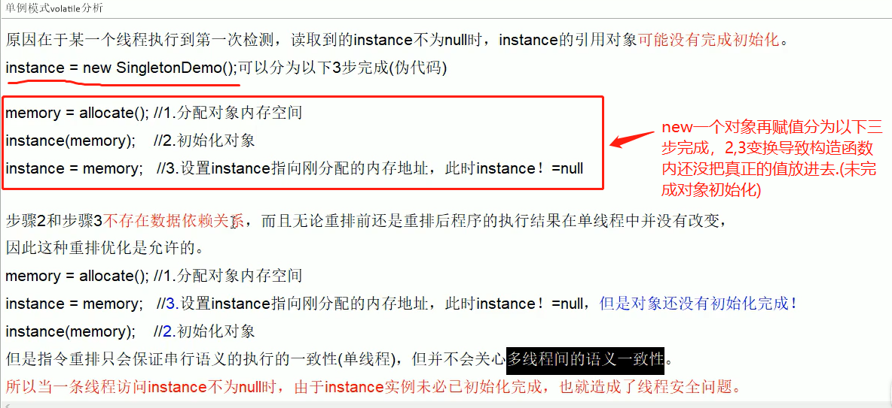

**手写一个单例模式**

一、单线程下

```java
public class SingletonDemo{
    private static SingletonDemo singleton = null;
    
    private SingletonDemo{
        System.out.println(Thread.currentThread().getName()+"===这是一个单例模式===");
    }
    
    public SingletonDemo getSingleton(){
        if(singleton == null){
           singleton = new SingletonDemo();
        }
        return singleton;
    }
    
    public static void main(String[] args){
        System.out.println(SingletonDemo.getSingleton() == SingletonDemo.getSingleton);
        System.out.println(SingletonDemo.getSingleton() == SingletonDemo.getSingleton);
        System.out.println(SingletonDemo.getSingleton() == SingletonDemo.getSingleton);
    }
}
//打印结果是：===这是一个单例模式===  只打印一次，再打印三个true.


```


二、多线程下

```java
public class SingletonDemo{
    private static volatile SingletonDemo singleton = null;//1.此处一定要加volatile禁止指令重排，否则无法真正保证线程安全
    
    private SingletonDemo{
        System.out.println(Thread.currentThread().getName()+"===这是一个单例模式===");
    }
    
    //DCL (Double check Lock 双端检锁机制)
    public static SingletonDemo getSingleton(){
        if(singleton == null){
           synchronized (SingletonDemo.class){
               if(singleton == null){
                   singleton = new SingletonDemo();//2.不要加在方法上，否则太重了
               }
           } 
        }
        return singleton;
    }
    
    public static void main(String[] args){
        System.out.println(SingletonDemo.getSingleton() == SingletonDemo.getSingleton);
        System.out.println(SingletonDemo.getSingleton() == SingletonDemo.getSingleton);
        System.out.println(SingletonDemo.getSingleton() == SingletonDemo.getSingleton);
    }
}
//打印结果是：===这是一个单例模式===  只打印一次，再打印三个true.

```

原理解析：

