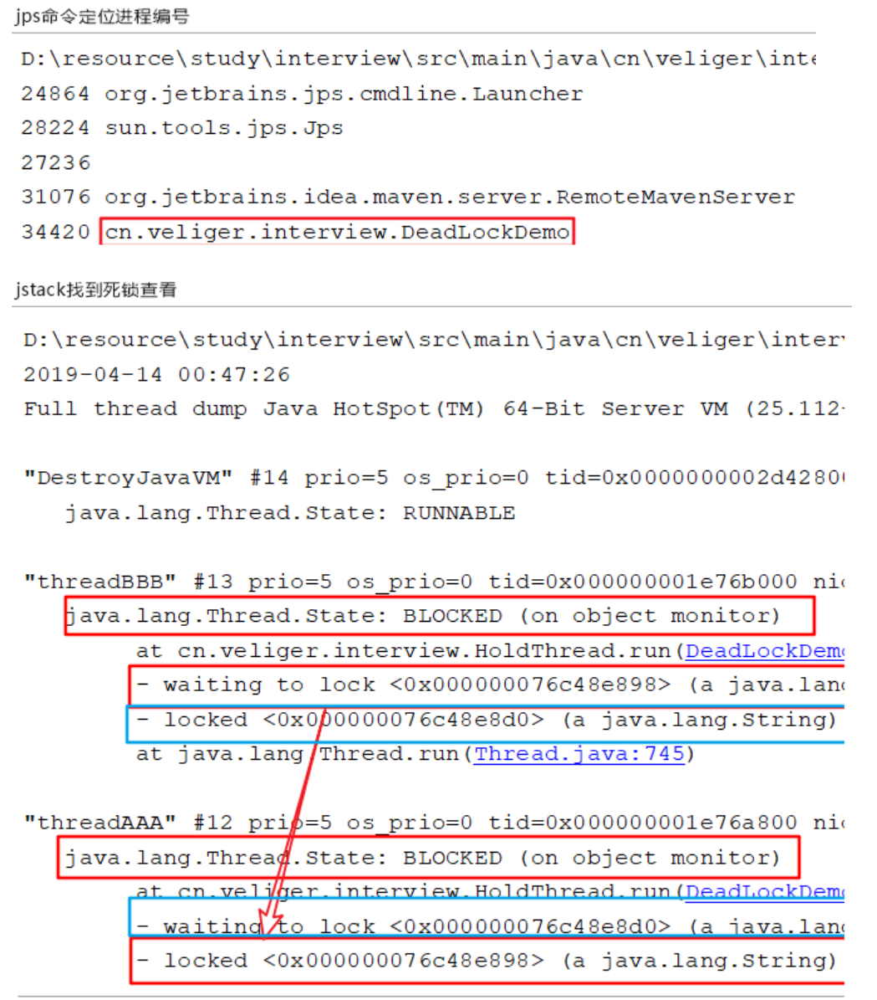

**死锁编码及定位分析**

**1.死锁是什么？**

```java
死锁是指两个或两个以上的进程在执行过程中，因争夺资源而造成的一种互相等待的现象，若无外力干涉那么他们都将无法推进下去。如果系统资源充足，进程的资源请求都能够得到满足，死锁出现的可能性就很低，否则就会因为争夺有限的资源而陷入死锁。
```


**2.手写一个死锁 , 并使用jps、jstack分析排查死锁.**

- **手写死锁案例**

死锁案例一：

```java
//死锁案例一：此处为对象锁，锁的是对象内的非静态成员变量
class MyThread implements Runnable {

    private String lockA;

    private String lockB;

    public MyThread(String lockA, String lockB) {
        this.lockA = lockA;
        this.lockB = lockB;
    }

    @Override
    public void run() {
        synchronized (lockA) {
            try {
                Thread.sleep(10);
            } catch (InterruptedException e) {
                e.printStackTrace();
            }
            System.out.println(Thread.currentThread().getName() + "\t 获得lockA 尝试获得lockB");

            synchronized (lockB) {

                System.out.println(Thread.currentThread().getName() + "\t 获得lockB 尝试获得lockA");

                synchronized (lockA) {
                    System.out.println(Thread.currentThread().getName() + "\t 获得lockA");
                }
            }
        }
    }
}

public class DealLockDemo01 {

    public static void main(String[] args) {

        String lockA = "locka";
        String lockB = "lockb";
        new Thread(new MyThread(lockA, lockB), "ThreadAAA").start();
        new Thread(new MyThread(lockB, lockA), "ThreadBBB").start();
    }
}
```

死锁案例二：

```java
//死锁案例二：此处也是对象锁/方法锁，方法锁默认锁的是当前对象.故统一对象中的加了synchronized关键字修饰的持同一把锁.
class A {

    public synchronized void a1(B b) {
        try {
            Thread.sleep(10);
        } catch (InterruptedException e) {
            e.printStackTrace();
        }
        System.out.println(Thread.currentThread().getName() + "\t 获得a的锁");
        b.b2();
    }

    public synchronized void a2() {

    }
}

class B {

    public synchronized void b1(A a) {
        try {
            Thread.sleep(10);
        } catch (InterruptedException e) {
            e.printStackTrace();
        }
        System.out.println(Thread.currentThread().getName() + "\t 获得b的锁");
        a.a2();
    }

    public synchronized void b2() {

    }

}

public class DealLockDemo02 {

    public static void main(String[] args) {

        A a = new A();
        B b = new B();

        new Thread(() -> {
            a.a1(b);
        }, "AAA").start();

        new Thread(() -> {
            b.b1(a);
        }, "BBB").start();
    }
}
```

- **死锁检测**

  ```java
  //jps -l 【jps -l 类似于linux查找运行程序的进程号】
  //jstack 33420 【打印对应进程号的栈信息】
  ```

  

