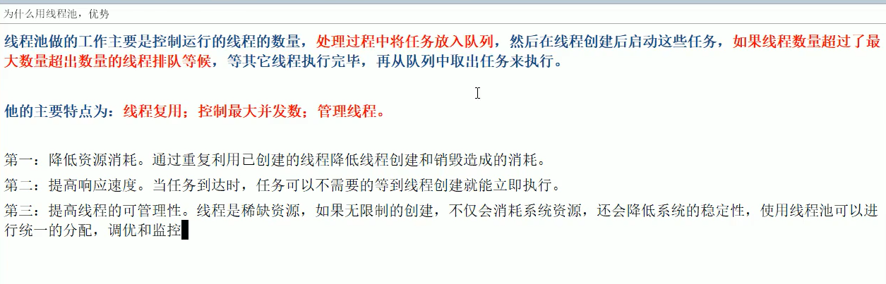

**线程池**

**1.Callable接口**


**2.FutureTask类.**

​	它实现了继承了Runnable接口的子接口，实现了和Runnable接口以及Thread类的耦合关联.使用方法如下图：


**3.线程池的优势？**




**4.线程池的底层用了哪些类和接口？**

​		Java中的线程池是通过Executor框架实现的，该框架用到了Executor，Executors，ExecutorService，ThreadPoolExecutor这几个类。如下图所示：


**5.线程池常用的三个方式和底层原理（重点）**

```java
public void test{
    ExecutorService threadPoll = Executors.newFixedThreadPoll(5);//一池5个处理线程,执行长期的任务，性能好很多；
	ExecutorService threadPoll = Executors.newSingleThreadExecutor();//一池一个处理线程,一个任务一个任务执行的场景；
    ExecutorService threadPoll = Executors.newCachedThreadPoll();//一池N个处理线程,适用执行很多短期异步的小程序或者负载较轻的服务器；
}
```


**6.线程池的7大参数和底层工作原理（重点）**

```java
- 	1）corePoolSize：线程池中的常驻核心线程数；

​	2）maximumPoolSize：线程池能够容纳同时执行的最大线程数，此值必须大于等于1；

​	3）keepAliveTime：多余的空闲线程的存活时间。当前线程池数量超过corePoolSize时，当线程空闲时间达到keepAliveTime时，多余空闲线程会被销毁，直到只剩下corePoolSize个线程为止；

​	4）unit：keepAliveTime的单位；

​	5）workQueue：任务队列，被提交但尚未被执行的任务；

​	6）threadFactory：表示生成线程池中工作线程的线程工厂，用于创建线程，一般用默认的即可；

​	7）handler：拒绝策略，表示当队列满了并且工作线程大于等于线程池的最大线程数(maximumPoolSize),此时执行拒绝策略(四种).
```


- 线程池底层工作原理（工作流程）如下：


7.谈谈线程池的拒绝策略.

​		拒绝策略是指核心线程满载-->阻塞队列满载-->最大线程数满载且阻塞队列也满了，此时整个池子已经达到最大处理能力，再要开启新线程的话，这时就会启用拒绝策略，jdk内置的拒绝策略有以下4种。

```java
//1)AbortPolicy(默认)：直接抛出RejectedExecutionException异常阻止系统正常运行。(不影响其他线程)
//2)CallerRunsPolicy："调用者运行"一种调节机制,该策略既不会抛弃任务，也不会抛出异常，而是将某些任务回退到调用者，
//3)抛弃队列中等待最久的任务，然后把当前任务加入队列中尝试再次提交当前任务。
//4)直接丢弃任务，不予任何处理也不抛出异常。如果允许任务丢失，这才是最好的一种方案。
```


